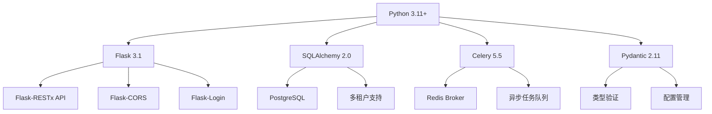
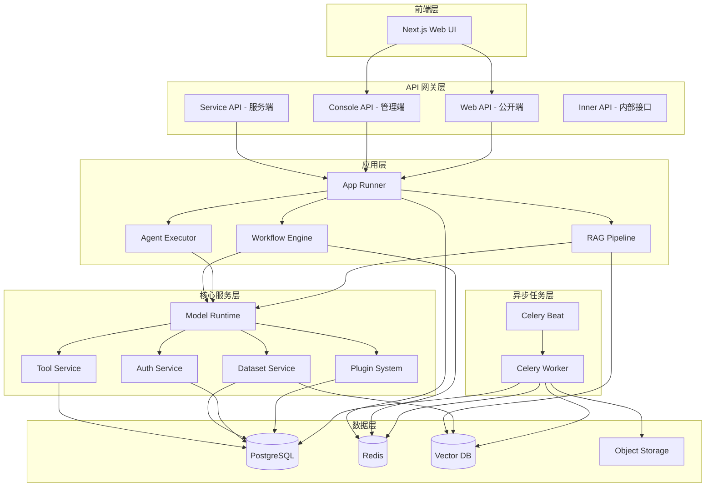
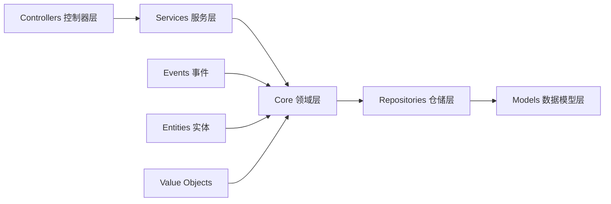
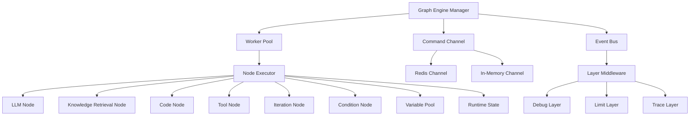
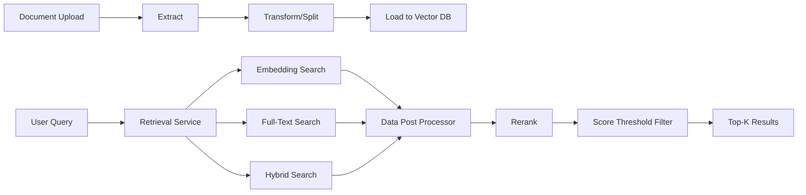
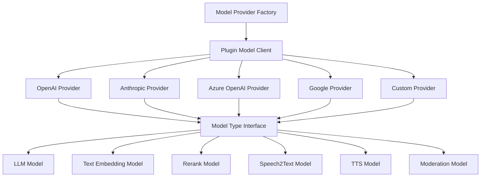
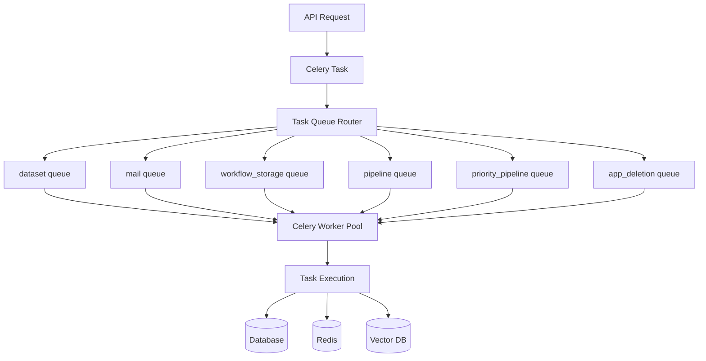
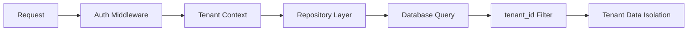
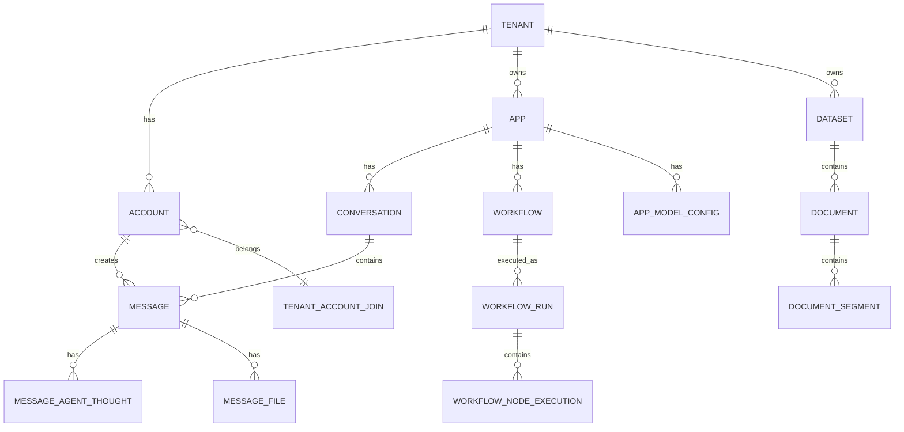
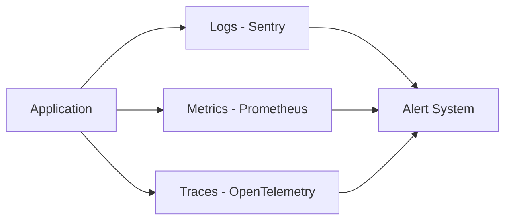

# Dify 项目架构与技术栈详解

## 1. 项目概述

Dify 是一个开源的 LLM 应用开发平台，通过直观的界面结合 AI Agent 工作流、RAG 管道、Agent 能力和模型管理，帮助开发者快速构建大模型应用。

**项目定位**：企业级 LLM 应用开发平台，支持多租户、高并发、分布式架构。

## 2. 技术栈

### 2.1 后端核心技术栈



#### 核心依赖版本

| 技术 | 版本 | 用途 |
|------|------|------|
| Flask | 3.1.2 | Web 框架 |
| SQLAlchemy | 2.0.29 | ORM 框架 |
| Celery | 5.5.2 | 异步任务队列 |
| Redis | 6.1.0 | 缓存 + 消息队列 |
| Pydantic | 2.11.4 | 数据验证与配置 |
| Gunicorn | 23.0.0 | WSGI 服务器 |
| Gevent | 25.9.1 | 协程支持 |
| PostgreSQL | - | 主数据库 |

#### AI/ML 相关

- **LLM 集成**: LiteLLM 1.77.1（统一多模型接口）
- **向量数据库**: Weaviate, Qdrant, Milvus, Chroma 等
- **嵌入模型**: OpenAI, Google, Cohere, Jina 等
- **文档处理**: Unstructured 0.16.1
- **分词器**: Tiktoken 0.9.0, Transformers 4.56.1

#### 可观测性

- **链路追踪**: OpenTelemetry 1.27.0
- **日志**: Sentry SDK 2.28.0
- **性能监控**: Langfuse 2.51.3, Langsmith 0.1.77

### 2.2 前端技术栈

- **框架**: Next.js 15 (React 19)
- **语言**: TypeScript (严格模式)
- **UI**: Tailwind CSS + 自定义组件
- **状态管理**: React Hooks + Context
- **国际化**: i18n (en-US)

### 2.3 基础设施

- **容器化**: Docker + Docker Compose
- **部署**: Gunicorn + Gevent Worker
- **缓存**: Redis (支持 Sentinel 高可用)
- **存储**: S3 兼容对象存储 (AWS/Azure/GCS/阿里云等)

## 3. 架构设计

### 3.1 整体架构



### 3.2 目录结构

```
api/
├── app_factory.py           # Flask 应用工厂
├── dify_app.py             # 应用主类
├── configs/                # 配置模块
│   └── middleware/         # 配置中间件
├── controllers/            # 控制器层（API 接口）
│   ├── console/           # 管理端 API
│   ├── web/              # Web 端 API
│   ├── service_api/      # 服务 API
│   └── inner_api/        # 内部 API
├── core/                  # 核心业务逻辑
│   ├── app/              # 应用执行引擎
│   ├── workflow/         # 工作流引擎
│   ├── agent/            # Agent 执行器
│   ├── rag/              # RAG 管道
│   ├── model_runtime/    # 模型运行时
│   ├── tools/            # 工具系统
│   ├── plugin/           # 插件系统
│   ├── mcp/              # MCP 协议
│   ├── ops/              # 可观测性
│   └── repositories/     # 仓储层
├── models/               # 数据模型（ORM）
├── services/             # 业务服务层
├── tasks/                # Celery 异步任务
├── extensions/           # Flask 扩展初始化
├── events/               # 事件系统
├── factories/            # 工厂类
├── libs/                 # 公共库
└── migrations/           # 数据库迁移
```

## 4. 核心设计模式

### 4.1 领域驱动设计 (DDD)

项目采用 DDD 架构，清晰划分各层职责：



**层级职责**：

1. **Controllers**: 接收 HTTP 请求，参数验证，调用服务层
2. **Services**: 业务编排，事务管理，调用核心领域
3. **Core**: 核心业务逻辑，领域模型，不依赖外部
4. **Repositories**: 数据持久化，屏蔽数据库细节
5. **Models**: ORM 模型定义，数据表映射

### 4.2 工作流引擎架构



**核心特性**：
- **队列驱动**: 基于队列的分布式执行
- **节点抽象**: 统一的节点执行接口
- **状态管理**: 变量池 + 运行时状态
- **外部控制**: 通过 Command Channel 实现暂停/恢复/终止
- **中间件系统**: 可插拔的执行层（调试、限流、追踪）
- **并行执行**: 支持节点并行和迭代执行

### 4.3 RAG 管道架构



**检索策略**：
- **向量检索**: 使用 Embedding 进行语义相似度搜索
- **全文检索**: 基于关键词的倒排索引
- **混合检索**: 结合向量和全文，权重融合
- **重排序**: 支持 Cohere/Jina 等 Rerank 模型
- **后处理**: 分数阈值过滤、去重、引用提取

### 4.4 模型提供商架构



**设计亮点**：
- **插件化**: 所有模型提供商通过插件系统加载
- **统一接口**: 不同提供商实现统一的模型接口
- **凭证管理**: 支持租户级、应用级凭证配置
- **负载均衡**: 支持多个 API Key 轮询
- **容错机制**: 自动重试、降级、熔断

### 4.5 异步任务架构



**任务类型**：
- **dataset**: 文档索引、向量化
- **mail**: 邮件发送
- **workflow_storage**: 工作流执行结果持久化
- **pipeline**: RAG 管道执行
- **priority_pipeline**: 优先级 RAG 管道
- **app_deletion**: 应用删除清理

**Worker 配置**：
- **并发模式**: Gevent 协程（高 I/O）
- **自动扩展**: 根据 CPU 核心数自动调整 Worker 数量
- **预取倍数**: 1（精确控制并发）
- **任务限制**: 每个 Worker 最多执行 50 个任务后重启

### 4.6 多租户架构



**隔离策略**：
- **数据隔离**: 所有数据表包含 `tenant_id` 字段
- **资源隔离**: 应用、数据集、模型配置按租户隔离
- **配额管理**: 按租户限制 API 调用、知识库查询等
- **权限控制**: 基于角色的访问控制 (RBAC)

## 5. API 接口设计

### 5.1 API 分层

| API 类型 | URL 前缀 | 目标用户 | 认证方式 |
|---------|---------|---------|---------|
| Console API | `/console/api` | 管理员/开发者 | Session + JWT |
| Web API | `/api` | 终端用户 | API Key |
| Service API | `/v1` | 外部服务调用 | API Token |
| Inner API | `/inner/api` | 内部服务 | Internal Token |

### 5.2 流式响应设计

**SSE (Server-Sent Events)** 用于实时流式输出：

```python
# 事件类型
- message: 消息内容增量
- agent_thought: Agent 思考过程
- workflow_started: 工作流开始
- node_started: 节点开始执行
- node_finished: 节点执行完成
- error: 错误信息
- ping: 心跳保活
```

**流式响应转换器**：
- `ChatAppGenerateResponseConverter`: 聊天应用
- `CompletionAppGenerateResponseConverter`: 补全应用
- `WorkflowAppGenerateResponseConverter`: 工作流应用
- `AgentChatAppGenerateResponseConverter`: Agent 应用

## 6. 数据库设计

### 6.1 核心表结构



### 6.2 连接池配置

```python
SQLALCHEMY_POOL_SIZE = 30           # 连接池大小
SQLALCHEMY_MAX_OVERFLOW = 10        # 最大溢出连接
SQLALCHEMY_POOL_RECYCLE = 3600      # 连接回收时间（秒）
SQLALCHEMY_POOL_PRE_PING = True     # 连接前 ping 检测
SQLALCHEMY_POOL_USE_LIFO = True     # LIFO 模式（提高连接复用）
SQLALCHEMY_POOL_TIMEOUT = 30        # 获取连接超时
```

## 7. 缓存策略

### 7.1 Redis 缓存设计

**缓存类型**：
1. **会话缓存**: 用户登录态、临时 Token
2. **数据缓存**: 数据集配置、模型配置
3. **限流计数器**: API 限流、知识库查询限流
4. **分布式锁**: 初始化锁、并发控制
5. **任务结果**: Celery 任务结果缓存

**缓存键设计**：
```
rate_limit_{tenant_id}               # 限流计数
vector_initialize_{host}             # 向量库初始化标记
plugin_model_providers               # 模型提供商缓存
workflow:{task_id}:commands          # 工作流控制命令
```

## 8. 安全设计

### 8.1 认证授权

- **JWT Token**: API 访问凭证
- **API Key**: 应用级 API 调用
- **OAuth 2.0**: 第三方登录（GitHub、Google）
- **RBAC**: 基于角色的权限控制

### 8.2 数据安全

- **敏感数据加密**: AES-256 加密存储（API Key、凭证）
- **密码哈希**: bcrypt 哈希算法
- **SQL 注入防护**: ORM 参数化查询
- **XSS 防护**: 输出转义
- **CORS 配置**: 跨域访问控制

## 9. 可扩展性设计

### 9.1 水平扩展

- **无状态 API**: API 层可任意水平扩展
- **Worker 池**: Celery Worker 可独立扩展
- **数据库读写分离**: 支持主从复制
- **缓存分片**: Redis Cluster 支持

### 9.2 插件系统

- **模型插件**: 新增模型提供商无需修改核心代码
- **工具插件**: 自定义工具扩展
- **存储插件**: 支持多种对象存储和向量数据库

## 10. 监控与可观测性

### 10.1 三大支柱



### 10.2 追踪集成

- **OpenTelemetry**: 统一追踪标准
- **Langfuse**: LLM 调用追踪
- **Langsmith**: LangChain 追踪
- **自定义追踪**: WorkflowTrace, MessageTrace

---

## 总结

Dify 采用了现代化的微服务架构设计，具备以下特点：

✅ **高可用**: Redis Sentinel + 数据库主从 + 多实例部署  
✅ **高性能**: 连接池 + 缓存 + 异步任务 + 流式响应  
✅ **高扩展**: DDD 架构 + 插件系统 + 工作流引擎  
✅ **高安全**: 多层认证 + 数据加密 + 权限隔离  
✅ **可观测**: 日志 + 指标 + 链路追踪  

这套架构设计能够支撑企业级大模型应用的开发和运营需求。

