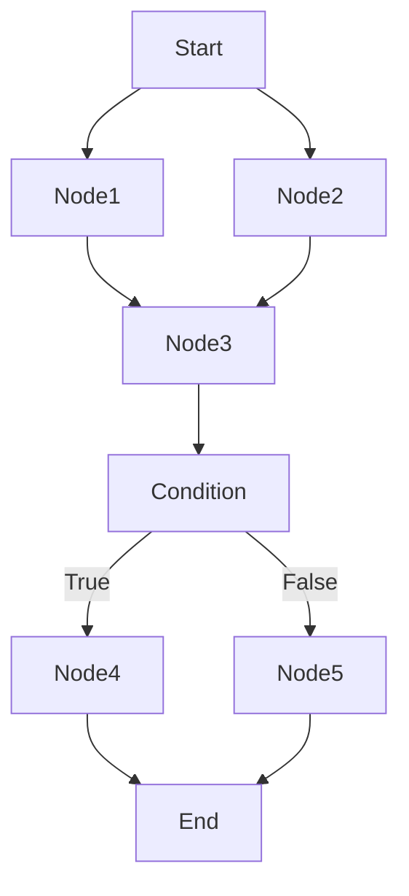

# Dify 项目技术难点分析

## 1. 分布式工作流引擎实现

### 1.1 核心难点

**问题描述**：如何实现一个支持复杂节点编排、并行执行、动态条件分支、迭代循环的分布式工作流引擎？

### 1.2 技术挑战

#### 挑战 1: 图的拓扑遍历与执行顺序



**解决方案**：

1. **边驱动的执行模型**：
```python
# 核心思路：基于边的前置条件判断
class Graph:
    def get_executable_nodes(self, executed_nodes: set) -> list:
        """获取可执行的节点"""
        executable = []
        for node in self.nodes:
            # 检查所有前驱节点是否已执行
            predecessors = self.get_predecessors(node)
            if all(pred in executed_nodes for pred in predecessors):
                executable.append(node)
        return executable
```

2. **并行执行支持**：
   - 无依赖关系的节点可同时执行
   - 使用 Worker Pool 并发处理
   - 通过事件总线同步状态

3. **条件分支处理**：
   - IF/ELSE 节点评估条件表达式
   - 动态选择执行路径
   - Skip 机制跳过未选中分支

#### 挑战 2: 外部控制与状态一致性

**需求**：用户可以随时暂停、恢复、终止正在运行的工作流。

**难点**：
- 如何保证中间状态的一致性？
- 暂停后如何准确恢复？
- 多节点并行时如何优雅终止？

**解决方案**：

```python
# Command Channel 模式
class WorkflowEngine:
    def __init__(self):
        self.command_channel = RedisChannel()  # 或 InMemoryChannel
        
    def run(self):
        while True:
            # 检查外部命令
            command = self.command_channel.poll()
            if isinstance(command, PauseCommand):
                self._save_checkpoint()  # 保存检查点
                self._wait_resume()
            elif isinstance(command, AbortCommand):
                self._cleanup_and_exit()
                break
            
            # 执行下一个节点
            self._execute_next_node()
```

**关键技术**：
- **Redis Pub/Sub**: 分布式命令通知
- **Checkpoint 机制**: 保存执行快照（变量池、执行状态）
- **幂等性设计**: 节点可重复执行不产生副作用

#### 挑战 3: 变量传递与作用域管理

**问题**：不同节点之间如何传递数据？循环迭代中的变量如何隔离？

```python
# 变量池设计
class VariablePool:
    def __init__(self):
        self._variables = {}  # {selector: Segment}
        self._scopes = []      # 作用域栈
    
    def add(self, selector: list, value: Segment):
        """添加变量"""
        key = '.'.join(selector)
        self._variables[key] = value
    
    def get(self, selector: list) -> Segment:
        """获取变量（支持作用域查找）"""
        # 从当前作用域向上查找
        for scope in reversed(self._scopes):
            key = f"{scope}.{'.'.join(selector)}"
            if key in self._variables:
                return self._variables[key]
        
        # 全局作用域
        key = '.'.join(selector)
        return self._variables.get(key)
```

**设计亮点**：
- **Selector 机制**: `['node_id', 'output_key']` 精确定位变量
- **Segment 抽象**: 统一的变量类型（String/Number/Object/Array/File）
- **作用域栈**: 支持嵌套迭代的变量隔离

### 1.3 迭代节点的复杂性

**场景**：对列表数据进行逐项处理，每项可能包含复杂的子流程。

```python
# Iteration Node 实现难点
class IterationNode(Node):
    def _run(self):
        items = self.get_input_list()
        
        for index, item in enumerate(items):
            # 1. 创建子作用域
            self._push_scope(f"iteration_{index}")
            
            # 2. 注入迭代变量
            self.variable_pool.add(['item'], item)
            self.variable_pool.add(['index'], index)
            
            # 3. 执行子图
            sub_graph = self._build_sub_graph()
            result = sub_graph.run()
            
            # 4. 收集结果
            self._collect_output(result)
            
            # 5. 清理作用域
            self._pop_scope()
```

**技术难点**：
- **子图构建**: 动态生成子工作流
- **并行迭代**: 支持并行度控制（`parallelism` 参数）
- **错误处理**: 单项失败是否中断整体执行
- **内存管理**: 大列表迭代的内存优化

---

## 2. RAG 检索性能优化

### 2.1 多路召回与融合排序

**问题**：如何在海量文档中快速找到最相关的片段？

#### 挑战 1: 混合检索策略

```python
# 同时使用向量检索和全文检索
class RetrievalService:
    @classmethod
    def retrieve(cls, query: str, top_k: int, method: RetrievalMethod):
        if method == RetrievalMethod.HYBRID:
            # 并行执行两种检索
            with ThreadPoolExecutor() as executor:
                vector_future = executor.submit(
                    cls.embedding_search, query, top_k
                )
                fulltext_future = executor.submit(
                    cls.full_text_index_search, query, top_k
                )
            
            vector_docs = vector_future.result()
            fulltext_docs = fulltext_future.result()
            
            # RRF 融合排序
            return cls._reciprocal_rank_fusion(vector_docs, fulltext_docs)
```

**难点**：
- **分数归一化**: 向量相似度 vs 全文检索分数（不同量纲）
- **权重配置**: 如何平衡两种检索方式
- **去重逻辑**: 两路召回可能有重复文档

**解决方案**：
- **RRF (Reciprocal Rank Fusion)**：
  ```python
  score(d) = Σ 1 / (k + rank_i(d))
  # k=60 是常用参数，rank_i 是文档在第 i 路召回中的排名
  ```

#### 挑战 2: Rerank 模型集成

**问题**：初次召回的 Top-K 结果未必最优，需要二次精排。

```python
class DataPostProcessor:
    def invoke(self, query: str, documents: list, top_n: int):
        if self.mode == RerankMode.RERANKING_MODEL:
            # 调用 Cohere/Jina Rerank API
            rerank_results = self._call_rerank_model(query, documents)
            
            # 按新分数重排序
            sorted_docs = sorted(
                rerank_results, 
                key=lambda x: x.score, 
                reverse=True
            )
            
            return sorted_docs[:top_n]
```

**技术要点**：
- **批量 Rerank**: 减少 API 调用次数
- **缓存策略**: 相同 query 复用结果
- **超时控制**: Rerank 失败降级为原始排序

### 2.2 向量索引优化

#### 挑战：大规模向量存储与检索

**数据规模**：
- 单个数据集可能包含数十万文档
- 每个文档拆分为数百个 Segment
- 总向量数可达千万级

**优化策略**：

1. **分层索引**：
   ```python
   # 先在 Document 级别粗筛，再在 Segment 级别精筛
   class HierarchicalIndex:
       def search(self, query_embedding, top_k):
           # 1. Document 向量（均值池化）
           doc_scores = self.doc_index.search(query_embedding, top_k * 10)
           
           # 2. 在候选 Document 内搜索 Segment
           segments = []
           for doc_id in doc_scores:
               segments.extend(
                   self.segment_index.search_in_doc(doc_id, query_embedding, top_k)
               )
           
           return sorted(segments, key=lambda x: x.score)[:top_k]
   ```

2. **量化压缩**：
   - **PQ (Product Quantization)**: 将向量量化为索引，减少存储和计算
   - **HNSW + PQ**: 分层图索引 + 乘积量化

3. **分片策略**：
   - 按 `dataset_id` 分片存储
   - 避免跨数据集检索

### 2.3 文档切分策略

**问题**：如何切分文档才能兼顾语义完整性和检索准确性？

```python
class EnhanceRecursiveCharacterTextSplitter:
    def split_text(self, text: str) -> list[str]:
        # 递归分割：段落 -> 句子 -> 单词
        separators = ["\n\n", "\n", "。", ".", " "]
        
        chunks = []
        for sep in separators:
            if len(text) <= self.chunk_size:
                chunks.append(text)
                break
            
            parts = text.split(sep)
            current_chunk = ""
            
            for part in parts:
                if len(current_chunk) + len(part) > self.chunk_size:
                    if current_chunk:
                        chunks.append(current_chunk)
                    current_chunk = part
                else:
                    current_chunk += sep + part
            
            if current_chunk:
                chunks.append(current_chunk)
        
        # 添加重叠 (Overlap)
        return self._add_overlap(chunks, self.chunk_overlap)
```

**核心参数**：
- `chunk_size`: 512~1024 Token（取决于 Embedding 模型）
- `chunk_overlap`: 50~100 Token（避免语义截断）
- `separators`: 优先级递减的分隔符

---

## 3. 流式响应与实时性

### 3.1 SSE 流式传输

**问题**：LLM 生成需要数秒甚至数十秒，如何让用户实时看到输出？

```python
# Flask SSE 实现
@app.route('/chat-messages', methods=['POST'])
def chat():
    def generate():
        for chunk in app_runner.run_stream():
            # 转换为 SSE 格式
            data = json.dumps(chunk.dict())
            yield f"data: {data}\n\n"
        
        yield "data: [DONE]\n\n"
    
    return Response(
        generate(), 
        mimetype='text/event-stream',
        headers={
            'Cache-Control': 'no-cache',
            'X-Accel-Buffering': 'no',  # 禁用 Nginx 缓冲
        }
    )
```

**技术难点**：

1. **Nginx 缓冲问题**：
   - Nginx 默认会缓冲响应，导致流式失效
   - 解决：设置 `X-Accel-Buffering: no` 头

2. **连接保活**：
   - 长时间无数据可能导致代理断开连接
   - 解决：定时发送 `ping` 事件

3. **错误处理**：
   - 流式过程中发生错误如何通知客户端？
   - 解决：发送特殊的 `error` 事件

### 3.2 背压控制

**问题**：LLM 生成速度 > 网络传输速度时，如何避免内存溢出？

```python
# Generator + Queue 模式
class AppQueueManager:
    def __init__(self):
        self._queue = queue.Queue(maxsize=100)  # 限制队列长度
    
    def publish(self, event: Event):
        try:
            self._queue.put(event, timeout=5)  # 阻塞式写入
        except queue.Full:
            logger.warning("Queue full, dropping event")
    
    def listen(self):
        while True:
            try:
                event = self._queue.get(timeout=1)
                yield event
            except queue.Empty:
                continue
```

**设计亮点**：
- **有界队列**: 防止无限堆积
- **阻塞写入**: 生产者自动降速
- **超时机制**: 避免死锁

---

## 4. 多租户数据隔离

### 4.1 Repository 层的租户过滤

**问题**：如何保证一个租户无法访问另一个租户的数据？

```python
class SQLAlchemyWorkflowNodeExecutionRepository:
    def __init__(self, user: Account, app_id: str):
        # 提取租户 ID
        self._tenant_id = extract_tenant_id(user)
        self._app_id = app_id
    
    def get_by_id(self, execution_id: str):
        with self._session_factory.begin() as session:
            stmt = (
                select(WorkflowNodeExecution)
                .where(WorkflowNodeExecution.id == execution_id)
                .where(WorkflowNodeExecution.tenant_id == self._tenant_id)  # 强制过滤
            )
            
            if self._app_id:
                stmt = stmt.where(WorkflowNodeExecution.app_id == self._app_id)
            
            return session.execute(stmt).scalar_one_or_none()
```

**防御策略**：
- **每个查询都加 tenant_id 过滤**（在 Repository 层强制）
- **索引优化**: `(tenant_id, id)` 复合索引
- **权限检查**: Service 层二次验证

### 4.2 资源配额管理

**问题**：如何防止某个租户消耗过多资源？

```python
# 基于 Redis 的限流
def check_rate_limit(tenant_id: str, operation: str, limit: int, window: int):
    """滑动窗口限流"""
    key = f"rate_limit_{tenant_id}_{operation}"
    current_time = int(time.time() * 1000)
    
    # 添加当前请求
    redis_client.zadd(key, {current_time: current_time})
    
    # 移除窗口外的记录
    redis_client.zremrangebyscore(key, 0, current_time - window)
    
    # 统计窗口内请求数
    count = redis_client.zcard(key)
    
    if count > limit:
        raise RateLimitExceeded()
```

**限流维度**：
- API 调用频率（QPS）
- 知识库查询次数
- 文档上传大小
- 模型调用 Token 数

---

## 5. Celery 异步任务可靠性

### 5.1 任务幂等性设计

**问题**：网络抖动可能导致任务重复执行，如何保证幂等？

```python
@shared_task(bind=True, max_retries=3)
def document_indexing_task(self, dataset_id: str, document_ids: list):
    # 使用分布式锁
    lock_key = f"indexing_lock:{dataset_id}:{document_ids[0]}"
    
    with redis_client.lock(lock_key, timeout=300):
        # 1. 检查任务状态
        for doc_id in document_ids:
            doc = Document.query.get(doc_id)
            if doc.indexing_status == 'completed':
                continue  # 跳过已完成的文档
            
            # 2. 执行索引
            try:
                index_processor.process(doc)
                doc.indexing_status = 'completed'
            except Exception as e:
                doc.indexing_status = 'failed'
                doc.error_message = str(e)
            
            db.session.commit()
```

**关键技术**：
- **分布式锁**: 避免并发执行同一任务
- **状态机**: 通过 `status` 字段记录进度
- **断点续传**: 支持从中断处继续

### 5.2 死信队列处理

**问题**：任务失败重试多次后如何处理？

```python
@shared_task(
    bind=True,
    max_retries=3,
    default_retry_delay=60,
    autoretry_for=(TemporaryError,),  # 自动重试的异常
    retry_backoff=True,                # 指数退避
    retry_backoff_max=600,             # 最大退避时间
)
def risky_task(self, data):
    try:
        process(data)
    except PermanentError as e:
        # 永久性错误不重试，记录到 Dead Letter Queue
        save_to_dlq(self.request.id, data, str(e))
        raise
    except TemporaryError as e:
        # 临时性错误自动重试
        raise self.retry(exc=e)
```

**DLQ 设计**：
```python
class DeadLetterQueue:
    def save(self, task_id: str, payload: dict, error: str):
        """保存失败任务"""
        db.session.add(FailedTask(
            task_id=task_id,
            payload=json.dumps(payload),
            error=error,
            retry_count=0,
            status='pending_manual_review'
        ))
        db.session.commit()
    
    def retry_batch(self, task_ids: list):
        """批量重试"""
        for task_id in task_ids:
            task = FailedTask.query.get(task_id)
            # 重新入队
            original_task.apply_async(args=json.loads(task.payload))
```

---

## 6. LLM 调用的容错与降级

### 6.1 模型负载均衡

**场景**：配置多个 API Key，轮询调用以规避单 Key 限流。

```python
class LoadBalancingModelConfig:
    def __init__(self, configs: list[dict]):
        self._configs = configs
        self._current_index = 0
        self._lock = threading.Lock()
    
    def get_credentials(self) -> dict:
        """Round-Robin 轮询"""
        with self._lock:
            config = self._configs[self._current_index]
            self._current_index = (self._current_index + 1) % len(self._configs)
            return config.credentials
```

### 6.2 超时与重试策略

```python
class LLMInvoker:
    @retry(
        stop=stop_after_attempt(3),
        wait=wait_exponential(multiplier=1, min=1, max=10),
        retry=retry_if_exception_type((Timeout, APIError))
    )
    def invoke_with_retry(self, model: str, messages: list):
        try:
            response = self.client.chat.completions.create(
                model=model,
                messages=messages,
                timeout=30  # 30 秒超时
            )
            return response
        except RateLimitError:
            # 限流错误不重试，直接切换 Key
            self._switch_credentials()
            raise
```

### 6.3 降级策略

**多级降级**：
```
1. 主模型 (GPT-4) -> 备用模型 (GPT-3.5)
2. 实时生成 -> 缓存结果
3. 同步调用 -> 异步任务
4. 完整回答 -> 简化回答
```

---

## 7. 数据库查询优化

### 7.1 N+1 查询问题

**反例**：
```python
# 会产生 N+1 次查询
conversations = Conversation.query.filter_by(app_id=app_id).all()
for conv in conversations:
    messages = conv.messages  # 每次触发一次查询
```

**正例**：
```python
# 使用 joinedload 预加载
conversations = (
    Conversation.query
    .filter_by(app_id=app_id)
    .options(joinedload(Conversation.messages))  # 一次性加载
    .all()
)
```

### 7.2 分页查询优化

**大偏移量问题**：
```sql
-- 慢查询：需要扫描前 100 万行
SELECT * FROM messages 
WHERE app_id = 'xxx' 
ORDER BY created_at DESC 
LIMIT 1000000, 20;
```

**优化方案**：游标分页
```python
def get_messages_cursor_pagination(app_id: str, cursor: str, limit: int):
    """基于游标的分页"""
    query = (
        Message.query
        .filter_by(app_id=app_id)
        .order_by(Message.created_at.desc())
    )
    
    if cursor:
        # 从游标位置开始
        last_message = Message.query.get(cursor)
        query = query.filter(Message.created_at < last_message.created_at)
    
    messages = query.limit(limit + 1).all()
    
    has_more = len(messages) > limit
    if has_more:
        messages = messages[:limit]
    
    next_cursor = messages[-1].id if has_more else None
    return messages, next_cursor
```

---

## 8. 内存管理与性能优化

### 8.1 大文件处理

**问题**：用户上传 100MB 文档，如何避免内存溢出？

```python
def process_large_file(file_path: str):
    """流式处理大文件"""
    with open(file_path, 'rb') as f:
        # 分块读取
        while True:
            chunk = f.read(1024 * 1024)  # 1MB
            if not chunk:
                break
            
            # 处理 chunk
            process_chunk(chunk)
```

### 8.2 ORM 对象生命周期管理

**问题**：SQLAlchemy 对象会缓存在 Session 中，长时间运行可能导致内存泄漏。

```python
# 批量插入优化
def bulk_insert_segments(segments: list):
    """批量插入（不使用 ORM 对象）"""
    db.session.execute(
        DocumentSegment.__table__.insert(),
        [seg.to_dict() for seg in segments]
    )
    db.session.commit()
    
    # 清理 Session 缓存
    db.session.expire_all()
```

---

## 总结

以上是 Dify 项目中的主要技术难点及解决方案。这些难点涵盖：

1. **分布式系统**: 工作流引擎、任务队列、状态一致性
2. **高性能**: RAG 检索优化、流式响应、连接池管理
3. **可靠性**: 幂等性设计、重试机制、降级策略
4. **安全性**: 多租户隔离、权限控制、限流保护

掌握这些技术难点的解决思路，将大大提升你在面试中的竞争力。

