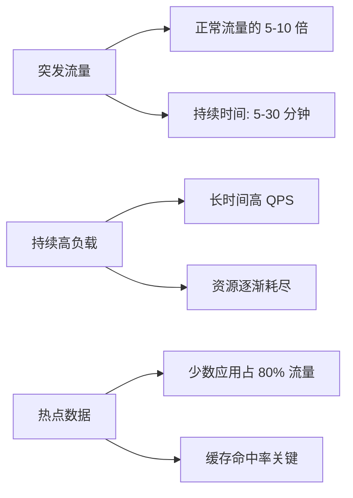
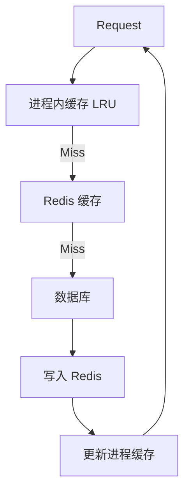

# Dify 高并发场景处理方案

## 1. 高并发场景识别

### 1.1 核心高并发场景

Dify 作为 LLM 应用开发平台，主要的高并发场景包括：

| 场景 | QPS 级别 | 瓶颈 | 关键指标 |
|------|---------|------|---------|
| Chat API 调用 | 1000+ | LLM 调用延迟、数据库连接 | P99 < 3s |
| 知识库检索 | 500+ | 向量数据库查询、Embedding 计算 | P99 < 500ms |
| 流式响应推送 | 10000+ | SSE 长连接、网络带宽 | 并发连接数 |
| 文档索引任务 | 100+ | 向量计算、数据库写入 | 吞吐量 |
| Workflow 并行执行 | 200+ | 图遍历、状态同步 | 任务完成率 |

### 1.2 流量特征



---

## 2. API 层高并发处理

### 2.1 连接模型优化

#### 2.1.1 Gunicorn + Gevent 架构

```python
# gunicorn.conf.py
import multiprocessing

# Worker 配置
workers = multiprocessing.cpu_count() * 2 + 1  # 2n+1 公式
worker_class = 'gevent'                         # 协程模型
worker_connections = 1000                        # 每个 Worker 最大连接数

# 超时配置
timeout = 200                                    # 请求超时（秒）
keepalive = 5                                    # Keep-Alive 时间

# 最大并发连接数 = workers * worker_connections
# 例如：8 核机器 = 17 workers * 1000 = 17000 并发
```

**为什么选择 Gevent？**

1. **协程模型**: 单个进程支持数千并发连接
2. **I/O 密集友好**: LLM 调用大部分时间在等待响应
3. **内存效率**: 相比多线程，协程更轻量

#### 2.1.2 长连接优化

```python
# SSE 流式响应场景
@app.route('/chat-messages', methods=['POST'])
def chat_stream():
    def generate():
        # 设置心跳，避免连接被中断
        last_ping = time.time()
        
        for chunk in app_runner.run_stream():
            yield f"data: {json.dumps(chunk)}\n\n"
            
            # 每 30 秒发送一次 ping
            if time.time() - last_ping > 30:
                yield "data: ping\n\n"
                last_ping = time.time()
        
        yield "data: [DONE]\n\n"
    
    return Response(
        generate(),
        mimetype='text/event-stream',
        headers={
            'Cache-Control': 'no-cache',
            'X-Accel-Buffering': 'no',           # 禁用 Nginx 缓冲
            'Connection': 'keep-alive',
        }
    )
```

**优化点**：
- **心跳机制**: 防止代理层超时断开
- **禁用缓冲**: 确保实时推送
- **Keep-Alive**: 复用 TCP 连接

### 2.2 请求队列与限流

#### 2.2.1 基于 Redis 的滑动窗口限流

```python
class RateLimiter:
    def __init__(self, redis_client, key_prefix: str):
        self.redis = redis_client
        self.key_prefix = key_prefix
    
    def check_limit(
        self, 
        identifier: str,      # 租户 ID 或 API Key
        limit: int,           # 限流阈值
        window: int = 60000   # 窗口大小（毫秒）
    ) -> bool:
        """滑动窗口限流"""
        key = f"{self.key_prefix}:{identifier}"
        current_time = int(time.time() * 1000)
        
        # 使用 Lua 脚本保证原子性
        lua_script = """
        local key = KEYS[1]
        local current_time = tonumber(ARGV[1])
        local window = tonumber(ARGV[2])
        local limit = tonumber(ARGV[3])
        
        -- 移除窗口外的记录
        redis.call('ZREMRANGEBYSCORE', key, 0, current_time - window)
        
        -- 统计窗口内请求数
        local count = redis.call('ZCARD', key)
        
        if count < limit then
            redis.call('ZADD', key, current_time, current_time)
            redis.call('EXPIRE', key, 60)
            return 1  -- 通过
        else
            return 0  -- 限流
        end
        """
        
        result = self.redis.eval(lua_script, 1, key, current_time, window, limit)
        return result == 1
```

**限流维度**：
```python
# 1. 租户级限流
RateLimiter(redis, "tenant_limit").check_limit(tenant_id, 1000, 60000)

# 2. API Key 级限流
RateLimiter(redis, "api_key_limit").check_limit(api_key, 100, 60000)

# 3. 端点级限流（防止单个接口被打爆）
RateLimiter(redis, "endpoint_limit").check_limit(f"{tenant_id}:/api/chat", 500, 60000)
```

#### 2.2.2 漏桶算法实现

```python
class LeakyBucket:
    def __init__(self, redis_client, capacity: int, leak_rate: float):
        """
        capacity: 桶容量
        leak_rate: 漏水速率（请求/秒）
        """
        self.redis = redis_client
        self.capacity = capacity
        self.leak_rate = leak_rate
    
    def acquire(self, identifier: str) -> bool:
        """尝试获取令牌"""
        key = f"leaky_bucket:{identifier}"
        current_time = time.time()
        
        # Lua 脚本实现
        lua_script = """
        local key = KEYS[1]
        local capacity = tonumber(ARGV[1])
        local leak_rate = tonumber(ARGV[2])
        local current_time = tonumber(ARGV[3])
        
        local last_time = tonumber(redis.call('HGET', key, 'last_time') or current_time)
        local water = tonumber(redis.call('HGET', key, 'water') or 0)
        
        -- 计算漏出的水量
        local leaked = (current_time - last_time) * leak_rate
        water = math.max(0, water - leaked)
        
        -- 尝试加入一滴水
        if water < capacity then
            water = water + 1
            redis.call('HMSET', key, 'water', water, 'last_time', current_time)
            redis.call('EXPIRE', key, 60)
            return 1
        else
            return 0
        end
        """
        
        result = self.redis.eval(
            lua_script, 1, key, 
            self.capacity, self.leak_rate, current_time
        )
        return result == 1
```

**适用场景**：
- **平滑流量**: 将突发流量转换为稳定流量
- **后端保护**: 限制向 LLM 提供商的请求速率

---

## 3. 数据库层高并发优化

### 3.1 连接池配置

```python
# configs/middleware/__init__.py
class DatabaseConfig:
    SQLALCHEMY_POOL_SIZE = 30          # 常驻连接数
    SQLALCHEMY_MAX_OVERFLOW = 10       # 溢出连接数
    # 最大连接数 = 30 + 10 = 40
    
    SQLALCHEMY_POOL_RECYCLE = 3600     # 连接回收时间（1小时）
    SQLALCHEMY_POOL_PRE_PING = True    # 连接前检测
    SQLALCHEMY_POOL_USE_LIFO = True    # LIFO 模式（提高热连接复用）
    SQLALCHEMY_POOL_TIMEOUT = 30       # 获取连接超时
```

**连接池大小计算**：
```
Pool Size = Tn * (Cm - 1) + 1

Tn: 并发事务数（通常 = Worker 数）
Cm: 单事务平均持有的连接数

示例：
- 17 个 Worker (8 核 * 2 + 1)
- 每个事务平均持有 1 个连接
- Pool Size = 17 * (1 - 1) + 1 = 18

考虑到峰值和 Celery Worker，设置为 30 较为合理。
```

### 3.2 慢查询优化

#### 3.2.1 索引优化

```python
# 多租户场景的复合索引
class Message(db.Model):
    __tablename__ = 'messages'
    
    id = db.Column(UUID, primary_key=True)
    app_id = db.Column(UUID, nullable=False)
    conversation_id = db.Column(UUID, nullable=False)
    created_at = db.Column(DateTime, nullable=False)
    
    # 复合索引设计
    __table_args__ = (
        # 1. 租户隔离 + 时间排序
        db.Index('idx_message_app_created', 'app_id', 'created_at'),
        
        # 2. 对话查询
        db.Index('idx_message_conversation', 'conversation_id', 'created_at'),
        
        # 3. 覆盖索引（查询 + 排序 + 返回字段）
        db.Index('idx_message_cover', 'app_id', 'created_at', 'id', 'query'),
    )
```

**索引设计原则**：
1. **最左前缀匹配**: `(app_id, created_at)` 可以支持 `app_id` 单独查询
2. **覆盖索引**: 查询字段全在索引中，避免回表
3. **索引大小**: 单个索引不超过 5 个字段

#### 3.2.2 分页查询优化

```python
# 反例：OFFSET 分页（大偏移量慢）
def get_messages_offset_pagination(app_id: str, page: int, size: int):
    return (
        Message.query
        .filter_by(app_id=app_id)
        .order_by(Message.created_at.desc())
        .offset(page * size)  # ❌ 需要扫描前面所有行
        .limit(size)
        .all()
    )

# 正例：游标分页
def get_messages_cursor_pagination(app_id: str, cursor: str, size: int):
    query = (
        Message.query
        .filter_by(app_id=app_id)
        .order_by(Message.created_at.desc())
    )
    
    if cursor:
        cursor_msg = Message.query.get(cursor)
        query = query.filter(Message.created_at < cursor_msg.created_at)
    
    messages = query.limit(size + 1).all()
    has_more = len(messages) > size
    
    return {
        'data': messages[:size],
        'next_cursor': messages[size - 1].id if has_more else None,
        'has_more': has_more
    }
```

### 3.3 读写分离

```python
# 主从配置
class DatabaseConfig:
    # 主库（写）
    SQLALCHEMY_DATABASE_URI = "postgresql://master:5432/dify"
    
    # 从库（读）
    SQLALCHEMY_BINDS = {
        'read_replica_1': "postgresql://slave1:5432/dify",
        'read_replica_2': "postgresql://slave2:5432/dify",
    }

# 使用示例
class Message(db.Model):
    __bind_key__ = None  # 默认主库
    
    @classmethod
    def get_readonly(cls, **kwargs):
        """只读查询使用从库"""
        return cls.query.execution_options(
            bind=db.get_engine(db.get_app(), 'read_replica_1')
        ).filter_by(**kwargs).all()
```

**读写分离策略**：
- **写操作**: 全部走主库
- **实时性要求高**: 主库读（如刚创建的数据）
- **历史数据查询**: 从库读（如消息历史、统计报表）

---

## 4. 缓存策略

### 4.1 多级缓存架构



#### 4.1.1 进程内缓存（热数据）

```python
from functools import lru_cache
import threading

class ProcessCache:
    def __init__(self, max_size: int = 1000):
        self._cache = {}
        self._lock = threading.Lock()
        self._max_size = max_size
    
    def get(self, key: str):
        with self._lock:
            return self._cache.get(key)
    
    def set(self, key: str, value, ttl: int = 300):
        with self._lock:
            if len(self._cache) >= self._max_size:
                # LRU 淘汰
                oldest_key = next(iter(self._cache))
                del self._cache[oldest_key]
            
            self._cache[key] = {
                'value': value,
                'expire_at': time.time() + ttl
            }

# 使用装饰器
@lru_cache(maxsize=1000)
def get_app_config(app_id: str):
    """应用配置缓存"""
    return App.query.get(app_id)
```

**适用数据**：
- 应用配置（很少变化）
- 模型提供商列表
- 租户信息

#### 4.1.2 Redis 缓存（共享数据）

```python
class RedisCache:
    def __init__(self, redis_client):
        self.redis = redis_client
    
    def get_or_set(self, key: str, factory_func, ttl: int = 3600):
        """获取缓存或重新计算"""
        # 1. 尝试从缓存获取
        cached = self.redis.get(key)
        if cached:
            return json.loads(cached)
        
        # 2. 计算值
        value = factory_func()
        
        # 3. 写入缓存
        self.redis.setex(key, ttl, json.dumps(value))
        
        return value
    
    def invalidate(self, pattern: str):
        """批量失效缓存"""
        keys = self.redis.keys(pattern)
        if keys:
            self.redis.delete(*keys)

# 使用示例
redis_cache = RedisCache(redis_client)

def get_dataset_config(dataset_id: str):
    return redis_cache.get_or_set(
        key=f"dataset_config:{dataset_id}",
        factory_func=lambda: Dataset.query.get(dataset_id).to_dict(),
        ttl=1800  # 30 分钟
    )
```

### 4.2 缓存更新策略

#### 4.2.1 Cache-Aside 模式（常用）

```python
class DatasetService:
    def get_dataset(self, dataset_id: str):
        """读操作：先查缓存，再查数据库"""
        cache_key = f"dataset:{dataset_id}"
        
        # 1. 查缓存
        cached = redis_client.get(cache_key)
        if cached:
            return json.loads(cached)
        
        # 2. 查数据库
        dataset = Dataset.query.get(dataset_id)
        
        # 3. 写缓存
        redis_client.setex(cache_key, 3600, json.dumps(dataset.to_dict()))
        
        return dataset
    
    def update_dataset(self, dataset_id: str, data: dict):
        """写操作：先更新数据库，再删除缓存"""
        # 1. 更新数据库
        dataset = Dataset.query.get(dataset_id)
        dataset.update(data)
        db.session.commit()
        
        # 2. 删除缓存（而不是更新缓存）
        cache_key = f"dataset:{dataset_id}"
        redis_client.delete(cache_key)
```

#### 4.2.2 防止缓存击穿（热点 Key 失效）

```python
def get_with_lock(key: str, factory_func, ttl: int = 3600):
    """使用分布式锁防止缓存击穿"""
    # 1. 尝试获取缓存
    cached = redis_client.get(key)
    if cached:
        return json.loads(cached)
    
    # 2. 获取分布式锁
    lock_key = f"lock:{key}"
    with redis_client.lock(lock_key, timeout=10):
        # 3. 再次检查缓存（可能已被其他线程设置）
        cached = redis_client.get(key)
        if cached:
            return json.loads(cached)
        
        # 4. 计算值并缓存
        value = factory_func()
        redis_client.setex(key, ttl, json.dumps(value))
        
        return value
```

### 4.3 缓存预热

```python
# Celery 定时任务预热热点数据
@shared_task
def cache_warmup_task():
    """缓存预热任务"""
    # 1. 查询活跃应用（近 7 天有访问）
    active_apps = (
        App.query
        .filter(App.updated_at > datetime.now() - timedelta(days=7))
        .all()
    )
    
    # 2. 预热应用配置
    for app in active_apps:
        cache_key = f"app_config:{app.id}"
        redis_client.setex(
            cache_key, 
            3600, 
            json.dumps(app.to_dict())
        )
    
    logger.info(f"Cache warmed up for {len(active_apps)} apps")
```

---

## 5. 向量数据库高并发优化

### 5.1 连接池管理

```python
class VectorDBConnectionPool:
    def __init__(self, config: dict, pool_size: int = 10):
        self.config = config
        self.pool = queue.Queue(maxsize=pool_size)
        self._lock = threading.Lock()
        
        # 预创建连接
        for _ in range(pool_size):
            conn = self._create_connection()
            self.pool.put(conn)
    
    def _create_connection(self):
        """创建向量数据库连接"""
        return WeaviateClient(
            url=self.config['url'],
            auth_credentials=self.config['api_key']
        )
    
    @contextmanager
    def get_connection(self):
        """获取连接（上下文管理器）"""
        conn = None
        try:
            conn = self.pool.get(timeout=5)
            yield conn
        finally:
            if conn:
                self.pool.put(conn)

# 使用示例
pool = VectorDBConnectionPool(config, pool_size=20)

def search_vectors(query_embedding: list, top_k: int):
    with pool.get_connection() as client:
        results = client.query.get("Document").with_near_vector({
            "vector": query_embedding
        }).with_limit(top_k).do()
        return results
```

### 5.2 批量操作优化

```python
class BatchVectorIndexer:
    def __init__(self, batch_size: int = 100):
        self.batch_size = batch_size
        self.buffer = []
    
    def add(self, document: dict):
        """添加文档到批处理缓冲区"""
        self.buffer.append(document)
        
        if len(self.buffer) >= self.batch_size:
            self.flush()
    
    def flush(self):
        """批量写入向量数据库"""
        if not self.buffer:
            return
        
        # 批量插入（减少网络往返）
        with vector_db_client.batch as batch:
            for doc in self.buffer:
                batch.add_data_object(
                    data_object=doc['metadata'],
                    class_name="Document",
                    vector=doc['embedding']
                )
        
        logger.info(f"Flushed {len(self.buffer)} documents")
        self.buffer.clear()

# 使用示例
indexer = BatchVectorIndexer(batch_size=100)

for segment in document_segments:
    indexer.add({
        'metadata': segment.metadata,
        'embedding': segment.embedding
    })

indexer.flush()  # 处理剩余数据
```

---

## 6. Celery 异步任务并发控制

### 6.1 队列隔离

```python
# docker/entrypoint.sh
CELERY_QUEUES = "dataset,mail,ops_trace,app_deletion,plugin,workflow_storage,conversation,priority_pipeline,pipeline"

# 不同队列分配不同 Worker
celery -A celery_entrypoint.celery worker \
  -Q dataset \
  -c 4 \
  --max-tasks-per-child 50
```

**队列优先级**：
```
priority_pipeline (高优先级) > pipeline (普通) > dataset (批处理)
```

### 6.2 任务并发控制

```python
# 限制单个任务的并发数
@shared_task(
    bind=True,
    rate_limit='10/m',           # 每分钟最多 10 个
    max_retries=3,
    default_retry_delay=60
)
def expensive_task(self, data):
    """高成本任务（如大文件索引）"""
    process(data)

# 全局并发限制
@shared_task
def document_indexing_task(document_id: str):
    # 使用信号量控制并发
    semaphore_key = f"semaphore:document_indexing"
    
    # 最多 5 个任务同时执行
    if redis_client.incr(semaphore_key) > 5:
        redis_client.decr(semaphore_key)
        raise self.retry(countdown=10)  # 10 秒后重试
    
    try:
        process_document(document_id)
    finally:
        redis_client.decr(semaphore_key)
```

### 6.3 Worker 自动扩展

```bash
# docker/entrypoint.sh
if [ "${CELERY_AUTO_SCALE,,}" = "true" ]; then
    AVAILABLE_CORES=$(nproc)
    MAX_WORKERS=${CELERY_MAX_WORKERS:-$AVAILABLE_CORES}
    MIN_WORKERS=${CELERY_MIN_WORKERS:-1}
    CONCURRENCY_OPTION="--autoscale=${MAX_WORKERS},${MIN_WORKERS}"
else
    CONCURRENCY_OPTION="-c ${CELERY_WORKER_AMOUNT:-1}"
fi

celery -A celery_entrypoint.celery worker \
  -P gevent \
  $CONCURRENCY_OPTION \
  --max-tasks-per-child 50
```

**动态扩展策略**：
- **低负载**: 1 个 Worker
- **高负载**: 自动扩展到 CPU 核心数
- **内存保护**: 每个 Worker 执行 50 个任务后重启

---

## 7. LLM 调用并发优化

### 7.1 负载均衡

```python
class LoadBalancedLLMClient:
    def __init__(self, api_keys: list[str]):
        self.api_keys = api_keys
        self.current_index = 0
        self.lock = threading.Lock()
        
        # 记录每个 Key 的失败次数
        self.failure_counts = {key: 0 for key in api_keys}
    
    def get_next_key(self) -> str:
        """轮询获取可用 API Key"""
        with self.lock:
            # 跳过失败次数过多的 Key
            for _ in range(len(self.api_keys)):
                key = self.api_keys[self.current_index]
                self.current_index = (self.current_index + 1) % len(self.api_keys)
                
                if self.failure_counts[key] < 3:
                    return key
            
            # 所有 Key 都不可用，重置计数器
            self.failure_counts = {key: 0 for key in self.api_keys}
            return self.api_keys[0]
    
    def report_failure(self, key: str):
        """报告 Key 失败"""
        with self.lock:
            self.failure_counts[key] += 1
    
    def report_success(self, key: str):
        """报告 Key 成功"""
        with self.lock:
            self.failure_counts[key] = 0
```

### 7.2 批量请求合并

```python
class BatchLLMProcessor:
    def __init__(self, batch_size: int = 10, wait_time: float = 0.1):
        self.batch_size = batch_size
        self.wait_time = wait_time
        self.queue = []
        self.lock = threading.Lock()
    
    def add_request(self, prompt: str, callback):
        """添加请求到批处理队列"""
        with self.lock:
            self.queue.append((prompt, callback))
            
            if len(self.queue) >= self.batch_size:
                self._process_batch()
    
    def _process_batch(self):
        """批量处理请求"""
        with self.lock:
            if not self.queue:
                return
            
            batch = self.queue[:self.batch_size]
            self.queue = self.queue[self.batch_size:]
        
        # 批量调用 LLM（支持批量接口的模型）
        prompts = [req[0] for req in batch]
        responses = llm_client.batch_complete(prompts)
        
        # 回调通知
        for (_, callback), response in zip(batch, responses):
            callback(response)
```

---

## 8. 监控与告警

### 8.1 关键指标

```python
# Prometheus 指标定义
from prometheus_client import Counter, Histogram, Gauge

# API 请求计数
api_request_total = Counter(
    'api_request_total',
    'Total API requests',
    ['method', 'endpoint', 'status']
)

# 请求延迟分布
api_request_duration = Histogram(
    'api_request_duration_seconds',
    'API request duration',
    ['method', 'endpoint'],
    buckets=[0.1, 0.5, 1.0, 2.0, 5.0, 10.0]
)

# 数据库连接池状态
db_pool_size = Gauge(
    'db_pool_size',
    'Database connection pool size'
)

# LLM 调用计数
llm_call_total = Counter(
    'llm_call_total',
    'Total LLM calls',
    ['provider', 'model', 'status']
)
```

### 8.2 告警规则

```yaml
# Prometheus 告警规则
groups:
  - name: dify_alerts
    rules:
      # API 错误率过高
      - alert: HighErrorRate
        expr: rate(api_request_total{status=~"5.."}[5m]) > 0.05
        for: 5m
        labels:
          severity: warning
        annotations:
          summary: "API error rate is above 5%"
      
      # 响应时间过长
      - alert: SlowResponse
        expr: histogram_quantile(0.99, api_request_duration_seconds) > 5
        for: 5m
        labels:
          severity: warning
        annotations:
          summary: "P99 latency is above 5s"
      
      # 数据库连接池耗尽
      - alert: DatabasePoolExhausted
        expr: db_pool_size >= 40
        for: 1m
        labels:
          severity: critical
        annotations:
          summary: "Database connection pool is exhausted"
      
      # Redis 内存使用过高
      - alert: RedisMemoryHigh
        expr: redis_memory_used_bytes / redis_memory_max_bytes > 0.9
        for: 5m
        labels:
          severity: warning
        annotations:
          summary: "Redis memory usage is above 90%"
```

---

## 9. 压力测试与容量规划

### 9.1 压测工具

```python
# 使用 Locust 进行压力测试
from locust import HttpUser, task, between

class DifyUser(HttpUser):
    wait_time = between(1, 3)  # 用户间隔 1-3 秒
    
    @task(3)
    def chat(self):
        """聊天接口（权重 3）"""
        self.client.post("/api/chat-messages", json={
            "query": "Hello, how are you?",
            "conversation_id": "",
            "user": "test_user"
        })
    
    @task(1)
    def knowledge_retrieval(self):
        """知识库检索（权重 1）"""
        self.client.post("/api/datasets/query", json={
            "query": "What is AI?",
            "top_k": 5
        })

# 运行压测
# locust -f locustfile.py --users 1000 --spawn-rate 50 --host https://api.dify.ai
```

### 9.2 容量评估

**单机容量测试结果**：

| 场景 | 配置 | QPS | P99 延迟 | CPU | 内存 |
|------|------|-----|---------|-----|------|
| Chat API | 8C16G | 500 | 2.5s | 70% | 8GB |
| 知识库检索 | 8C16G | 1000 | 300ms | 60% | 6GB |
| 文档索引 | 8C16G | 50 | 10s | 80% | 12GB |

**扩容策略**：
```
当前负载 > 70% 时，触发水平扩展
新增实例数 = ceil((当前 QPS / 单机 QPS) * 1.5)  # 预留 50% 余量
```

---

## 总结

Dify 的高并发处理方案核心要点：

1. **API 层**: Gunicorn + Gevent 协程 + 限流
2. **数据库层**: 连接池 + 索引优化 + 读写分离
3. **缓存层**: 多级缓存 + 缓存预热 + 防击穿
4. **任务层**: Celery 队列隔离 + 并发控制 + 自动扩展
5. **向量库**: 连接池 + 批量操作
6. **LLM 层**: 负载均衡 + 批量合并
7. **监控层**: Prometheus + Grafana + 告警

通过以上优化，Dify 能够支撑 **1000+ QPS** 的 API 调用和 **10000+** 并发 SSE 连接。

