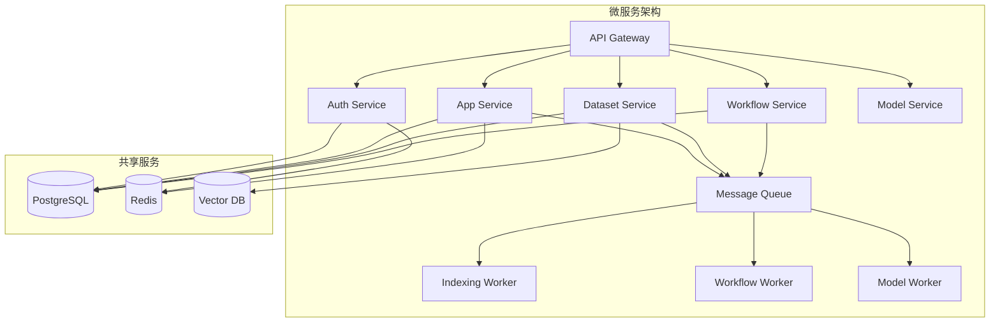

# Dify 项目优化建议

## 1. 架构层面优化

### 1.1 服务拆分与微服务化

**现状问题**：
- 当前是单体应用，所有功能耦合在一个 Flask 应用中
- 模块之间存在循环依赖风险
- 扩容时必须整体扩展，资源利用率不高

**优化方案**：



**拆分建议**：

1. **Auth Service**（认证服务）
   - 职责：用户认证、租户管理、权限校验
   - 独立部署，其他服务通过 JWT 验证

2. **Dataset Service**（数据集服务）
   - 职责：文档管理、向量索引、知识库检索
   - 高 I/O 密集，独立扩展

3. **Workflow Service**（工作流服务）
   - 职责：工作流执行、节点调度、状态管理
   - 有状态服务，需要特殊处理

4. **Model Service**（模型服务）
   - 职责：LLM 调用、模型配置、提供商管理
   - 统一模型调用入口

**收益评估**：
- ✅ 独立扩展：Dataset Service 可单独扩容应对检索高峰
- ✅ 隔离故障：单个服务故障不影响全局
- ✅ 技术栈多样化：可针对不同服务选择最佳技术
- ❌ 复杂度提升：需要服务发现、分布式追踪、API 网关

---

### 1.2 GraphQL API 替代 REST

**现状问题**：
- REST API 容易过度获取（Over-fetching）或获取不足（Under-fetching）
- 前端需要多次请求才能获取完整数据
- API 版本管理复杂

**优化方案**：

```python
# 使用 Strawberry GraphQL
import strawberry
from strawberry.flask.views import GraphQLView

@strawberry.type
class Message:
    id: str
    query: str
    answer: str
    created_at: str
    
    @strawberry.field
    def conversation(self) -> "Conversation":
        """关联查询，按需加载"""
        return Conversation.query.get(self.conversation_id)

@strawberry.type
class Query:
    @strawberry.field
    def message(self, id: str) -> Message:
        return Message.query.get(id)
    
    @strawberry.field
    def messages(
        self, 
        app_id: str, 
        limit: int = 20,
        cursor: str | None = None
    ) -> list[Message]:
        """支持游标分页"""
        return get_messages_cursor_pagination(app_id, cursor, limit)

schema = strawberry.Schema(query=Query)
app.add_url_rule('/graphql', view_func=GraphQLView.as_view('graphql', schema=schema))
```

**GraphQL 查询示例**：
```graphql
query GetMessage($id: ID!) {
  message(id: $id) {
    id
    query
    answer
    conversation {
      id
      name
      # 按需加载对话信息
    }
  }
}
```

**收益**：
- ✅ 精确获取：前端指定需要的字段
- ✅ 减少请求：一次请求获取多层关联数据
- ✅ 类型安全：自动生成 TypeScript 类型定义
- ❌ 查询复杂度控制：需要防止恶意深度查询

---

### 1.3 事件驱动架构

**现状问题**：
- 同步调用链路长，任何一环故障都会影响整体
- 跨模块通信紧耦合

**优化方案**：

```python
# 事件总线
class EventBus:
    def __init__(self, redis_client):
        self.redis = redis_client
        self.handlers = {}
    
    def subscribe(self, event_type: str, handler):
        """订阅事件"""
        if event_type not in self.handlers:
            self.handlers[event_type] = []
        self.handlers[event_type].append(handler)
    
    def publish(self, event: Event):
        """发布事件"""
        # 1. 发布到 Redis Stream
        self.redis.xadd(
            f"events:{event.type}",
            {'data': json.dumps(event.to_dict())}
        )
        
        # 2. 本地处理器（同步）
        for handler in self.handlers.get(event.type, []):
            handler(event)

# 事件定义
@dataclass
class DocumentIndexedEvent:
    type: str = "document.indexed"
    document_id: str
    dataset_id: str
    segment_count: int

# 订阅者
def on_document_indexed(event: DocumentIndexedEvent):
    """文档索引完成后，更新统计信息"""
    dataset = Dataset.query.get(event.dataset_id)
    dataset.document_count += 1
    dataset.segment_count += event.segment_count
    db.session.commit()

event_bus.subscribe("document.indexed", on_document_indexed)

# 发布者
def index_document(document_id: str):
    # 索引逻辑...
    segments = process_document(document_id)
    
    # 发布事件（解耦）
    event_bus.publish(DocumentIndexedEvent(
        document_id=document_id,
        dataset_id=dataset_id,
        segment_count=len(segments)
    ))
```

**应用场景**：
- 文档索引完成 -> 更新统计、发送通知
- 用户注册 -> 发送欢迎邮件、创建默认应用
- 对话创建 -> 记录审计日志、统计分析

---

## 2. 数据库层优化

### 2.1 分库分表

**现状问题**：
- 单表数据量过大（如 `messages` 表可能达到千万级）
- 查询性能下降
- 备份恢复时间长

**优化方案**：

#### 垂直拆分（按业务）
```python
# 当前：所有表在一个数据库
Database: dify
  - accounts
  - apps
  - messages
  - datasets
  - documents
  - workflows

# 优化：按业务拆分
Database: dify_user      # 用户与租户
Database: dify_app       # 应用与对话
Database: dify_dataset   # 数据集与文档
Database: dify_workflow  # 工作流
```

#### 水平拆分（按租户）
```python
class ShardingRouter:
    def __init__(self, shard_count: int = 8):
        self.shard_count = shard_count
    
    def get_shard(self, tenant_id: str) -> str:
        """根据租户 ID 计算分片"""
        shard_index = int(hashlib.md5(tenant_id.encode()).hexdigest(), 16) % self.shard_count
        return f"shard_{shard_index}"
    
    def get_session(self, tenant_id: str):
        """获取对应分片的数据库会话"""
        shard = self.get_shard(tenant_id)
        engine = db.get_engine(app, bind=shard)
        return sessionmaker(bind=engine)()

# 使用
router = ShardingRouter()
session = router.get_session(tenant_id)
messages = session.query(Message).filter_by(app_id=app_id).all()
```

**收益**：
- ✅ 单表数据量降低，查询更快
- ✅ 分散 I/O 压力
- ✅ 故障隔离（单个分片故障不影响其他租户）
- ❌ 跨分片查询困难
- ❌ 事务一致性难以保证

---

### 2.2 时序数据优化

**问题**：
- `messages`、`workflow_node_executions` 等表是典型的时序数据
- 历史数据查询频率低但占用大量空间

**优化方案**：

#### 使用 TimescaleDB
```sql
-- 将 messages 表转换为超表
SELECT create_hypertable('messages', 'created_at');

-- 自动分区（按时间）
-- 数据会自动按月分区存储

-- 设置数据保留策略
SELECT add_retention_policy('messages', INTERVAL '90 days');
-- 90 天前的数据自动删除或归档
```

#### 冷热数据分离
```python
# 热数据（近 30 天）：存储在 PostgreSQL
# 温数据（30-90 天）：存储在 PostgreSQL（压缩分区）
# 冷数据（90 天以上）：归档到对象存储（如 S3）

class MessageArchiver:
    def archive_old_messages(self, days: int = 90):
        """归档旧消息到 S3"""
        cutoff_date = datetime.now() - timedelta(days=days)
        
        # 1. 查询旧消息
        old_messages = (
            Message.query
            .filter(Message.created_at < cutoff_date)
            .limit(10000)
            .all()
        )
        
        # 2. 导出为 Parquet 文件
        df = pd.DataFrame([msg.to_dict() for msg in old_messages])
        parquet_file = f"messages_{cutoff_date.strftime('%Y%m')}.parquet"
        df.to_parquet(parquet_file, compression='snappy')
        
        # 3. 上传到 S3
        s3_client.upload_file(parquet_file, 'dify-archive', parquet_file)
        
        # 4. 删除原始数据
        Message.query.filter(
            Message.id.in_([msg.id for msg in old_messages])
        ).delete(synchronize_session=False)
        db.session.commit()
```

---

### 2.3 读写分离与缓存一体化

**优化方案**：

```python
class CachedReadReplica:
    def __init__(self, redis_client, read_replica_dsn: str):
        self.redis = redis_client
        self.engine = create_engine(read_replica_dsn)
        self.session = sessionmaker(bind=self.engine)
    
    def query_with_cache(
        self, 
        model, 
        filters: dict, 
        ttl: int = 300
    ):
        """查询时先查缓存，再查从库"""
        # 1. 生成缓存键
        cache_key = f"query:{model.__tablename__}:{json.dumps(filters, sort_keys=True)}"
        
        # 2. 查询缓存
        cached = self.redis.get(cache_key)
        if cached:
            return json.loads(cached)
        
        # 3. 查询从库
        with self.session() as session:
            result = session.query(model).filter_by(**filters).all()
            data = [item.to_dict() for item in result]
        
        # 4. 写入缓存
        self.redis.setex(cache_key, ttl, json.dumps(data))
        
        return data

# 使用
cached_replica = CachedReadReplica(redis_client, REPLICA_DSN)
messages = cached_replica.query_with_cache(
    Message, 
    {'app_id': app_id}, 
    ttl=600
)
```

---

## 3. 向量检索优化

### 3.1 多路召回融合优化

**现状问题**：
- RRF (Reciprocal Rank Fusion) 简单，但未考虑不同召回路的置信度
- 向量检索和全文检索权重固定

**优化方案**：

```python
class AdaptiveHybridRetrieval:
    def __init__(self):
        # 学习不同查询类型的最佳权重
        self.weight_model = self._load_weight_model()
    
    def retrieve(self, query: str, top_k: int):
        # 1. 多路召回
        vector_docs = self._vector_search(query, top_k * 2)
        fulltext_docs = self._fulltext_search(query, top_k * 2)
        keyword_docs = self._keyword_search(query, top_k * 2)
        
        # 2. 特征提取（查询长度、实体密度、语义复杂度等）
        query_features = self._extract_features(query)
        
        # 3. 预测最佳权重
        weights = self.weight_model.predict(query_features)
        # weights = [0.6, 0.3, 0.1]  # [向量, 全文, 关键词]
        
        # 4. 加权融合
        merged_docs = self._weighted_fusion(
            [vector_docs, fulltext_docs, keyword_docs],
            weights
        )
        
        return merged_docs[:top_k]
    
    def _weighted_fusion(self, doc_lists: list, weights: list):
        """加权融合多路召回结果"""
        scores = {}
        
        for docs, weight in zip(doc_lists, weights):
            for rank, doc in enumerate(docs):
                doc_id = doc['id']
                # 加权 RRF
                score = weight / (60 + rank)
                scores[doc_id] = scores.get(doc_id, 0) + score
        
        # 按分数排序
        sorted_docs = sorted(scores.items(), key=lambda x: x[1], reverse=True)
        return [self._get_doc_by_id(doc_id) for doc_id, _ in sorted_docs]
```

### 3.2 向量量化与索引优化

**优化方案**：

```python
# 使用 Faiss 进行向量量化和索引
import faiss

class OptimizedVectorIndex:
    def __init__(self, dimension: int = 1536):
        self.dimension = dimension
        
        # HNSW + PQ 混合索引
        self.index = faiss.IndexHNSWPQ(
            dimension,      # 向量维度
            32,             # PQ 子空间数
            64              # HNSW 图的 M 参数
        )
        self.index.hnsw.efConstruction = 40
        self.index.hnsw.efSearch = 16
    
    def add_vectors(self, vectors: np.ndarray):
        """批量添加向量（支持百万级）"""
        # 先训练 PQ
        if not self.index.is_trained:
            self.index.train(vectors)
        
        # 添加向量
        self.index.add(vectors)
    
    def search(self, query_vector: np.ndarray, top_k: int):
        """高效搜索"""
        distances, indices = self.index.search(query_vector, top_k)
        return indices[0], distances[0]
```

**性能对比**：

| 索引类型 | 100万向量查询时间 | 内存占用 | 准确率 |
|---------|-----------------|---------|--------|
| Flat (暴力) | 1000ms | 6GB | 100% |
| HNSW | 50ms | 8GB | 99% |
| PQ | 20ms | 500MB | 95% |
| HNSW+PQ | 30ms | 2GB | 98% |

---

### 3.3 Embedding 缓存

**优化方案**：

```python
class EmbeddingCache:
    def __init__(self, redis_client):
        self.redis = redis_client
        self.model = EmbeddingModel()
    
    def get_embedding(self, text: str) -> list[float]:
        """获取 Embedding（带缓存）"""
        # 1. 计算文本哈希
        text_hash = hashlib.sha256(text.encode()).hexdigest()
        cache_key = f"embedding:{text_hash}"
        
        # 2. 查询缓存
        cached = self.redis.get(cache_key)
        if cached:
            return json.loads(cached)
        
        # 3. 计算 Embedding
        embedding = self.model.encode(text)
        
        # 4. 缓存（7 天过期）
        self.redis.setex(cache_key, 7 * 24 * 3600, json.dumps(embedding))
        
        return embedding
```

**收益**：
- 相同查询直接从缓存返回，避免重复计算
- Embedding 计算是 CPU 密集型操作，缓存可节省大量资源

---

## 4. 工作流引擎优化

### 4.1 DAG 预编译

**现状问题**：
- 每次执行工作流都要解析 JSON、构建图结构
- 重复工作流浪费计算资源

**优化方案**：

```python
class WorkflowCompiler:
    def compile(self, workflow_json: dict) -> CompiledWorkflow:
        """预编译工作流"""
        # 1. 构建 DAG
        graph = self._build_graph(workflow_json['nodes'], workflow_json['edges'])
        
        # 2. 拓扑排序
        sorted_nodes = self._topological_sort(graph)
        
        # 3. 识别可并行节点
        parallel_groups = self._identify_parallel_groups(sorted_nodes)
        
        # 4. 生成执行计划
        execution_plan = ExecutionPlan(
            nodes=sorted_nodes,
            parallel_groups=parallel_groups,
            dependencies=graph.get_dependencies()
        )
        
        # 5. 缓存编译结果
        cache_key = f"compiled_workflow:{workflow_json['id']}"
        redis_client.setex(cache_key, 3600, pickle.dumps(execution_plan))
        
        return execution_plan

# 使用
compiler = WorkflowCompiler()
plan = compiler.compile(workflow_json)

# 执行时直接使用编译好的计划
engine.execute(plan, inputs)
```

### 4.2 节点级缓存

**优化方案**：

```python
@dataclass
class NodeExecutionCache:
    """节点执行结果缓存"""
    
    @staticmethod
    def cache_key(node_id: str, inputs: dict) -> str:
        """生成缓存键"""
        input_hash = hashlib.md5(
            json.dumps(inputs, sort_keys=True).encode()
        ).hexdigest()
        return f"node_cache:{node_id}:{input_hash}"
    
    @staticmethod
    def get(node_id: str, inputs: dict):
        """获取缓存的节点执行结果"""
        key = NodeExecutionCache.cache_key(node_id, inputs)
        cached = redis_client.get(key)
        if cached:
            return json.loads(cached)
        return None
    
    @staticmethod
    def set(node_id: str, inputs: dict, outputs: dict, ttl: int = 3600):
        """缓存节点执行结果"""
        key = NodeExecutionCache.cache_key(node_id, inputs)
        redis_client.setex(key, ttl, json.dumps(outputs))

# 在节点执行时使用
class CachedLLMNode(LLMNode):
    def _run(self):
        inputs = self.get_inputs()
        
        # 1. 尝试从缓存获取
        cached_result = NodeExecutionCache.get(self.id, inputs)
        if cached_result:
            return NodeRunResult(
                status=WorkflowNodeExecutionStatus.SUCCEEDED,
                outputs=cached_result
            )
        
        # 2. 执行节点
        result = super()._run()
        
        # 3. 缓存结果
        NodeExecutionCache.set(self.id, inputs, result.outputs, ttl=1800)
        
        return result
```

**适用节点**：
- LLM Node（相同 Prompt 可复用）
- HTTP Request Node（幂等请求）
- Code Node（纯函数）

---

## 5. LLM 调用优化

### 5.1 Prompt 压缩

**优化方案**：

```python
class PromptCompressor:
    def compress(self, prompt: str, max_tokens: int) -> str:
        """压缩 Prompt 以节省 Token"""
        # 1. 移除多余空格和换行
        compressed = re.sub(r'\s+', ' ', prompt).strip()
        
        # 2. 提取关键句子（使用 TextRank）
        if self._count_tokens(compressed) > max_tokens:
            sentences = self._split_sentences(compressed)
            ranked = self._textrank(sentences)
            
            # 保留 Top 句子，直到达到 Token 限制
            result = []
            token_count = 0
            for sentence in ranked:
                tokens = self._count_tokens(sentence)
                if token_count + tokens > max_tokens:
                    break
                result.append(sentence)
                token_count += tokens
            
            compressed = ' '.join(result)
        
        return compressed
```

### 5.2 流式解码优化

**优化方案**：

```python
class StreamingDecoder:
    def __init__(self):
        self.buffer = ""
        self.sentence_endings = {'.', '!', '?', '。', '！', '？'}
    
    def decode_chunk(self, chunk: str) -> tuple[str, bool]:
        """
        解码流式 Token
        返回：(完整句子, 是否缓冲中)
        """
        self.buffer += chunk
        
        # 检查是否有完整句子
        for ending in self.sentence_endings:
            if ending in self.buffer:
                sentences = self.buffer.split(ending)
                complete = ending.join(sentences[:-1]) + ending
                self.buffer = sentences[-1]
                return complete, False
        
        # 缓冲区达到一定长度后，强制输出
        if len(self.buffer) > 50:
            result = self.buffer
            self.buffer = ""
            return result, False
        
        return "", True  # 继续缓冲

# 使用
decoder = StreamingDecoder()
for chunk in llm_stream():
    sentence, is_buffering = decoder.decode_chunk(chunk)
    if sentence:
        yield sentence
```

**收益**：
- 更自然的流式输出（按句子输出，而不是按 Token）
- 减少前端渲染次数

---

### 5.3 批量 Embedding 优化

**优化方案**：

```python
class BatchEmbeddingProcessor:
    def __init__(self, batch_size: int = 32):
        self.batch_size = batch_size
        self.queue = []
        self.futures = []
    
    def add_text(self, text: str) -> concurrent.futures.Future:
        """添加文本到批处理队列"""
        future = concurrent.futures.Future()
        self.queue.append((text, future))
        self.futures.append(future)
        
        if len(self.queue) >= self.batch_size:
            self._process_batch()
        
        return future
    
    def _process_batch(self):
        """批量处理 Embedding"""
        if not self.queue:
            return
        
        texts = [item[0] for item in self.queue]
        futures = [item[1] for item in self.queue]
        
        # 批量调用 Embedding API
        embeddings = embedding_model.encode(texts)
        
        # 设置 Future 结果
        for future, embedding in zip(futures, embeddings):
            future.set_result(embedding)
        
        self.queue.clear()

# 使用
processor = BatchEmbeddingProcessor()

# 异步添加多个文本
futures = [processor.add_text(text) for text in texts]

# 等待所有结果
embeddings = [future.result() for future in futures]
```

**性能提升**：
- 单次调用：10 个文本 = 10 次 API 请求 = 1000ms
- 批量调用：10 个文本 = 1 次 API 请求 = 150ms
- **提升 6-7 倍**

---

## 6. 前端性能优化

### 6.1 虚拟滚动

**问题**：
- 对话历史可能有数千条消息
- 全部渲染会导致页面卡顿

**优化方案**：

```typescript
// 使用 react-window 实现虚拟滚动
import { FixedSizeList } from 'react-window';

const MessageList = ({ messages }) => {
  const Row = ({ index, style }) => (
    <div style={style}>
      <MessageItem message={messages[index]} />
    </div>
  );

  return (
    <FixedSizeList
      height={600}           // 可见高度
      itemCount={messages.length}
      itemSize={80}          // 每项高度
      width="100%"
    >
      {Row}
    </FixedSizeList>
  );
};
```

### 6.2 SSE 消息合并

**优化方案**：

```typescript
class SSEMessageBatcher {
  private buffer: string[] = [];
  private timer: NodeJS.Timeout | null = null;
  
  add(chunk: string) {
    this.buffer.push(chunk);
    
    // 防抖：50ms 内的消息合并渲染
    if (this.timer) clearTimeout(this.timer);
    
    this.timer = setTimeout(() => {
      this.flush();
    }, 50);
  }
  
  flush() {
    if (this.buffer.length === 0) return;
    
    const merged = this.buffer.join('');
    this.onMessage(merged);
    
    this.buffer = [];
    this.timer = null;
  }
  
  onMessage: (text: string) => void;
}
```

---

## 7. 监控与可观测性优化

### 7.1 分布式追踪

**优化方案**：

```python
from opentelemetry import trace
from opentelemetry.exporter.otlp.proto.grpc.trace_exporter import OTLPSpanExporter
from opentelemetry.sdk.trace import TracerProvider
from opentelemetry.sdk.trace.export import BatchSpanProcessor

# 初始化追踪
tracer_provider = TracerProvider()
span_processor = BatchSpanProcessor(OTLPSpanExporter(endpoint="http://jaeger:4317"))
tracer_provider.add_span_processor(span_processor)
trace.set_tracer_provider(tracer_provider)

tracer = trace.get_tracer(__name__)

# 在关键路径添加追踪
def process_chat_message(message: str):
    with tracer.start_as_current_span("chat.process") as span:
        span.set_attribute("message.length", len(message))
        
        # 子 Span：知识库检索
        with tracer.start_as_current_span("knowledge.retrieval"):
            docs = retrieve_documents(message)
            span.set_attribute("docs.count", len(docs))
        
        # 子 Span：LLM 调用
        with tracer.start_as_current_span("llm.invoke"):
            response = llm_invoke(message, docs)
            span.set_attribute("response.tokens", len(response))
        
        return response
```

**收益**：
- 可视化请求链路
- 定位性能瓶颈
- 发现异常调用

---

### 7.2 慢查询分析

**优化方案**：

```python
# SQLAlchemy 慢查询日志
import logging
from sqlalchemy import event
from sqlalchemy.engine import Engine

@event.listens_for(Engine, "before_cursor_execute")
def receive_before_cursor_execute(conn, cursor, statement, params, context, executemany):
    conn.info.setdefault('query_start_time', []).append(time.time())

@event.listens_for(Engine, "after_cursor_execute")
def receive_after_cursor_execute(conn, cursor, statement, params, context, executemany):
    total_time = time.time() - conn.info['query_start_time'].pop()
    
    # 记录慢查询（>100ms）
    if total_time > 0.1:
        logger.warning(
            f"Slow query: {total_time:.2f}s\n{statement}\nParams: {params}"
        )
        
        # 上报到监控系统
        metrics.histogram('db.query.duration', total_time, tags={
            'table': extract_table_name(statement),
            'slow': True
        })
```

---

## 8. 成本优化

### 8.1 LLM 调用成本控制

**优化方案**：

```python
class CostOptimizedLLMRouter:
    def select_model(self, query: str, context_length: int):
        """根据查询复杂度选择模型"""
        # 简单查询 -> 便宜模型
        if self._is_simple_query(query) and context_length < 1000:
            return "gpt-3.5-turbo"  # $0.5 / 1M tokens
        
        # 需要推理能力 -> 中等模型
        elif self._requires_reasoning(query):
            return "gpt-4o-mini"     # $0.15 / 1M tokens
        
        # 复杂任务 -> 高级模型
        else:
            return "gpt-4o"          # $2.5 / 1M tokens
    
    def _is_simple_query(self, query: str) -> bool:
        """判断是否为简单查询"""
        # 问候语、简单问答
        return any(keyword in query.lower() for keyword in ['hello', 'hi', 'thanks'])
```

### 8.2 向量存储成本优化

**优化方案**：

1. **低维度 Embedding**：
   - 使用 384 维模型（all-MiniLM-L6-v2）代替 1536 维（OpenAI）
   - 存储空间减少 75%，查询速度提升 2-3 倍

2. **标量量化**：
   - 将 float32 向量量化为 int8
   - 存储空间减少 75%，准确率损失 < 1%

3. **文档去重**：
   ```python
   def deduplicate_documents(documents: list[str]) -> list[str]:
       """基于 SimHash 的文档去重"""
       seen_hashes = set()
       unique_docs = []
       
       for doc in documents:
           doc_hash = simhash(doc)
           if doc_hash not in seen_hashes:
               seen_hashes.add(doc_hash)
               unique_docs.append(doc)
       
       return unique_docs
   ```

---

## 总结

以上优化建议按优先级排序：

### 高优先级（立即实施）
1. ✅ 数据库索引优化
2. ✅ 多级缓存架构
3. ✅ Embedding 缓存
4. ✅ 慢查询监控

### 中优先级（3-6 个月）
1. ✅ 读写分离
2. ✅ 节点级缓存
3. ✅ 批量 Embedding
4. ✅ 成本优化

### 低优先级（长期规划）
1. ✅ 微服务拆分
2. ✅ GraphQL API
3. ✅ 分库分表
4. ✅ 事件驱动架构

**实施建议**：
- 每个优化点需要进行 A/B 测试验证效果
- 优先优化 ROI 高的项目（投入小、收益大）
- 监控指标先行，避免盲目优化

