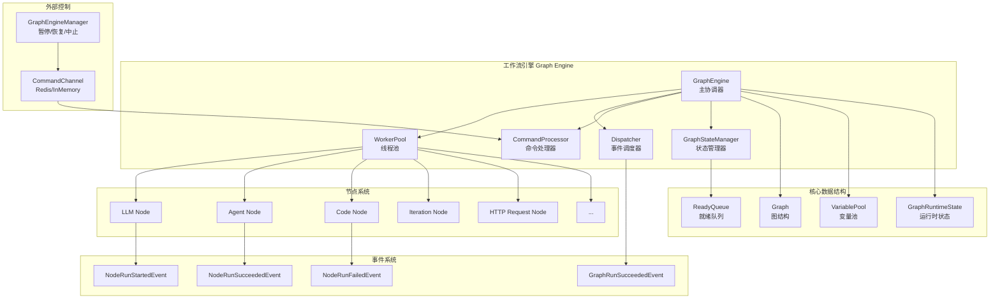
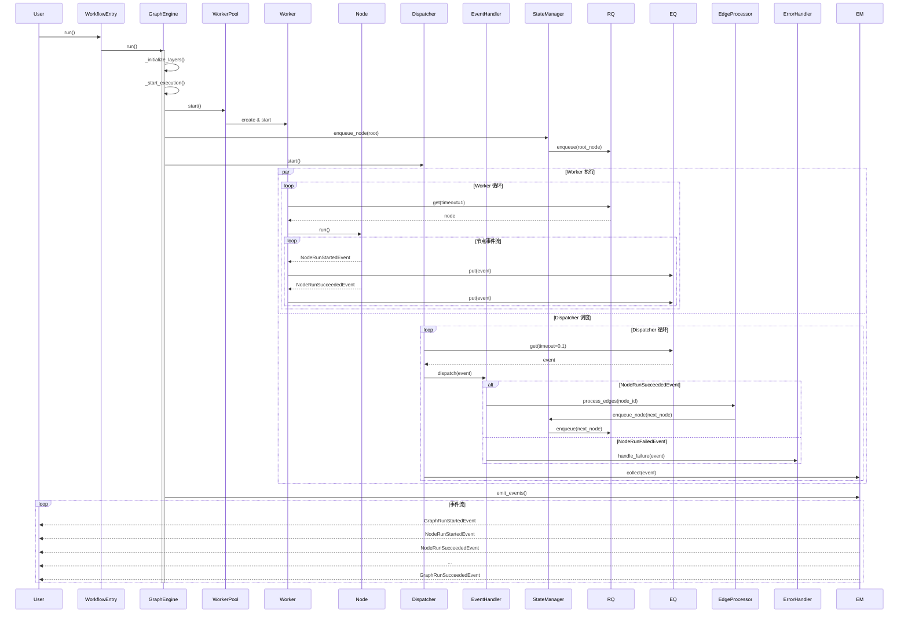
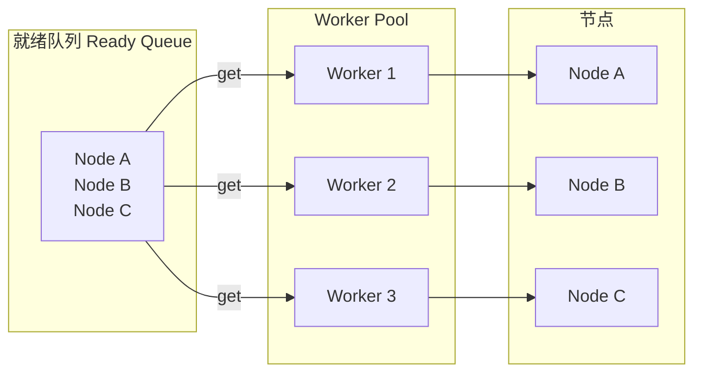
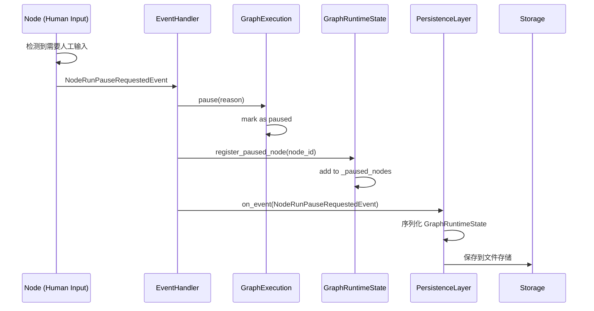
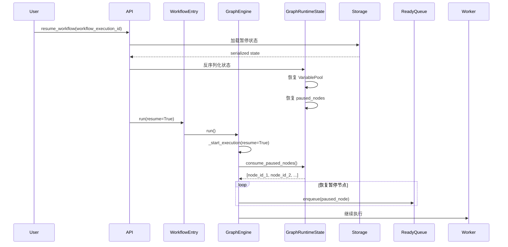

# Dify 工作流（Workflow）设计与实现

## 目录
1. [工作流架构概览](#一工作流架构概览)
2. [核心组件详解](#二核心组件详解)
3. [工作流执行流程](#三工作流执行流程)
4. [节点系统](#四节点系统)
5. [变量池与状态管理](#五变量池与状态管理)
6. [事件系统](#六事件系统)
7. [并发执行机制](#七并发执行机制)
8. [暂停与恢复](#八暂停与恢复)
9. [扩展性设计](#九扩展性设计)

---

## 一、工作流架构概览

### 1.1 整体架构图



### 1.2 设计原则

Dify 工作流引擎基于以下核心设计原则：

1. **队列驱动（Queue-Based）**
   - 使用就绪队列（ReadyQueue）管理待执行节点
   - 事件队列（EventQueue）处理节点执行事件
   - 解耦节点执行与事件处理

2. **事件驱动（Event-Driven）**
   - 所有节点执行通过事件通知
   - 支持流式输出（Streaming）
   - 易于监控和调试

3. **模块化架构（Modular Architecture）**
   - 严格的模块依赖规则
   - 可插拔的层系统（Layer System）
   - 清晰的职责分离

4. **领域驱动设计（DDD）**
   - 领域模型与基础设施分离
   - 使用 Protocol 定义接口
   - 依赖倒置原则

---

## 二、核心组件详解

### 2.1 GraphEngine - 主协调器

`GraphEngine` 是工作流执行的核心协调器。

**代码位置**: `api/core/workflow/graph_engine/graph_engine.py`

```python
@final
class GraphEngine:
    """
    队列驱动的图执行引擎
    
    职责：
    - 协调所有子系统
    - 管理工作流生命周期
    - 处理层（Layer）扩展
    """
    
    def __init__(
        self,
        workflow_id: str,
        graph: Graph,
        graph_runtime_state: GraphRuntimeState,
        command_channel: CommandChannel,
        min_workers: int | None = None,
        max_workers: int | None = None,
        scale_up_threshold: int | None = None,
        scale_down_idle_time: float | None = None,
    ) -> None:
        """初始化图引擎及所有子系统"""
        
        # === 核心数据 ===
        self._graph = graph  # 图结构
        self._graph_runtime_state = graph_runtime_state  # 运行时状态
        self._command_channel = command_channel  # 命令通道
        self._graph_execution = graph_runtime_state.graph_execution  # 执行状态
        
        # === 执行队列 ===
        self._ready_queue = graph_runtime_state.ready_queue  # 就绪队列
        self._event_queue: queue.Queue[GraphNodeEventBase] = queue.Queue()  # 事件队列
        
        # === 子系统 ===
        # 1. 状态管理器（管理节点状态和队列操作）
        self._state_manager = GraphStateManager(self._graph, self._ready_queue)
        
        # 2. 响应协调器（处理响应节点输出）
        self._response_coordinator = ResponseStreamCoordinator(...)
        
        # 3. 边处理器（处理节点间的边和条件分支）
        self._edge_processor = EdgeProcessor(
            graph=self._graph,
            state_manager=self._state_manager
        )
        
        # 4. 跳过传播器（处理节点跳过逻辑）
        self._skip_propagator = SkipPropagator(
            graph=self._graph,
            state_manager=self._state_manager
        )
        
        # 5. 事件管理器（收集和发射事件）
        self._event_manager = EventManager()
        
        # 6. 命令处理器（处理外部控制命令）
        self._command_processor = CommandProcessor(
            command_channel=self._command_channel,
            handlers={
                CommandType.ABORT: AbortCommandHandler(),
                CommandType.PAUSE: PauseCommandHandler(),
            },
        )
        
        # 7. 错误处理器（处理节点失败和重试）
        self._error_handler = ErrorHandler(
            graph=self._graph,
            graph_execution=self._graph_execution,
        )
        
        # 8. Worker 池（线程池执行节点）
        flask_app = self._get_flask_app()
        context_vars = contextvars.copy_context()
        
        self._worker_pool = WorkerPool(
            ready_queue=self._ready_queue,
            event_queue=self._event_queue,
            graph=self._graph,
            flask_app=flask_app,
            context_vars=context_vars,
            min_workers=min_workers,
            max_workers=max_workers,
            scale_up_threshold=scale_up_threshold,
            scale_down_idle_time=scale_down_idle_time,
        )
        
        # 9. 执行协调器（协调整体执行生命周期）
        self._execution_coordinator = ExecutionCoordinator(
            graph_execution=self._graph_execution,
            state_manager=self._state_manager,
            command_processor=self._command_processor,
            worker_pool=self._worker_pool,
        )
        
        # 10. 事件处理器注册表（处理所有节点事件）
        self._event_handler_registry = EventHandler(
            graph=self._graph,
            graph_runtime_state=self._graph_runtime_state,
            graph_execution=self._graph_execution,
            response_coordinator=self._response_coordinator,
            event_collector=self._event_manager,
            edge_processor=self._edge_processor,
            state_manager=self._state_manager,
            error_handler=self._error_handler,
        )
        
        # 11. 调度器（调度事件和执行流）
        self._dispatcher = Dispatcher(
            event_queue=self._event_queue,
            event_handler=self._event_handler_registry,
            event_collector=self._event_manager,
            execution_coordinator=self._execution_coordinator,
            event_emitter=self._event_manager,
        )
        
        # === 扩展性 ===
        self._layers: list[GraphEngineLayer] = []  # 可插拔层
    
    def run(self) -> Generator[GraphEngineEvent, None, None]:
        """
        执行图并生成事件流
        
        执行流程：
        1. 初始化层
        2. 启动执行（首次或恢复）
        3. 流式输出事件
        4. 处理完成状态
        """
        try:
            # 初始化层
            self._initialize_layers()
            
            # 判断是否为恢复执行
            is_resume = self._graph_execution.started
            
            if not is_resume:
                # 首次执行
                self._graph_execution.start()
            else:
                # 恢复执行
                self._graph_execution.paused = False
                self._graph_execution.pause_reason = None
            
            # 发射启动事件
            start_event = GraphRunStartedEvent()
            self._event_manager.notify_layers(start_event)
            yield start_event
            
            # 启动执行子系统
            self._start_execution(resume=is_resume)
            
            # 流式输出事件
            yield from self._event_manager.emit_events()
            
            # 处理完成状态
            if self._graph_execution.is_paused:
                # 暂停
                paused_event = GraphRunPausedEvent(
                    reason=self._graph_execution.pause_reason,
                    outputs=self._graph_runtime_state.outputs,
                )
                self._event_manager.notify_layers(paused_event)
                yield paused_event
                
            elif self._graph_execution.aborted:
                # 中止
                aborted_event = GraphRunAbortedEvent(
                    reason=str(self._graph_execution.error),
                    outputs=self._graph_runtime_state.outputs,
                )
                self._event_manager.notify_layers(aborted_event)
                yield aborted_event
                
            elif self._graph_execution.has_error:
                # 失败
                if self._graph_execution.error:
                    raise self._graph_execution.error
                    
            else:
                # 成功
                outputs = self._graph_runtime_state.outputs
                exceptions_count = self._graph_execution.exceptions_count
                
                if exceptions_count > 0:
                    # 部分成功
                    partial_event = GraphRunPartialSucceededEvent(
                        exceptions_count=exceptions_count,
                        outputs=outputs,
                    )
                    self._event_manager.notify_layers(partial_event)
                    yield partial_event
                else:
                    # 完全成功
                    succeeded_event = GraphRunSucceededEvent(outputs=outputs)
                    self._event_manager.notify_layers(succeeded_event)
                    yield succeeded_event
        
        except Exception as e:
            failed_event = GraphRunFailedEvent(
                error=str(e),
                exceptions_count=self._graph_execution.exceptions_count,
            )
            self._event_manager.notify_layers(failed_event)
            yield failed_event
            raise
        
        finally:
            self._stop_execution()
    
    def _start_execution(self, *, resume: bool = False) -> None:
        """启动执行子系统"""
        paused_nodes: list[str] = []
        
        if resume:
            # 恢复执行：获取暂停的节点
            paused_nodes = self._graph_runtime_state.consume_paused_nodes()
        
        # 启动 Worker 池
        self._worker_pool.start()
        
        # 注册响应节点
        for node in self._graph.nodes.values():
            if node.execution_type == NodeExecutionType.RESPONSE:
                self._response_coordinator.register(node.id)
        
        if not resume:
            # 首次执行：入队根节点
            root_node = self._graph.root_node
            self._state_manager.enqueue_node(root_node.id)
            self._state_manager.start_execution(root_node.id)
        else:
            # 恢复执行：入队暂停的节点
            for node_id in paused_nodes:
                self._state_manager.enqueue_node(node_id)
                self._state_manager.start_execution(node_id)
        
        # 启动调度器
        self._dispatcher.start()
    
    def layer(self, layer: GraphEngineLayer) -> "GraphEngine":
        """添加可插拔层"""
        self._layers.append(layer)
        return self
```

**设计亮点**：

1. **子系统解耦**：11 个独立子系统，各司其职
2. **上下文传递**：捕获 Flask 上下文和 ContextVar，传递给 Worker 线程
3. **层系统**：支持可插拔的中间件（如持久化层、调试层）
4. **恢复机制**：支持从暂停状态恢复执行

---

### 2.2 Graph - 图结构

`Graph` 表示工作流的静态结构。

**代码位置**: `api/core/workflow/graph/graph.py`

```python
@final
class Graph:
    """工作流图结构（节点 + 边）"""
    
    def __init__(
        self,
        *,
        nodes: dict[str, Node] | None = None,  # 节点映射
        edges: dict[str, Edge] | None = None,  # 边映射
        in_edges: dict[str, list[str]] | None = None,  # 入边映射
        out_edges: dict[str, list[str]] | None = None,  # 出边映射
        root_node: Node,  # 根节点
    ):
        self.nodes = nodes or {}
        self.edges = edges or {}
        self.in_edges = in_edges or {}
        self.out_edges = out_edges or {}
        self.root_node = root_node
    
    @classmethod
    def init(
        cls,
        *,
        graph_config: Mapping[str, object],  # 前端传来的图配置
        node_factory: "NodeFactory",  # 节点工厂
        root_node_id: str | None = None,
    ) -> "Graph":
        """
        从配置初始化图
        
        步骤：
        1. 解析节点和边配置
        2. 查找根节点
        3. 构建边映射
        4. 创建节点实例
        5. 标记非活跃分支为跳过
        6. 验证图结构
        """
        # 1. 解析配置
        edge_configs = graph_config.get("edges", [])
        node_configs = graph_config.get("nodes", [])
        
        # 过滤掉注释节点
        node_configs = [
            node_config 
            for node_config in node_configs 
            if node_config.get("type", "") != "custom-note"
        ]
        
        # 2. 解析节点配置
        node_configs_map = cls._parse_node_configs(node_configs)
        
        # 3. 查找根节点
        root_node_id = cls._find_root_node_id(
            node_configs_map, 
            edge_configs, 
            root_node_id
        )
        
        # 4. 构建边
        edges, in_edges, out_edges = cls._build_edges(edge_configs)
        
        # 5. 创建节点实例
        nodes = cls._create_node_instances(node_configs_map, node_factory)
        
        # 6. 提升失败分支节点的执行类型
        cls._promote_fail_branch_nodes(nodes)
        
        # 7. 获取根节点实例
        root_node = nodes[root_node_id]
        
        # 8. 标记非活跃根分支为跳过
        cls._mark_inactive_root_branches(
            nodes, edges, in_edges, out_edges, root_node_id
        )
        
        # 9. 创建图实例
        graph = cls(
            nodes=nodes,
            edges=edges,
            in_edges=in_edges,
            out_edges=out_edges,
            root_node=root_node,
        )
        
        # 10. 验证图结构
        get_graph_validator().validate(graph)
        
        return graph
    
    @classmethod
    def _find_root_node_id(
        cls,
        node_configs_map: Mapping[str, Mapping[str, object]],
        edge_configs: Sequence[Mapping[str, object]],
        root_node_id: str | None = None,
    ) -> str:
        """
        查找根节点
        
        策略：
        1. 如果指定了 root_node_id，直接使用
        2. 否则，查找没有入边的节点
        3. 优先选择 START 或 DATASOURCE 类型的节点
        """
        if root_node_id:
            if root_node_id not in node_configs_map:
                raise ValueError(f"Root node id {root_node_id} not found")
            return root_node_id
        
        # 查找没有入边的节点
        nodes_with_incoming: set[str] = set()
        for edge_config in edge_configs:
            target = edge_config.get("target")
            if isinstance(target, str):
                nodes_with_incoming.add(target)
        
        root_candidates = [
            nid 
            for nid in node_configs_map 
            if nid not in nodes_with_incoming
        ]
        
        # 优先选择 START 节点
        start_node_id = None
        for nid in root_candidates:
            node_data = node_configs_map[nid].get("data")
            if not isinstance(node_data, dict):
                continue
            
            node_type = node_data.get("type")
            if node_type in [NodeType.START, NodeType.DATASOURCE]:
                start_node_id = nid
                break
        
        root_node_id = start_node_id or (root_candidates[0] if root_candidates else None)
        
        if not root_node_id:
            raise ValueError("Unable to determine root node ID")
        
        return root_node_id
```

**图验证器**：

```python
class GraphValidationRule(Protocol):
    """图验证规则协议"""
    
    def validate(self, graph: Graph) -> Sequence[GraphValidationIssue]:
        """验证图并返回问题列表"""
        ...

# 内置验证规则
@dataclass(frozen=True, slots=True)
class _EdgeEndpointValidator:
    """验证边的端点是否存在"""
    
    def validate(self, graph: Graph) -> Sequence[GraphValidationIssue]:
        issues: list[GraphValidationIssue] = []
        
        for edge in graph.edges.values():
            # 检查源节点
            if edge.tail not in graph.nodes:
                issues.append(
                    GraphValidationIssue(
                        code="MISSING_NODE",
                        message=f"Edge {edge.id} references unknown source node '{edge.tail}'.",
                        node_id=edge.tail,
                    )
                )
            
            # 检查目标节点
            if edge.head not in graph.nodes:
                issues.append(
                    GraphValidationIssue(
                        code="MISSING_NODE",
                        message=f"Edge {edge.id} references unknown target node '{edge.head}'.",
                        node_id=edge.head,
                    )
                )
        
        return issues
```

---

### 2.3 WorkerPool - 线程池

`WorkerPool` 管理多个 Worker 线程并行执行节点。

**代码位置**: `api/core/workflow/graph_engine/worker_management/worker_pool.py`

```python
class WorkerPool:
    """
    Worker 线程池
    
    特性：
    - 动态伸缩（根据队列大小自动增减线程）
    - 上下文传递（Flask App + ContextVar）
    - 优雅停止
    """
    
    def __init__(
        self,
        ready_queue: ReadyQueue,
        event_queue: queue.Queue[GraphNodeEventBase],
        graph: Graph,
        flask_app: Flask | None,
        context_vars: contextvars.Context,
        min_workers: int | None = None,
        max_workers: int | None = None,
        scale_up_threshold: int | None = None,
        scale_down_idle_time: float | None = None,
    ) -> None:
        self._ready_queue = ready_queue
        self._event_queue = event_queue
        self._graph = graph
        self._flask_app = flask_app
        self._context_vars = context_vars
        
        # 动态伸缩参数
        self._min_workers = min_workers or 1
        self._max_workers = max_workers or 5
        self._scale_up_threshold = scale_up_threshold or 2
        self._scale_down_idle_time = scale_down_idle_time or 10.0
        
        self._workers: list[Worker] = []
        self._stop_event = threading.Event()
    
    def start(self) -> None:
        """启动 Worker 池"""
        initial_workers = self._calculate_initial_workers()
        
        for _ in range(initial_workers):
            self._create_worker()
    
    def _calculate_initial_workers(self) -> int:
        """根据队列大小计算初始 Worker 数量"""
        queue_size = self._ready_queue.size()
        
        # 根据队列大小动态计算
        if queue_size <= 1:
            return self._min_workers
        elif queue_size >= self._scale_up_threshold:
            return min(queue_size, self._max_workers)
        else:
            return self._min_workers
    
    def _create_worker(self) -> None:
        """创建新 Worker 线程"""
        worker = Worker(
            ready_queue=self._ready_queue,
            event_queue=self._event_queue,
            graph=self._graph,
            stop_event=self._stop_event,
            flask_app=self._flask_app,
            context_vars=self._context_vars,
        )
        worker.start()
        self._workers.append(worker)
```

**Worker 线程**：

```python
class Worker(threading.Thread):
    """Worker 线程：从就绪队列获取节点并执行"""
    
    def run(self) -> None:
        """Worker 主循环"""
        while not self._stop_event.is_set():
            try:
                # 从就绪队列获取节点（超时 1 秒）
                node = self._ready_queue.get(timeout=1.0)
                
                if node is None:
                    # 毒丸（停止信号）
                    break
                
                # 执行节点
                self._execute_node(node)
                
            except queue.Empty:
                # 队列为空，继续等待
                continue
            except Exception as e:
                logger.exception("Worker encountered error: %s", e)
    
    def _execute_node(self, node: Node) -> None:
        """
        执行节点并转发事件
        
        关键：
        - 使用 preserve_flask_contexts 传递 Flask 上下文
        - 流式输出事件（逐个 yield）
        """
        if self._flask_app and self._context_vars:
            # 传递 Flask 上下文
            with preserve_flask_contexts(
                flask_app=self._flask_app,
                context_vars=self._context_vars,
            ):
                # 执行节点（返回生成器）
                node_events = node.run()
                
                # 逐个转发事件
                for event in node_events:
                    self._event_queue.put(event)
        else:
            # 无上下文执行
            node_events = node.run()
            for event in node_events:
                self._event_queue.put(event)
```

---

### 2.4 ReadyQueue - 就绪队列

`ReadyQueue` 管理待执行的节点。

```python
class ReadyQueue:
    """
    就绪队列
    
    功能：
    - 入队节点
    - 出队节点
    - 查询队列大小
    """
    
    def __init__(self) -> None:
        self._queue: queue.Queue[Node] = queue.Queue()
    
    def enqueue(self, node: Node) -> None:
        """入队节点"""
        self._queue.put(node)
    
    def get(self, timeout: float | None = None) -> Node | None:
        """出队节点（阻塞）"""
        try:
            return self._queue.get(timeout=timeout)
        except queue.Empty:
            return None
    
    def size(self) -> int:
        """队列大小"""
        return self._queue.qsize()
```

---

## 三、工作流执行流程

### 3.1 执行时序图



### 3.2 详细执行步骤

#### 步骤 1: 初始化

```python
# 1. 创建 WorkflowEntry
entry = WorkflowEntry(
    tenant_id=tenant_id,
    app_id=app_id,
    workflow_id=workflow_id,
    graph_config=workflow.graph_dict,
    graph=graph,
    user_id=user_id,
    user_from=UserFrom.ACCOUNT,
    invoke_from=InvokeFrom.SERVICE_API,
    call_depth=0,
    variable_pool=variable_pool,
    graph_runtime_state=graph_runtime_state,
    command_channel=RedisChannel(...),  # Redis 命令通道
)

# 2. 运行工作流
for event in entry.run():
    # 流式处理事件
    handle_event(event)
```

#### 步骤 2: 启动执行

```python
def _start_execution(self, *, resume: bool = False) -> None:
    """启动执行"""
    
    # 1. 启动 Worker 池
    self._worker_pool.start()  # 创建多个 Worker 线程
    
    # 2. 注册响应节点
    for node in self._graph.nodes.values():
        if node.execution_type == NodeExecutionType.RESPONSE:
            self._response_coordinator.register(node.id)
    
    # 3. 入队根节点
    if not resume:
        root_node = self._graph.root_node
        self._state_manager.enqueue_node(root_node.id)
        self._state_manager.start_execution(root_node.id)
    else:
        # 恢复执行：入队暂停的节点
        for node_id in paused_nodes:
            self._state_manager.enqueue_node(node_id)
            self._state_manager.start_execution(node_id)
    
    # 4. 启动调度器
    self._dispatcher.start()
```

#### 步骤 3: Worker 执行节点

```python
# Worker 线程主循环
def run(self) -> None:
    while not self._stop_event.is_set():
        try:
            # 1. 从就绪队列获取节点
            node = self._ready_queue.get(timeout=1.0)
            
            if node is None:
                break  # 毒丸，停止
            
            # 2. 执行节点
            node_events = node.run()
            
            # 3. 逐个转发事件到事件队列
            for event in node_events:
                self._event_queue.put(event)
        
        except queue.Empty:
            continue
```

#### 步骤 4: Dispatcher 调度事件

```python
def start(self) -> None:
    """调度器主循环"""
    while not self._should_stop():
        try:
            # 1. 从事件队列获取事件
            event = self._event_queue.get(timeout=0.1)
            
            # 2. 处理命令（如暂停、中止）
            self._execution_coordinator.process_commands()
            
            # 3. 分发事件
            self._event_handler.dispatch(event)
            
            # 4. 收集事件（用于后续流式输出）
            self._event_collector.collect(event)
        
        except queue.Empty:
            # 检查执行是否完成
            if self._execution_coordinator.is_execution_complete():
                break
```

#### 步骤 5: EventHandler 处理事件

```python
@singledispatch
def dispatch(self, event: GraphNodeEventBase) -> None:
    """分发事件到具体处理器"""
    ...

@dispatch.register
def _(self, event: NodeRunSucceededEvent) -> None:
    """处理节点成功事件"""
    
    # 1. 更新节点执行状态
    node_execution = self._graph_execution.get_or_create_node_execution(event.node_id)
    node_execution.mark_completed()
    
    # 2. 累计 LLM 使用量
    self._accumulate_node_usage(event.node_run_result.llm_usage)
    
    # 3. 处理边（查找下游节点）
    ready_nodes, edge_events = self._edge_processor.process_edges(event.node_id)
    
    # 4. 发射边事件
    for edge_event in edge_events:
        self._event_collector.collect(edge_event)
    
    # 5. 入队就绪节点
    for node_id in ready_nodes:
        self._state_manager.enqueue_node(node_id)
        self._state_manager.start_execution(node_id)
    
    # 6. 标记节点执行完成
    self._state_manager.finish_execution(event.node_id)
    
    # 7. 收集事件
    self._event_collector.collect(event)
```

---

## 四、节点系统

### 4.1 节点类型

Dify 支持多种节点类型：

| 节点类型 | 说明 | 代码位置 |
|---------|------|---------|
| **START** | 工作流入口 | `nodes/start/` |
| **END** | 工作流出口 | `nodes/end/` |
| **LLM** | 大模型调用 | `nodes/llm/` |
| **Agent** | 智能体节点 | `nodes/agent/` |
| **CODE** | 代码执行 | `nodes/code/` |
| **HTTP_REQUEST** | HTTP 请求 | `nodes/http_request/` |
| **TOOL** | 工具调用 | `nodes/tool/` |
| **KNOWLEDGE_RETRIEVAL** | 知识库检索 | `nodes/knowledge_retrieval/` |
| **IF_ELSE** | 条件分支 | `nodes/if_else/` |
| **ITERATION** | 迭代节点 | `nodes/iteration/` |
| **LOOP** | 循环节点 | `nodes/loop/` |
| **VARIABLE_ASSIGNER** | 变量赋值 | `nodes/variable_assigner/` |
| **VARIABLE_AGGREGATOR** | 变量聚合 | `nodes/variable_aggregator/` |
| **PARAMETER_EXTRACTOR** | 参数提取 | `nodes/parameter_extractor/` |
| **QUESTION_CLASSIFIER** | 问题分类 | `nodes/question_classifier/` |
| **DOCUMENT_EXTRACTOR** | 文档提取 | `nodes/document_extractor/` |
| **LIST_OPERATOR** | 列表操作 | `nodes/list_operator/` |
| **TEMPLATE_TRANSFORM** | 模板转换 | `nodes/template_transform/` |
| **ANSWER** | 答案输出 | `nodes/answer/` |
| **HUMAN_INPUT** | 人工输入 | `nodes/human_input/` |

### 4.2 节点基类

**代码位置**: `api/core/workflow/nodes/base/node.py`

```python
class Node:
    """节点基类"""
    
    node_type: ClassVar["NodeType"]  # 节点类型
    execution_type: NodeExecutionType = NodeExecutionType.EXECUTABLE  # 执行类型
    
    def __init__(
        self,
        id: str,
        config: Mapping[str, Any],
        graph_init_params: "GraphInitParams",
        graph_runtime_state: "GraphRuntimeState",
    ) -> None:
        self.id = id
        self.tenant_id = graph_init_params.tenant_id
        self.app_id = graph_init_params.app_id
        self.workflow_id = graph_init_params.workflow_id
        self.graph_config = graph_init_params.graph_config
        self.user_id = graph_init_params.user_id
        self.graph_runtime_state = graph_runtime_state
        self.state: NodeState = NodeState.UNKNOWN
        
        self._node_id = config.get("id")
        self._node_execution_id: str = ""
        self._start_at = naive_utc_now()
    
    @abstractmethod
    def init_node_data(self, data: Mapping[str, Any]) -> None:
        """初始化节点数据（子类实现）"""
        ...
    
    @abstractmethod
    def _run(self) -> NodeRunResult | Generator[NodeEventBase, None, None]:
        """运行节点（子类实现）"""
        raise NotImplementedError
    
    def run(self) -> Generator[GraphNodeEventBase, None, None]:
        """
        运行节点（公共方法）
        
        流程：
        1. 生成节点执行 ID
        2. 发射 NodeRunStartedEvent
        3. 执行节点逻辑（_run）
        4. 处理节点输出
        5. 发射 NodeRunSucceededEvent / NodeRunFailedEvent
        """
        # 1. 生成执行 ID
        self._node_execution_id = str(uuid.uuid4())
        
        # 2. 发射启动事件
        yield NodeRunStartedEvent(
            id=self._node_execution_id,
            node_id=self._node_id,
            node_type=self.node_type,
            node_data=self._node_data.model_dump(),
            parallel_id=self._parallel_id,
            parallel_start_node_id=self._parallel_start_node_id,
        )
        
        try:
            # 3. 执行节点逻辑
            result = self._run()
            
            # 4. 处理结果
            if isinstance(result, Generator):
                # 流式输出（如 LLM 节点）
                for event in result:
                    # 转换为 GraphNodeEvent
                    graph_event = self._to_graph_event(event)
                    yield graph_event
                
                # 获取最终结果
                final_result = self._get_final_result(result)
            else:
                # 直接返回结果
                final_result = result
            
            # 5. 发射成功事件
            yield NodeRunSucceededEvent(
                id=self._node_execution_id,
                node_id=self._node_id,
                node_type=self.node_type,
                node_run_result=final_result,
            )
        
        except Exception as e:
            # 发射失败事件
            yield NodeRunFailedEvent(
                id=self._node_execution_id,
                node_id=self._node_id,
                node_type=self.node_type,
                error=str(e),
            )
```

### 4.3 节点示例：LLM Node

**代码位置**: `api/core/workflow/nodes/llm/node.py`

```python
class LLMNode(Node):
    """LLM 节点"""
    
    node_type = NodeType.LLM
    
    def _run(self) -> Generator[NodeEventBase, None, None]:
        """
        执行 LLM 节点
        
        流程：
        1. 获取模型实例
        2. 构建 Prompt
        3. 调用 LLM（流式）
        4. 处理输出
        """
        # 1. 获取模型实例
        model_instance = ModelManager().get_model_instance(
            tenant_id=self.tenant_id,
            provider=self._node_data.model.provider,
            model_type=ModelType.LLM,
            model=self._node_data.model.name,
        )
        
        # 2. 构建 Prompt
        prompt_messages = self._build_prompt_messages()
        
        # 3. 调用 LLM（流式）
        response = model_instance.invoke(
            model=self._node_data.model.name,
            credentials=model_credentials,
            prompt_messages=prompt_messages,
            model_parameters=model_parameters,
            stream=True,  # 流式输出
            user=self.user_id,
        )
        
        # 4. 处理流式输出
        full_text = ""
        
        for chunk in response:
            if isinstance(chunk, LLMResultChunk):
                delta_text = chunk.delta.message.content
                full_text += delta_text
                
                # 发射文本 chunk 事件
                yield NodeRunStreamChunkEvent(
                    id=self._node_execution_id,
                    node_id=self._node_id,
                    chunk_content=delta_text,
                )
        
        # 5. 返回最终结果
        return NodeRunResult(
            outputs={
                "text": full_text,
                "usage": response.usage,
            },
            llm_usage=LLMUsage(
                prompt_tokens=response.usage.prompt_tokens,
                completion_tokens=response.usage.completion_tokens,
                total_tokens=response.usage.total_tokens,
            ),
        )
```

---

## 五、变量池与状态管理

### 5.1 VariablePool - 变量池

`VariablePool` 是工作流的核心数据结构，存储所有节点的输入输出。

**代码位置**: `api/core/workflow/runtime/variable_pool.py`

```python
class VariablePool(BaseModel):
    """
    变量池
    
    数据结构：
    - 两级字典：{node_id: {variable_name: Variable}}
    - 使用选择器（Selector）访问变量：[node_id, variable_name]
    """
    
    # 变量字典
    variable_dictionary: defaultdict[str, dict[str, VariableUnion]] = Field(
        description="变量映射",
        default=defaultdict(dict),
    )
    
    # 用户输入（仅用于 START 节点）
    user_inputs: Mapping[str, Any] = Field(
        description="用户输入",
        default_factory=dict,
    )
    
    # 系统变量
    system_variables: SystemVariable = Field(
        description="系统变量",
        default_factory=SystemVariable.empty,
    )
    
    # 环境变量
    environment_variables: Sequence[VariableUnion] = Field(
        description="环境变量",
        default_factory=list,
    )
    
    # 对话变量
    conversation_variables: Sequence[VariableUnion] = Field(
        description="对话变量",
        default_factory=list,
    )
    
    def add(self, selector: Sequence[str], value: Any, /) -> None:
        """
        添加变量
        
        Args:
            selector: [node_id, variable_name]
            value: 变量值
        """
        if len(selector) != 2:
            raise ValueError(f"Selector must have 2 elements, got {len(selector)}")
        
        # 转换为 Variable 对象
        if isinstance(value, Variable):
            variable = value
        elif isinstance(value, Segment):
            variable = variable_factory.segment_to_variable(segment=value, selector=selector)
        else:
            segment = variable_factory.build_segment(value)
            variable = variable_factory.segment_to_variable(segment=segment, selector=selector)
        
        node_id, name = selector
        self.variable_dictionary[node_id][name] = variable
    
    def get(self, selector: Sequence[str]) -> VariableUnion | None:
        """
        获取变量
        
        Args:
            selector: [node_id, variable_name] 或 [node_id, variable_name, field_name, ...]
        """
        if not selector:
            return None
        
        node_id = selector[0]
        
        # 处理系统变量
        if node_id == SystemVariableKey.query:
            return self._get_system_variable(selector)
        
        # 处理环境变量
        if node_id == ENVIRONMENT_VARIABLE_NODE_ID:
            return self._get_environment_variable(selector)
        
        # 处理对话变量
        if node_id == CONVERSATION_VARIABLE_NODE_ID:
            return self._get_conversation_variable(selector)
        
        # 处理普通变量
        if len(selector) == 2:
            # 直接访问：[node_id, variable_name]
            node_id, name = selector
            return self.variable_dictionary.get(node_id, {}).get(name)
        else:
            # 嵌套访问：[node_id, variable_name, field1, field2, ...]
            variable = self.variable_dictionary.get(node_id, {}).get(selector[1])
            
            if variable is None:
                return None
            
            # 递归获取嵌套字段
            return self._get_nested_value(variable, selector[2:])
```

**变量选择器示例**：

```python
# 添加变量
variable_pool.add(["llm_node_1", "output"], "Hello, World!")

# 获取变量
text = variable_pool.get(["llm_node_1", "output"])  # "Hello, World!"

# 嵌套访问
variable_pool.add(["http_node_1", "response"], {"status": 200, "data": {"name": "Alice"}})
name = variable_pool.get(["http_node_1", "response", "data", "name"])  # "Alice"
```

---

### 5.2 GraphRuntimeState - 运行时状态

`GraphRuntimeState` 管理工作流的运行时状态。

**代码位置**: `api/core/workflow/runtime/graph_runtime_state.py`

```python
class GraphRuntimeState:
    """工作流运行时状态"""
    
    def __init__(
        self,
        *,
        variable_pool: VariablePool,
        start_at: float,
        total_tokens: int = 0,
        llm_usage: LLMUsage | None = None,
        outputs: dict[str, object] | None = None,
        node_run_steps: int = 0,
        ready_queue: ReadyQueueProtocol | None = None,
        graph_execution: GraphExecutionProtocol | None = None,
        response_coordinator: ResponseStreamCoordinatorProtocol | None = None,
        graph: GraphProtocol | None = None,
    ) -> None:
        self._variable_pool = variable_pool
        self._start_at = start_at
        self._total_tokens = total_tokens
        self._llm_usage = (llm_usage or LLMUsage.empty_usage()).model_copy()
        self._outputs = deepcopy(outputs) if outputs is not None else {}
        self._node_run_steps = node_run_steps
        
        self._ready_queue = ready_queue
        self._graph_execution = graph_execution
        self._response_coordinator = response_coordinator
        self._paused_nodes: set[str] = set()
    
    @property
    def variable_pool(self) -> VariablePool:
        """获取变量池"""
        return self._variable_pool
    
    @property
    def outputs(self) -> dict[str, object]:
        """获取输出"""
        return self._outputs
    
    @property
    def total_tokens(self) -> int:
        """获取总 Token 数"""
        return self._total_tokens
    
    @total_tokens.setter
    def total_tokens(self, value: int) -> None:
        """设置总 Token 数"""
        if value < 0:
            raise ValueError("total_tokens must be non-negative")
        self._total_tokens = value
    
    def register_paused_node(self, node_id: str) -> None:
        """注册暂停的节点"""
        self._paused_nodes.add(node_id)
    
    def consume_paused_nodes(self) -> list[str]:
        """消费暂停的节点（恢复时使用）"""
        nodes = list(self._paused_nodes)
        self._paused_nodes.clear()
        return nodes
```

---

## 六、事件系统

### 6.1 事件类型

Dify 工作流使用事件驱动架构，所有操作通过事件通知。

**代码位置**: `api/core/workflow/graph_events.py`

```python
# === 图级别事件 ===

@dataclass(frozen=True, slots=True)
class GraphRunStartedEvent(GraphEngineEvent):
    """图开始执行"""
    pass

@dataclass(frozen=True, slots=True)
class GraphRunSucceededEvent(GraphEngineEvent):
    """图执行成功"""
    outputs: Mapping[str, object]

@dataclass(frozen=True, slots=True)
class GraphRunFailedEvent(GraphEngineEvent):
    """图执行失败"""
    error: str
    exceptions_count: int

@dataclass(frozen=True, slots=True)
class GraphRunPartialSucceededEvent(GraphEngineEvent):
    """图部分成功（有异常但未中止）"""
    exceptions_count: int
    outputs: Mapping[str, object]

@dataclass(frozen=True, slots=True)
class GraphRunPausedEvent(GraphEngineEvent):
    """图暂停"""
    reason: "PauseReason"
    outputs: Mapping[str, object]

@dataclass(frozen=True, slots=True)
class GraphRunAbortedEvent(GraphEngineEvent):
    """图中止"""
    reason: str
    outputs: Mapping[str, object]

# === 节点级别事件 ===

@dataclass(frozen=True, slots=True)
class NodeRunStartedEvent(GraphNodeEventBase):
    """节点开始执行"""
    id: str  # node_execution_id
    node_id: str
    node_type: NodeType
    node_data: Mapping[str, Any]
    parallel_id: str | None = None
    parallel_start_node_id: str | None = None

@dataclass(frozen=True, slots=True)
class NodeRunSucceededEvent(GraphNodeEventBase):
    """节点执行成功"""
    id: str
    node_id: str
    node_type: NodeType
    node_run_result: NodeRunResult

@dataclass(frozen=True, slots=True)
class NodeRunFailedEvent(GraphNodeEventBase):
    """节点执行失败"""
    id: str
    node_id: str
    node_type: NodeType
    error: str
    node_run_result: NodeRunResult | None = None

@dataclass(frozen=True, slots=True)
class NodeRunStreamChunkEvent(GraphNodeEventBase):
    """节点流式输出"""
    id: str
    node_id: str
    chunk_content: str

@dataclass(frozen=True, slots=True)
class NodeRunPauseRequestedEvent(GraphNodeEventBase):
    """节点请求暂停"""
    id: str
    node_id: str
    reason: "PauseReason"
```

### 6.2 EventManager - 事件管理器

```python
class EventManager:
    """
    事件管理器
    
    职责：
    - 收集事件
    - 缓冲事件
    - 流式发射事件
    - 通知层（Layer）
    """
    
    def __init__(self) -> None:
        self._events: list[GraphEngineEvent] = []
        self._lock = ReadWriteLock()  # 读写锁
        self._layers: list[GraphEngineLayer] = []
    
    def collect(self, event: GraphEngineEvent) -> None:
        """收集事件（写操作）"""
        with self._lock.write_lock():
            self._events.append(event)
            
            # 通知层
            for layer in self._layers:
                try:
                    layer.on_event(event)
                except Exception as e:
                    logger.warning("Layer %s failed on_event: %s", layer.__class__.__name__, e)
    
    def emit_events(self) -> Generator[GraphEngineEvent, None, None]:
        """流式发射事件（读操作）"""
        while True:
            with self._lock.read_lock():
                if not self._events:
                    break
                
                # 取出所有事件
                events = self._events.copy()
                self._events.clear()
            
            # 发射事件
            for event in events:
                yield event
    
    def notify_layers(self, event: GraphEngineEvent) -> None:
        """通知层"""
        for layer in self._layers:
            try:
                layer.on_event(event)
            except Exception as e:
                logger.warning("Layer %s failed on_event: %s", layer.__class__.__name__, e)
```

---

## 七、并发执行机制

### 7.1 并行节点执行

Dify 使用 **WorkerPool** 实现并行节点执行。



**并行执行条件**：

1. 多个节点同时就绪（所有入边已完成）
2. Worker 池有空闲线程
3. 节点之间无数据依赖

**示例**：

```
   Start
     |
    LLM 1
   /     \
  /       \
Code A    Code B   <- 并行执行
  \       /
   \     /
     End
```

### 7.2 Iteration 节点的并行迭代

`IterationNode` 支持并行和串行两种模式。

**代码位置**: `api/core/workflow/nodes/iteration/iteration_node.py`

```python
class IterationNode(Node):
    """
    迭代节点
    
    特性：
    - 支持串行/并行迭代
    - 每次迭代创建独立的子图引擎
    - 收集所有迭代的输出
    """
    
    def _run(self) -> NodeRunResult:
        """执行迭代"""
        
        # 获取迭代列表
        iterator_list_value = self._fetch_iterator_value()
        
        outputs = []
        iter_run_map = {}
        usage_accumulator = [LLMUsage.empty_usage()]
        
        # 判断执行模式
        if self._node_data.is_parallel:
            # 并行模式
            yield from self._execute_parallel_iterations(
                iterator_list_value=iterator_list_value,
                outputs=outputs,
                iter_run_map=iter_run_map,
                usage_accumulator=usage_accumulator,
            )
        else:
            # 串行模式
            yield from self._execute_serial_iterations(
                iterator_list_value=iterator_list_value,
                outputs=outputs,
                iter_run_map=iter_run_map,
                usage_accumulator=usage_accumulator,
            )
        
        # 返回结果
        return NodeRunResult(
            outputs={
                "output": outputs,
                "iterations": len(outputs),
            },
            llm_usage=usage_accumulator[0],
        )
    
    def _execute_parallel_iterations(
        self,
        iterator_list_value: Sequence[object],
        outputs: list[object],
        iter_run_map: dict[str, float],
        usage_accumulator: list[LLMUsage],
    ) -> Generator[GraphNodeEventBase | NodeEventBase, None, None]:
        """并行执行迭代"""
        
        # 初始化输出列表（占位）
        outputs.extend([None] * len(iterator_list_value))
        
        # 创建线程池
        with ThreadPoolExecutor(max_workers=10) as executor:
            # 提交所有迭代任务
            futures = {}
            
            for index, item in enumerate(iterator_list_value):
                # 创建子图引擎
                graph_engine = self._create_graph_engine(index, item)
                
                # 提交任务
                future = executor.submit(
                    self._run_single_iter,
                    variable_pool=graph_engine.graph_runtime_state.variable_pool,
                    outputs=outputs,
                    graph_engine=graph_engine,
                    index=index,
                )
                futures[future] = index
            
            # 等待所有任务完成
            for future in as_completed(futures):
                index = futures[future]
                
                try:
                    # 获取结果
                    result = future.result()
                    
                    # 更新输出
                    outputs[index] = result
                    
                    # 发射迭代完成事件
                    yield IterationNextEvent(index=index)
                
                except Exception as e:
                    logger.exception("Iteration %s failed: %s", index, e)
                    outputs[index] = {"error": str(e)}
```

---

## 八、暂停与恢复

### 8.1 暂停机制

Dify 工作流支持暂停和恢复，主要用于 **Human Input** 节点。

**暂停流程**：



**暂停实现**：

```python
# 节点请求暂停
class HumanInputNode(Node):
    def _run(self) -> Generator[NodeEventBase, None, None]:
        """执行人工输入节点"""
        
        # 发射暂停请求事件
        pause_reason = HumanInputPause(
            message="Waiting for human input",
            human_input_node_id=self._node_id,
        )
        
        yield NodeRunPauseRequestedEvent(
            id=self._node_execution_id,
            node_id=self._node_id,
            reason=pause_reason,
        )

# EventHandler 处理暂停请求
@_dispatch.register
def _(self, event: NodeRunPauseRequestedEvent) -> None:
    """处理暂停请求"""
    
    # 1. 标记图执行为暂停
    pause_reason = event.reason
    self._graph_execution.pause(pause_reason)
    
    # 2. 完成节点执行
    self._state_manager.finish_execution(event.node_id)
    
    # 3. 重置节点状态（恢复时重新执行）
    if event.node_id in self._graph.nodes:
        self._graph.nodes[event.node_id].state = NodeState.UNKNOWN
    
    # 4. 注册暂停节点
    self._graph_runtime_state.register_paused_node(event.node_id)
    
    # 5. 收集事件
    self._event_collector.collect(event)
```

### 8.2 恢复机制

**恢复流程**：



**恢复实现**：

```python
def _start_execution(self, *, resume: bool = False) -> None:
    """启动执行"""
    
    paused_nodes: list[str] = []
    
    if resume:
        # 恢复模式：获取暂停的节点
        paused_nodes = self._graph_runtime_state.consume_paused_nodes()
    
    # 启动 Worker 池
    self._worker_pool.start()
    
    if not resume:
        # 首次执行：入队根节点
        root_node = self._graph.root_node
        self._state_manager.enqueue_node(root_node.id)
        self._state_manager.start_execution(root_node.id)
    else:
        # 恢复执行：入队暂停的节点
        for node_id in paused_nodes:
            self._state_manager.enqueue_node(node_id)
            self._state_manager.start_execution(node_id)
    
    # 启动调度器
    self._dispatcher.start()
```

---

## 九、扩展性设计

### 9.1 Layer 系统

Dify 使用 **Layer 系统** 实现可插拔的中间件。

**Layer 基类**：

```python
class GraphEngineLayer(ABC):
    """图引擎层（中间件）"""
    
    def initialize(
        self,
        graph_runtime_state: ReadOnlyGraphRuntimeState,
        command_channel: CommandChannel,
    ) -> None:
        """初始化层"""
        pass
    
    @abstractmethod
    def on_graph_start(self) -> None:
        """图开始执行时调用"""
        pass
    
    @abstractmethod
    def on_event(self, event: GraphEngineEvent) -> None:
        """接收到事件时调用"""
        pass
    
    @abstractmethod
    def on_graph_end(self, error: Exception | None) -> None:
        """图执行结束时调用"""
        pass
```

**内置 Layer**：

#### 1. WorkflowPersistenceLayer - 持久化层

```python
class WorkflowPersistenceLayer(GraphEngineLayer):
    """
    工作流持久化层
    
    职责：
    - 持久化工作流执行记录
    - 持久化节点执行记录
    - 处理暂停状态保存
    """
    
    def on_graph_start(self) -> None:
        """图开始时：创建工作流执行记录"""
        workflow_execution = WorkflowExecution(
            id=self._execution_id,
            tenant_id=self._tenant_id,
            app_id=self._app_id,
            workflow_id=self._workflow_id,
            status=WorkflowExecutionStatus.RUNNING,
            inputs=self._prepare_workflow_inputs(),
            created_by=self._user_id,
        )
        
        self._workflow_execution_repository.create(workflow_execution)
    
    def on_event(self, event: GraphEngineEvent) -> None:
        """接收事件时：持久化节点执行记录"""
        
        if isinstance(event, NodeRunStartedEvent):
            # 节点开始：创建记录
            self._handle_node_started(event)
        
        elif isinstance(event, NodeRunSucceededEvent):
            # 节点成功：更新记录
            self._handle_node_succeeded(event)
        
        elif isinstance(event, NodeRunFailedEvent):
            # 节点失败：更新记录
            self._handle_node_failed(event)
        
        elif isinstance(event, NodeRunPauseRequestedEvent):
            # 节点暂停：保存暂停状态
            self._handle_node_pause_requested(event)
    
    def on_graph_end(self, error: Exception | None) -> None:
        """图结束时：更新工作流执行记录"""
        if error:
            status = WorkflowExecutionStatus.FAILED
        elif self._graph_execution.is_paused:
            status = WorkflowExecutionStatus.PAUSED
        else:
            status = WorkflowExecutionStatus.SUCCEEDED
        
        self._workflow_execution_repository.update_status(
            execution_id=self._execution_id,
            status=status,
            outputs=self._graph_runtime_state.outputs,
            error=str(error) if error else None,
        )
```

#### 2. DebugLoggingLayer - 调试日志层

```python
class DebugLoggingLayer(GraphEngineLayer):
    """
    调试日志层
    
    用于开发调试，记录所有事件
    """
    
    def __init__(
        self,
        level: str = "DEBUG",
        include_inputs: bool = True,
        include_outputs: bool = True,
    ):
        self.level = level
        self.include_inputs = include_inputs
        self.include_outputs = include_outputs
    
    def on_graph_start(self) -> None:
        logger.log(self.level, "=== Graph Execution Started ===")
    
    def on_event(self, event: GraphEngineEvent) -> None:
        if isinstance(event, NodeRunStartedEvent):
            logger.log(
                self.level,
                "Node Started: %s (type=%s)",
                event.node_id,
                event.node_type,
            )
            
            if self.include_inputs:
                logger.log(self.level, "  Inputs: %s", event.node_data)
        
        elif isinstance(event, NodeRunSucceededEvent):
            logger.log(self.level, "Node Succeeded: %s", event.node_id)
            
            if self.include_outputs:
                logger.log(
                    self.level,
                    "  Outputs: %s",
                    event.node_run_result.outputs,
                )
    
    def on_graph_end(self, error: Exception | None) -> None:
        if error:
            logger.log(self.level, "=== Graph Execution Failed: %s ===", error)
        else:
            logger.log(self.level, "=== Graph Execution Completed ===")
```

**使用 Layer**：

```python
# 创建 GraphEngine
engine = GraphEngine(
    workflow_id=workflow_id,
    graph=graph,
    graph_runtime_state=graph_runtime_state,
    command_channel=command_channel,
)

# 添加持久化层
persistence_layer = WorkflowPersistenceLayer(
    tenant_id=tenant_id,
    app_id=app_id,
    user_id=user_id,
    workflow_execution_repository=workflow_execution_repository,
    workflow_node_execution_repository=workflow_node_execution_repository,
)
engine.layer(persistence_layer)

# 添加调试层
if dify_config.DEBUG:
    debug_layer = DebugLoggingLayer(
        level="DEBUG",
        include_inputs=True,
        include_outputs=True,
    )
    engine.layer(debug_layer)

# 运行工作流
for event in engine.run():
    handle_event(event)
```

---

### 9.2 CommandChannel - 外部控制

`CommandChannel` 允许外部控制工作流执行（暂停、恢复、中止）。

**CommandChannel 协议**：

```python
class CommandChannel(Protocol):
    """命令通道协议"""
    
    def send_command(self, command: GraphEngineCommand) -> None:
        """发送命令"""
        ...
    
    def fetch_commands(self) -> list[GraphEngineCommand]:
        """获取命令"""
        ...
```

**InMemoryChannel - 内存通道**：

```python
class InMemoryChannel:
    """内存命令通道（单进程）"""
    
    def __init__(self) -> None:
        self._commands: list[GraphEngineCommand] = []
        self._lock = threading.Lock()
    
    def send_command(self, command: GraphEngineCommand) -> None:
        with self._lock:
            self._commands.append(command)
    
    def fetch_commands(self) -> list[GraphEngineCommand]:
        with self._lock:
            commands = self._commands.copy()
            self._commands.clear()
            return commands
```

**RedisChannel - Redis 通道**：

```python
class RedisChannel:
    """Redis 命令通道（分布式）"""
    
    def __init__(
        self,
        redis_client: RedisClientWrapper,
        channel_key: str,
        command_ttl: int = 3600,
    ) -> None:
        self._redis = redis_client
        self._key = channel_key
        self._command_ttl = command_ttl
        self._pending_key = f"{channel_key}:pending"
    
    def send_command(self, command: GraphEngineCommand) -> None:
        """发送命令到 Redis 列表"""
        command_json = command.model_dump_json()
        
        # 使用 LPUSH 添加到列表头部
        self._redis.lpush(self._pending_key, command_json)
        
        # 设置过期时间
        self._redis.expire(self._pending_key, self._command_ttl)
    
    def fetch_commands(self) -> list[GraphEngineCommand]:
        """从 Redis 列表获取所有命令"""
        commands: list[GraphEngineCommand] = []
        
        # 使用 RPOP 从列表尾部取出所有命令
        while True:
            command_json = self._redis.rpop(self._pending_key)
            
            if command_json is None:
                break
            
            # 反序列化命令
            command_data = json.loads(command_json)
            command_type = CommandType(command_data.get("type"))
            
            if command_type == CommandType.ABORT:
                command = AbortCommand(**command_data)
            elif command_type == CommandType.PAUSE:
                command = PauseCommand(**command_data)
            else:
                continue
            
            commands.append(command)
        
        return commands
```

**使用 CommandChannel**：

```python
# 创建 Redis 通道
channel = RedisChannel(
    redis_client=redis_client,
    channel_key=f"workflow:{workflow_execution_id}:commands",
)

# 创建引擎
engine = GraphEngine(
    workflow_id=workflow_id,
    graph=graph,
    graph_runtime_state=graph_runtime_state,
    command_channel=channel,
)

# 外部发送中止命令
def abort_workflow(workflow_execution_id: str, reason: str):
    channel = RedisChannel(
        redis_client=redis_client,
        channel_key=f"workflow:{workflow_execution_id}:commands",
    )
    
    command = AbortCommand(reason=reason)
    channel.send_command(command)
```

---

## 十、面试要点

### 10.1 核心概念

1. **队列驱动架构**
   - ReadyQueue：管理待执行节点
   - EventQueue：处理节点事件
   - 解耦执行与处理

2. **事件驱动架构**
   - 所有操作通过事件通知
   - 支持流式输出
   - 易于监控和扩展

3. **模块化设计**
   - 11 个独立子系统
   - 严格的依赖规则
   - 可插拔的 Layer 系统

4. **DDD 设计**
   - 领域模型与基础设施分离
   - Protocol 定义接口
   - 依赖倒置

### 10.2 高频面试题

**Q1: Dify 工作流引擎的核心架构是什么？**

A: Dify 工作流引擎采用 **队列驱动 + 事件驱动** 的架构：
- **队列驱动**：使用 ReadyQueue 管理待执行节点，WorkerPool 并行执行
- **事件驱动**：所有节点执行产生事件，Dispatcher 调度事件，EventHandler 处理事件
- **模块化**：11 个独立子系统，包括状态管理、边处理、错误处理、命令处理等
- **可扩展**：Layer 系统支持可插拔中间件，如持久化层、调试层

**Q2: 如何实现并行节点执行？**

A: 
1. **WorkerPool 线程池**：创建多个 Worker 线程
2. **就绪队列**：多个节点同时就绪时，入队到 ReadyQueue
3. **Worker 并发获取**：多个 Worker 同时从队列获取节点并执行
4. **边处理**：EdgeProcessor 分析节点完成后，将下游就绪节点入队
5. **动态伸缩**：根据队列大小动态调整 Worker 数量

**Q3: 工作流如何实现暂停与恢复？**

A:
- **暂停机制**：
  1. 节点（如 HumanInput）发射 `NodeRunPauseRequestedEvent`
  2. EventHandler 标记 GraphExecution 为暂停状态
  3. 将暂停节点注册到 GraphRuntimeState
  4. PersistenceLayer 序列化运行时状态并保存
  
- **恢复机制**：
  1. 从存储加载暂停状态
  2. 反序列化 GraphRuntimeState（包含 VariablePool）
  3. 获取暂停节点列表
  4. 启动执行时，将暂停节点入队
  5. Worker 继续执行

**Q4: 变量池（VariablePool）如何工作？**

A:
- **数据结构**：两级字典 `{node_id: {variable_name: Variable}}`
- **选择器访问**：使用 Selector `[node_id, variable_name]` 访问变量
- **嵌套访问**：支持 `[node_id, variable_name, field1, field2]` 访问嵌套字段
- **特殊变量**：支持系统变量、环境变量、对话变量
- **类型安全**：使用 Pydantic Variable 模型

**Q5: 如何处理节点失败和重试？**

A:
- **ErrorHandler** 处理节点失败：
  1. 检查节点的 error_strategy 配置
  2. 如果设置了重试策略，发射 `NodeRunRetryEvent`
  3. 如果设置了默认值，使用默认值继续执行
  4. 如果设置了异常策略，发射 `NodeRunExceptionEvent`
  5. 否则，中止工作流执行

---

## 总结

Dify 工作流引擎是一个 **高度模块化、可扩展、事件驱动** 的分布式执行系统，具有以下核心特点：

1. **架构优雅**：11 个独立子系统，职责清晰，易于维护
2. **并发高效**：WorkerPool 线程池并行执行节点
3. **事件驱动**：所有操作通过事件通知，支持流式输出
4. **可扩展**：Layer 系统支持可插拔中间件
5. **可控制**：CommandChannel 支持外部控制（暂停、恢复、中止）
6. **容错性**：支持节点重试、异常处理、错误恢复
7. **可恢复**：支持暂停和恢复，适用于长时间运行的工作流

这种设计使得 Dify 工作流引擎能够支持复杂的 AI 工作流场景，包括 LLM 调用、Agent 执行、知识库检索、代码执行、工具调用等。

