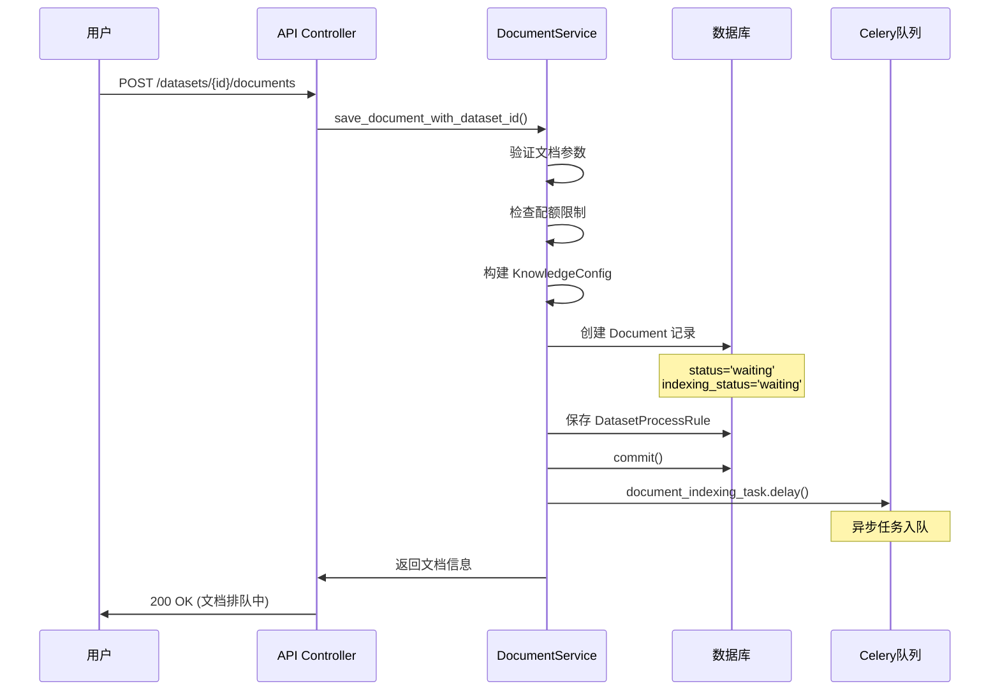
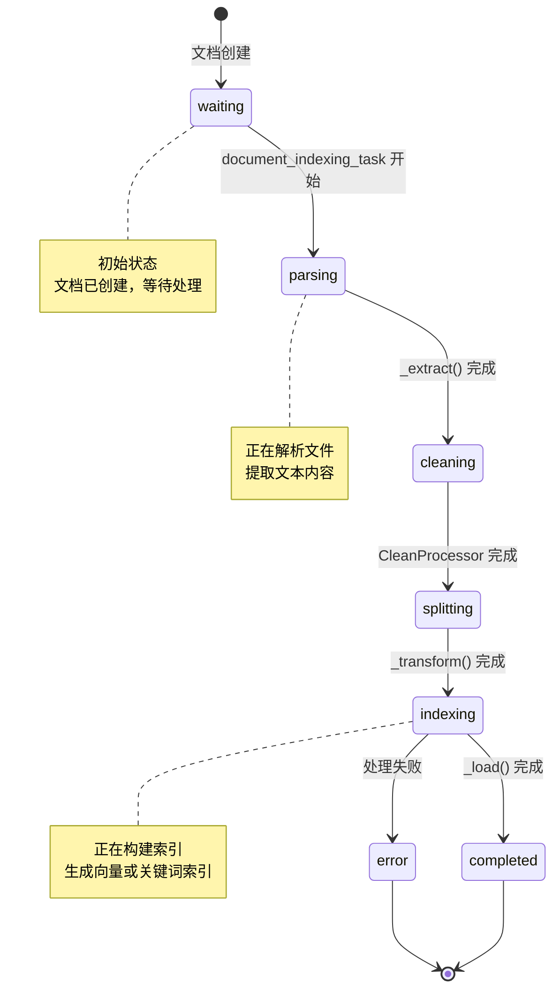
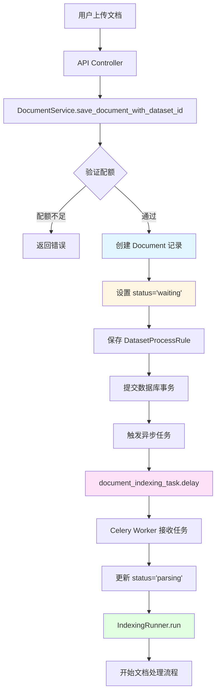

# 文档上传入口与异步任务触发

## 1. 整体架构概览

文档上传到索引完成的完整流程可以分为以下几个阶段：

```
用户上传文档
    ↓
API Controller 接收请求
    ↓
DocumentService.save_document_with_dataset_id()
    ↓ [创建 Document 记录，status='waiting']
    ↓
document_indexing_task.delay()  ← 异步任务触发点
    ↓
Celery Worker 执行任务
    ↓
IndexingRunner.run() 开始处理
```

## 2. API 入口层

### 2.1 文档上传 API

文档上传的 API 入口位于：
- `api/controllers/console/datasets/datasets.py`
- `api/controllers/service_api/dataset/document.py`

主要接口：
- `POST /datasets/{dataset_id}/documents` - 上传文档
- `POST /datasets/{dataset_id}/documents/batch` - 批量上传

### 2.2 请求处理流程



## 3. DocumentService.save_document_with_dataset_id()

### 3.1 方法签名

```python
@staticmethod
def save_document_with_dataset_id(
    dataset: Dataset,
    knowledge_config: KnowledgeConfig,
    account: Account | Any,
    dataset_process_rule: DatasetProcessRule | None = None,
    created_from: str = "web",
) -> tuple[list[Document], str]:
```

**位置**: `api/services/dataset_service.py:1408`

### 3.2 核心处理步骤

#### 步骤 1: 文档表单验证

```python
# check doc_form
DatasetService.check_doc_form(dataset, knowledge_config.doc_form)
```

验证文档格式是否与知识库配置匹配。

#### 步骤 2: 配额检查

```python
features = FeatureService.get_features(current_user.current_tenant_id)

if features.billing.enabled:
    # 检查批量上传限制
    if count > batch_upload_limit:
        raise ValueError(f"You have reached the batch upload limit of {batch_upload_limit}.")
    
    # 检查向量空间配额
    if 0 < vector_space.limit <= vector_space.size:
        raise ValueError("Your total number of documents plus the number of uploads have over the limit...")
```

**关键检查项**:
- 批量上传数量限制
- 向量空间配额
- 订阅计划限制（SANDBOX 计划不支持批量上传）

#### 步骤 3: 数据集配置更新

```python
# 如果数据集为空，更新 data_source_type
if not dataset.data_source_type and knowledge_config.data_source:
    dataset.data_source_type = knowledge_config.data_source.info_list.data_source_type

# 如果未设置索引技术，使用请求中的配置
if not dataset.indexing_technique:
    dataset.indexing_technique = knowledge_config.indexing_technique
    
    # 如果是高质量模式，配置嵌入模型
    if knowledge_config.indexing_technique == "high_quality":
        # 设置嵌入模型和提供商
        dataset.embedding_model = dataset_embedding_model
        dataset.embedding_model_provider = dataset_embedding_model_provider
        # 获取或创建集合绑定
        dataset.collection_binding_id = dataset_collection_binding.id
```

#### 步骤 4: 处理规则创建

```python
if not dataset_process_rule:
    process_rule = knowledge_config.process_rule
    if process_rule:
        if process_rule.mode in ("custom", "hierarchical"):
            # 自定义或层级分割规则
            dataset_process_rule = DatasetProcessRule(
                dataset_id=dataset.id,
                mode=process_rule.mode,
                rules=process_rule.rules.model_dump_json(),
                created_by=account.id,
            )
        elif process_rule.mode == "automatic":
            # 自动分割规则
            dataset_process_rule = DatasetProcessRule(
                dataset_id=dataset.id,
                mode=process_rule.mode,
                rules=json.dumps(DatasetProcessRule.AUTOMATIC_RULES),
                created_by=account.id,
            )
```

**处理规则类型**:
- `automatic`: 自动分割，使用默认规则
- `custom`: 自定义分割规则（指定 chunk_size, chunk_overlap, separator）
- `hierarchical`: 层级分割（Parent-Child 模式）

#### 步骤 5: 文档创建（使用分布式锁）

```python
lock_name = f"add_document_lock_dataset_id_{dataset.id}"
with redis_client.lock(lock_name, timeout=600):
    # 创建文档记录
    for file_id in upload_file_list:
        document = DocumentService.build_document(
            dataset,
            dataset_process_rule.id,
            knowledge_config.data_source.info_list.data_source_type,
            knowledge_config.doc_form,
            knowledge_config.doc_language,
            data_source_info,
            created_from,
            position,
            account,
            file_name,
            batch,
        )
        db.session.add(document)
        db.session.flush()
        document_ids.append(document.id)
        documents.append(document)
    
    db.session.commit()
```

**关键点**:
- 使用 Redis 分布式锁防止并发创建冲突
- 锁超时时间：600 秒
- 每个文档创建后立即 flush，获取 document.id
- 最后统一 commit

#### 步骤 6: 异步任务触发

```python
# trigger async task
if document_ids:
    document_indexing_task.delay(dataset.id, document_ids)
if duplicate_document_ids:
    duplicate_document_indexing_task.delay(dataset.id, duplicate_document_ids)
```

**任务队列**: `queue="dataset"`

## 4. Document 模型结构

### 4.1 关键字段

```python
class Document(TypeBase):
    # 基本信息
    id: str
    dataset_id: str
    tenant_id: str
    name: str
    
    # 状态字段
    indexing_status: str  # waiting, parsing, cleaning, splitting, indexing, completed, error
    enabled: bool
    archived: bool
    
    # 数据源信息
    data_source_type: str  # upload_file, notion_import, website_crawl
    data_source_info: str  # JSON 格式
    
    # 处理规则
    dataset_process_rule_id: str
    
    # 文档格式
    doc_form: str  # text_model, qa_model, book_model, etc.
    doc_language: str
    
    # 时间戳
    created_at: datetime
    processing_started_at: datetime
    parsing_completed_at: datetime
    cleaning_completed_at: datetime
    splitting_completed_at: datetime
    completed_at: datetime
    
    # 统计信息
    word_count: int
    tokens: int
    indexing_latency: float
    
    # 错误信息
    error: str
    stopped_at: datetime
```

### 4.2 状态流转



## 5. document_indexing_task 异步任务

### 5.1 任务定义

```python
@shared_task(queue="dataset")
def document_indexing_task(dataset_id: str, document_ids: list):
    """
    Async process document
    :param dataset_id:
    :param document_ids:

    Usage: document_indexing_task.delay(dataset_id, document_ids)
    """
```

**位置**: `api/tasks/document_indexing_task.py:19`

### 5.2 任务执行流程

```python
def document_indexing_task(dataset_id: str, document_ids: list):
    # 1. 获取数据集
    dataset = db.session.query(Dataset).where(Dataset.id == dataset_id).first()
    
    # 2. 配额检查（再次验证）
    features = FeatureService.get_features(dataset.tenant_id)
    if features.billing.enabled:
        # 检查批量上传限制
        # 检查向量空间配额
    
    # 3. 更新文档状态为 parsing
    for document_id in document_ids:
        document = db.session.query(Document).where(
            Document.id == document_id, 
            Document.dataset_id == dataset_id
        ).first()
        
        if document:
            document.indexing_status = "parsing"
            document.processing_started_at = naive_utc_now()
            documents.append(document)
            db.session.add(document)
    
    db.session.commit()
    
    # 4. 调用 IndexingRunner 处理
    try:
        indexing_runner = IndexingRunner()
        indexing_runner.run(documents)
    except DocumentIsPausedError as ex:
        logger.info(click.style(str(ex), fg="yellow"))
    except Exception:
        logger.exception("Document indexing task failed")
    finally:
        db.session.close()
```

### 5.3 幂等性问题

**当前实现的问题**:
- 没有检查文档当前状态，如果任务重复执行会重复处理
- 状态更新 `indexing_status = "parsing"` 存在竞态条件

**建议改进**:
```python
# 使用原子更新
for document_id in document_ids:
    updated = db.session.query(Document).where(
        Document.id == document_id,
        Document.dataset_id == dataset_id,
        Document.indexing_status == "waiting"  # 只处理等待状态的文档
    ).update({
        Document.indexing_status: "parsing",
        Document.processing_started_at: naive_utc_now()
    })
    
    if updated > 0:
        # 获取文档对象
        document = db.session.get(Document, document_id)
        documents.append(document)
```

## 6. Celery 配置

### 6.1 队列配置

```python
@shared_task(queue="dataset")
```

**队列名称**: `dataset`

### 6.2 Worker 配置

在 `docker-compose.yaml` 或部署配置中：

```yaml
celery_worker:
  command: celery -A app.celery worker --loglevel=info --queues=dataset,workflow_storage,pipeline,priority_pipeline
  environment:
    - CELERY_BROKER_URL=redis://redis:6379/1
    - CELERY_RESULT_BACKEND=redis://redis:6379/1
```

### 6.3 任务重试机制

当前 `document_indexing_task` **没有配置重试机制**，如果任务失败：
- 任务会记录错误日志
- 文档状态会更新为 `error`
- 需要手动重试或使用 `retry_document_indexing_task`

**建议添加重试**:
```python
@shared_task(queue="dataset", bind=True, max_retries=3, default_retry_delay=60)
def document_indexing_task(self, dataset_id: str, document_ids: list):
    try:
        # ... 处理逻辑
    except Exception as e:
        logger.exception("Document indexing task failed")
        # 重试任务
        raise self.retry(exc=e, countdown=60 * (2 ** self.request.retries))
```

## 7. 数据流图



## 8. 关键代码位置总结

| 组件 | 文件路径 | 关键方法/类 |
|------|---------|------------|
| API 入口 | `api/controllers/console/datasets/datasets.py` | `DatasetListApi.post()` |
| 服务层 | `api/services/dataset_service.py` | `DocumentService.save_document_with_dataset_id()` |
| 异步任务 | `api/tasks/document_indexing_task.py` | `document_indexing_task()` |
| 文档模型 | `api/models/dataset.py` | `Document` |
| 处理规则 | `api/models/dataset.py` | `DatasetProcessRule` |
| 索引运行器 | `api/core/indexing_runner.py` | `IndexingRunner.run()` |

## 9. 性能考虑

### 9.1 数据库操作优化

**当前实现**:
- 每个文档创建后立即 `flush()`，获取 ID
- 最后统一 `commit()`

**优化建议**:
- 批量创建文档时，可以考虑批量插入
- 使用 `bulk_insert_mappings()` 提高性能

### 9.2 异步任务优化

**当前实现**:
- 每个文档一个任务，或批量文档一个任务

**优化建议**:
- 根据文档大小动态决定批量大小
- 大文档单独处理，小文档批量处理

### 9.3 锁优化

**当前实现**:
- 使用 Redis 分布式锁，超时 600 秒

**优化建议**:
- 锁粒度可以更细，按文档级别而非数据集级别
- 考虑使用数据库唯一约束替代锁

## 10. 错误处理

### 10.1 配额检查失败

```python
if count > batch_upload_limit:
    raise ValueError(f"You have reached the batch upload limit of {batch_upload_limit}.")
```

**处理方式**: 直接返回错误，不创建文档

### 10.2 文件不存在

```python
if not file:
    raise FileNotExistsError()
```

**处理方式**: 抛出异常，中断处理

### 10.3 异步任务失败

```python
except Exception:
    logger.exception("Document indexing task failed, dataset_id: %s", dataset_id)
```

**处理方式**: 
- 记录错误日志
- 文档状态保持为 `parsing` 或更新为 `error`
- 需要手动重试

## 11. 监控和日志

### 11.1 关键日志点

```python
logger.info(click.style(f"Start process document: {document_id}", fg="green"))
logger.info(click.style(f"Processed dataset: {dataset_id} latency: {end_at - start_at}", fg="green"))
logger.exception("Document indexing task failed, dataset_id: %s", dataset_id)
```

### 11.2 性能指标

- `processing_started_at`: 任务开始时间
- `indexing_latency`: 索引耗时（在 IndexingRunner 中计算）
- 文档处理各阶段的时间戳

## 12. 总结

文档上传入口层的主要职责：

1. **接收用户请求**: API Controller 层接收上传请求
2. **参数验证**: 验证文档参数、配额限制
3. **创建记录**: 在数据库中创建 Document 和 DatasetProcessRule 记录
4. **触发异步任务**: 将文档处理任务提交到 Celery 队列
5. **返回响应**: 立即返回文档信息，不等待处理完成

**关键设计点**:
- ✅ 使用异步任务处理，提高响应速度
- ✅ 使用分布式锁防止并发冲突
- ✅ 状态机管理文档处理流程
- ⚠️ 缺少任务幂等性保护
- ⚠️ 错误处理可以更完善

**下一步**: 文档进入 `IndexingRunner.run()` 开始实际的文档处理流程。


