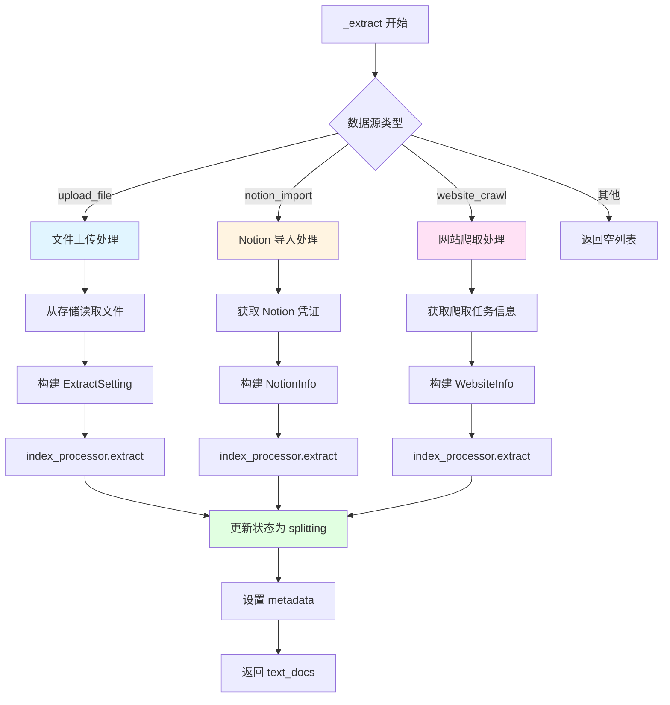
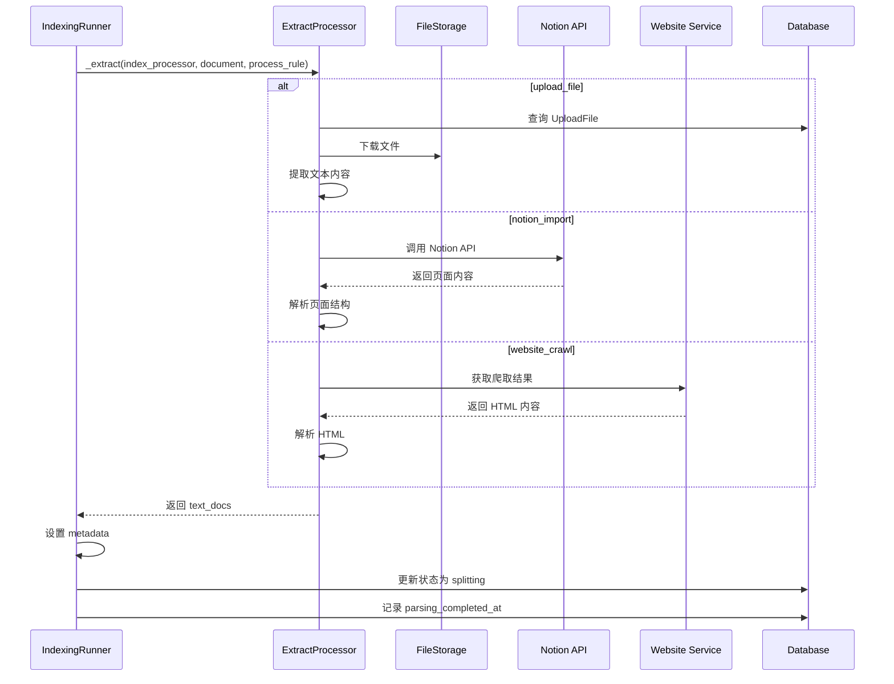

# 文档提取阶段（Extract）

## 1. 阶段概述

文档提取（Extract）是文档索引流程的第一个阶段，负责从各种数据源中提取文本内容。

**输入**: `DatasetDocument` 对象（包含数据源信息）
**输出**: `list[Document]` 文本文档列表
**状态变化**: `parsing` → `splitting`

## 2. 调用入口

### 2.1 在 IndexingRunner 中的调用

```python
def run(self, dataset_documents: list[DatasetDocument]):
    for dataset_document in dataset_documents:
        # ...
        index_processor = IndexProcessorFactory(index_type).init_index_processor()
        # extract
        text_docs = self._extract(index_processor, requeried_document, processing_rule.to_dict())
```

**位置**: `api/core/indexing_runner.py:89`

## 3. _extract() 方法详解

### 3.1 方法签名

```python
def _extract(
    self, 
    index_processor: BaseIndexProcessor, 
    dataset_document: DatasetDocument, 
    process_rule: dict
) -> list[Document]:
```

**位置**: `api/core/indexing_runner.py:346`

### 3.2 支持的数据源类型

```python
if dataset_document.data_source_type not in {"upload_file", "notion_import", "website_crawl"}:
    return []
```

支持三种数据源：
1. **upload_file**: 文件上传
2. **notion_import**: Notion 导入
3. **website_crawl**: 网站爬取

### 3.3 数据源处理流程图



## 4. 文件上传处理（upload_file）

### 4.1 处理流程

```python
if dataset_document.data_source_type == "upload_file":
    if not data_source_info or "upload_file_id" not in data_source_info:
        raise ValueError("no upload file found")
    
    # 从数据库查询文件信息
    stmt = select(UploadFile).where(UploadFile.id == data_source_info["upload_file_id"])
    file_detail = db.session.scalars(stmt).one_or_none()

    if file_detail:
        # 构建提取设置
        extract_setting = ExtractSetting(
            datasource_type=DatasourceType.FILE,
            upload_file=file_detail,
            document_model=dataset_document.doc_form,
        )
        # 调用 index_processor 提取文本
        text_docs = index_processor.extract(extract_setting, process_rule_mode=process_rule["mode"])
```

### 4.2 ExtractSetting 结构

```python
class ExtractSetting(BaseModel):
    datasource_type: DatasourceType  # FILE, NOTION, WEBSITE
    upload_file: UploadFile | None = None
    notion_info: NotionInfo | None = None
    website_info: WebsiteInfo | None = None
    document_model: str | None = None
```

### 4.3 支持的文件类型

根据 `index_processor` 的不同实现，支持的文件类型包括：

- **文本文件**: `.txt`, `.md`, `.markdown`
- **Office 文档**: `.docx`, `.xlsx`, `.pptx`
- **PDF**: `.pdf`
- **代码文件**: `.py`, `.js`, `.java`, `.cpp`, etc.
- **其他**: 根据配置的提取器支持

### 4.4 文件提取器选择

```python
# 在 ParagraphIndexProcessor.extract() 中
def extract(self, extract_setting: ExtractSetting, **kwargs) -> list[Document]:
    from core.rag.extractor.extract_strategy import ExtractStrategy
    
    extract_strategy = ExtractStrategy()
    text_docs = extract_strategy.extract(extract_setting)
    return text_docs
```

**ExtractStrategy** 根据文件扩展名选择对应的提取器：
- PDF → `PDFExtractor`
- DOCX → `DOCXExtractor`
- Markdown → `MarkdownExtractor`
- 等等

## 5. Notion 导入处理（notion_import）

### 5.1 处理流程

```python
elif dataset_document.data_source_type == "notion_import":
    if (
        not data_source_info
        or "notion_workspace_id" not in data_source_info
        or "notion_page_id" not in data_source_info
    ):
        raise ValueError("no notion import info found")
    
    extract_setting = ExtractSetting(
        datasource_type=DatasourceType.NOTION,
        notion_info=NotionInfo.model_validate({
            "credential_id": data_source_info["credential_id"],
            "notion_workspace_id": data_source_info["notion_workspace_id"],
            "notion_obj_id": data_source_info["notion_page_id"],
            "notion_page_type": data_source_info["type"],
            "document": dataset_document,
            "tenant_id": dataset_document.tenant_id,
        }),
        document_model=dataset_document.doc_form,
    )
    text_docs = index_processor.extract(extract_setting, process_rule_mode=process_rule["mode"])
```

### 5.2 NotionInfo 结构

```python
class NotionInfo(BaseModel):
    credential_id: str
    notion_workspace_id: str
    notion_obj_id: str
    notion_page_type: str  # page, database
    document: DatasetDocument
    tenant_id: str
```

### 5.3 Notion API 调用

提取器会调用 Notion API 获取页面内容：
- 使用 `credential_id` 获取访问凭证
- 调用 Notion API 获取页面内容
- 解析页面结构（文本、列表、表格等）
- 转换为纯文本格式

## 6. 网站爬取处理（website_crawl）

### 6.1 处理流程

```python
elif dataset_document.data_source_type == "website_crawl":
    if (
        not data_source_info
        or "provider" not in data_source_info
        or "url" not in data_source_info
        or "job_id" not in data_source_info
    ):
        raise ValueError("no website import info found")
    
    extract_setting = ExtractSetting(
        datasource_type=DatasourceType.WEBSITE,
        website_info=WebsiteInfo.model_validate({
            "provider": data_source_info["provider"],
            "job_id": data_source_info["job_id"],
            "tenant_id": dataset_document.tenant_id,
            "url": data_source_info["url"],
            "mode": data_source_info["mode"],
            "only_main_content": data_source_info["only_main_content"],
        }),
        document_model=dataset_document.doc_form,
    )
    text_docs = index_processor.extract(extract_setting, process_rule_mode=process_rule["mode"])
```

### 6.2 WebsiteInfo 结构

```python
class WebsiteInfo(BaseModel):
    provider: str  # 爬取服务提供商
    job_id: str    # 爬取任务 ID
    tenant_id: str
    url: str       # 目标 URL
    mode: str      # crawl, scrape
    only_main_content: bool  # 是否只提取主要内容
```

### 6.3 网站爬取流程

1. **任务提交**: 用户提交爬取任务，获得 `job_id`
2. **异步爬取**: 爬取服务异步执行爬取任务
3. **内容提取**: 提取器根据 `job_id` 获取爬取结果
4. **内容解析**: 解析 HTML，提取文本内容

## 7. 状态更新

### 7.1 更新文档状态

```python
# update document status to splitting
self._update_document_index_status(
    document_id=dataset_document.id,
    after_indexing_status="splitting",
    extra_update_params={
        DatasetDocument.parsing_completed_at: naive_utc_now(),
    },
)
```

**状态变化**: `parsing` → `splitting`

**时间戳**: 记录 `parsing_completed_at`

### 7.2 _update_document_index_status() 方法

```python
@staticmethod
def _update_document_index_status(
    document_id: str, 
    after_indexing_status: str, 
    extra_update_params: dict | None = None
):
    """
    Update the document indexing status.
    """
    # 检查文档是否被暂停
    count = db.session.query(DatasetDocument).filter_by(id=document_id, is_paused=True).count()
    if count > 0:
        raise DocumentIsPausedError()
    
    # 检查文档是否存在
    document = db.session.query(DatasetDocument).filter_by(id=document_id).first()
    if not document:
        raise DocumentIsDeletedPausedError()

    update_params = {DatasetDocument.indexing_status: after_indexing_status}

    if extra_update_params:
        update_params.update(extra_update_params)
    
    db.session.query(DatasetDocument).filter_by(id=document_id).update(update_params)
    db.session.commit()
```

**关键检查**:
- ✅ 检查文档是否被暂停（`is_paused=True`）
- ✅ 检查文档是否存在
- ✅ 原子更新状态

## 8. Metadata 设置

### 8.1 设置文档和数据集 ID

```python
# replace doc id to document model id
for text_doc in text_docs:
    if text_doc.metadata is not None:
        text_doc.metadata["document_id"] = dataset_document.id
        text_doc.metadata["dataset_id"] = dataset_document.dataset_id
```

**目的**: 确保后续处理阶段能够关联到原始文档和数据集。

### 8.2 Document 对象结构

```python
class Document(BaseModel):
    page_content: str  # 文本内容
    metadata: dict[str, Any] | None = None  # 元数据
    children: list[ChildDocument] | None = None  # 子文档（用于 Parent-Child 模式）
```

**metadata 字段**:
- `document_id`: 文档 ID
- `dataset_id`: 数据集 ID
- `doc_id`: 文档节点 ID（在 transform 阶段生成）
- `doc_hash`: 文档内容哈希（在 transform 阶段生成）

## 9. 提取器实现细节

### 9.1 ExtractStrategy 选择提取器

```python
class ExtractStrategy:
    def extract(self, extract_setting: ExtractSetting) -> list[Document]:
        datasource_type = extract_setting.datasource_type
        
        if datasource_type == DatasourceType.FILE:
            return self._extract_from_file(extract_setting)
        elif datasource_type == DatasourceType.NOTION:
            return self._extract_from_notion(extract_setting)
        elif datasource_type == DatasourceType.WEBSITE:
            return self._extract_from_website(extract_setting)
```

### 9.2 文件提取器示例

```python
def _extract_from_file(self, extract_setting: ExtractSetting) -> list[Document]:
    upload_file = extract_setting.upload_file
    file_extension = Path(upload_file.key).suffix.lower()
    
    # 根据文件扩展名选择提取器
    if file_extension == '.pdf':
        extractor = PDFExtractor()
    elif file_extension == '.docx':
        extractor = DOCXExtractor()
    elif file_extension == '.md':
        extractor = MarkdownExtractor()
    # ... 其他文件类型
    
    # 从存储读取文件
    file_path = storage.download(upload_file.key)
    
    # 提取文本
    text_content = extractor.extract(file_path)
    
    # 构建 Document 对象
    document = Document(
        page_content=text_content,
        metadata={
            "file_name": upload_file.name,
            "file_type": file_extension,
        }
    )
    
    return [document]
```

## 10. 错误处理

### 10.1 文件不存在

```python
if not file_detail:
    raise ValueError("no upload file found")
```

**处理**: 抛出异常，中断处理流程

### 10.2 数据源信息缺失

```python
if not data_source_info or "upload_file_id" not in data_source_info:
    raise ValueError("no upload file found")
```

**处理**: 验证数据源信息的完整性

### 10.3 提取失败

如果 `index_processor.extract()` 抛出异常：
- 异常会向上传播到 `IndexingRunner.run()`
- 在 `run()` 方法中被捕获
- 调用 `_handle_indexing_error()` 更新文档状态为 `error`

```python
except Exception as e:
    self._handle_indexing_error(document_id, e)

def _handle_indexing_error(self, document_id: str, error: Exception) -> None:
    """Handle indexing errors by updating document status."""
    logger.exception("consume document failed")
    document = db.session.get(DatasetDocument, document_id)
    if document:
        document.indexing_status = "error"
        error_message = getattr(error, "description", str(error))
        document.error = str(error_message)
        document.stopped_at = naive_utc_now()
        db.session.commit()
```

## 11. 性能考虑

### 11.1 大文件处理

**当前实现**: 
- 一次性提取整个文件内容
- 可能导致内存占用过高

**优化建议**:
- 流式处理大文件
- 分块读取和提取

### 11.2 并发提取

**当前实现**: 
- 串行处理每个文档
- 在 `IndexingRunner.run()` 中循环处理

**优化建议**:
- 可以并行提取多个文档
- 使用线程池或进程池

### 11.3 缓存机制

**当前实现**: 
- 每次都要重新提取

**优化建议**:
- 对于相同文件，可以缓存提取结果
- 使用文件哈希作为缓存键

## 12. 监控和日志

### 12.1 关键日志点

```python
logger.info(click.style(f"Start process document: {document_id}", fg="green"))
logger.exception("consume document failed")
```

### 12.2 性能指标

- `parsing_completed_at`: 提取完成时间
- 提取耗时 = `parsing_completed_at - processing_started_at`

## 13. 流程图总结



## 14. 关键代码位置总结

| 组件 | 文件路径 | 关键方法/类 |
|------|---------|------------|
| 提取入口 | `api/core/indexing_runner.py` | `_extract()` |
| 提取策略 | `api/core/rag/extractor/extract_strategy.py` | `ExtractStrategy` |
| 文件提取器 | `api/core/rag/extractor/extractors/` | `PDFExtractor`, `DOCXExtractor`, etc. |
| Notion 提取器 | `api/core/rag/extractor/extractors/notion_extractor.py` | `NotionExtractor` |
| 网站提取器 | `api/core/rag/extractor/extractors/website_extractor.py` | `WebsiteExtractor` |
| 状态更新 | `api/core/indexing_runner.py` | `_update_document_index_status()` |

## 15. 总结

文档提取阶段的主要职责：

1. **识别数据源类型**: 根据 `data_source_type` 选择对应的处理逻辑
2. **提取文本内容**: 从文件、Notion 或网站中提取文本
3. **构建 Document 对象**: 将提取的文本封装为 Document 对象
4. **设置元数据**: 关联文档和数据集 ID
5. **更新状态**: 将文档状态从 `parsing` 更新为 `splitting`

**关键设计点**:
- ✅ 支持多种数据源类型
- ✅ 统一的提取接口（ExtractSetting）
- ✅ 状态机管理处理流程
- ✅ 错误处理和状态更新
- ⚠️ 大文件处理可能需要优化
- ⚠️ 缺少提取结果缓存

**下一步**: 提取的文本进入 `_transform()` 阶段进行清洗和分割。


