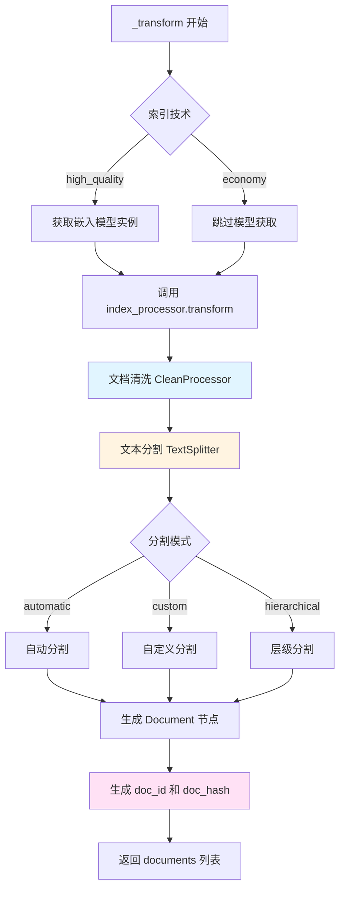
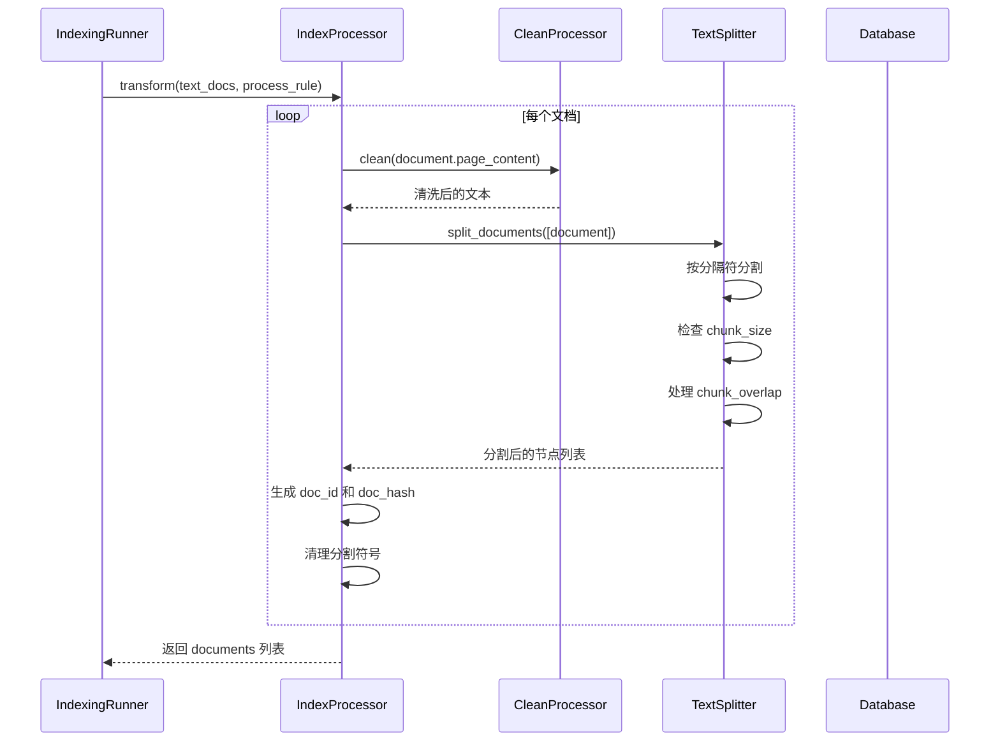

# 文档转换与分割阶段（Transform）

## 1. 阶段概述

文档转换（Transform）是文档索引流程的第二个阶段，负责对提取的文本进行清洗、分割和格式化处理。

**输入**: `list[Document]` 原始文本文档列表
**输出**: `list[Document]` 分割后的文档节点列表
**状态变化**: `splitting` → `indexing`（在 _load_segments 中更新）

## 2. 调用入口

### 2.1 在 IndexingRunner 中的调用

```python
def run(self, dataset_documents: list[DatasetDocument]):
    # ...
    # transform
    documents = self._transform(
        index_processor, 
        dataset, 
        text_docs, 
        requeried_document.doc_language, 
        processing_rule.to_dict()
    )
```

**位置**: `api/core/indexing_runner.py:92`

## 3. _transform() 方法详解

### 3.1 方法签名

```python
def _transform(
    self,
    index_processor: BaseIndexProcessor,
    dataset: Dataset,
    text_docs: list[Document],
    doc_language: str,
    process_rule: dict,
) -> list[Document]:
```

**位置**: `api/core/indexing_runner.py:706`

### 3.2 处理流程

```python
def _transform(self, ...):
    # 1. 获取嵌入模型实例（用于计算 token 数量）
    embedding_model_instance = None
    if dataset.indexing_technique == "high_quality":
        if dataset.embedding_model_provider:
            embedding_model_instance = self.model_manager.get_model_instance(
                tenant_id=dataset.tenant_id,
                provider=dataset.embedding_model_provider,
                model_type=ModelType.TEXT_EMBEDDING,
                model=dataset.embedding_model,
            )
        else:
            embedding_model_instance = self.model_manager.get_default_model_instance(
                tenant_id=dataset.tenant_id,
                model_type=ModelType.TEXT_EMBEDDING,
            )

    # 2. 调用 index_processor.transform() 进行转换
    documents = index_processor.transform(
        text_docs,
        embedding_model_instance=embedding_model_instance,
        process_rule=process_rule,
        tenant_id=dataset.tenant_id,
        doc_language=doc_language,
    )

    return documents
```

### 3.3 流程图



## 4. index_processor.transform() 实现

### 4.1 ParagraphIndexProcessor.transform()

**位置**: `api/core/rag/index_processor/processor/paragraph_index_processor.py:36`

```python
def transform(self, documents: list[Document], **kwargs) -> list[Document]:
    process_rule = kwargs.get("process_rule", {})
    embedding_model_instance = kwargs.get("embedding_model_instance")
    doc_language = kwargs.get("doc_language", "English")
    
    # 获取分割器
    splitter = self._get_splitter(
        processing_rule_mode=process_rule.get("mode", "automatic"),
        max_tokens=process_rule.get("rules", {}).get("segmentation", {}).get("max_tokens", 1000),
        chunk_overlap=process_rule.get("rules", {}).get("segmentation", {}).get("chunk_overlap", 200),
        separator=process_rule.get("rules", {}).get("segmentation", {}).get("separator", ""),
        embedding_model_instance=embedding_model_instance,
    )
    
    all_documents = []
    for document in documents:
        # 1. 文档清洗
        document_text = CleanProcessor.clean(document.page_content, process_rule)
        document.page_content = document_text
        
        # 2. 文本分割
        document_nodes = splitter.split_documents([document])
        
        split_documents = []
        for document_node in document_nodes:
            if document_node.page_content.strip():
                # 3. 生成唯一 ID 和哈希
                doc_id = str(uuid.uuid4())
                hash = helper.generate_text_hash(document_node.page_content)
                
                if document_node.metadata is not None:
                    document_node.metadata["doc_id"] = doc_id
                    document_node.metadata["doc_hash"] = hash
                
                # 4. 清理分割符号
                page_content = remove_leading_symbols(document_node.page_content).strip()
                if len(page_content) > 0:
                    document_node.page_content = page_content
                    split_documents.append(document_node)
        
        all_documents.extend(split_documents)
    
    return all_documents
```

## 5. 文档清洗（Clean）

### 5.1 CleanProcessor.clean()

**位置**: `api/core/rag/cleaner/clean_processor.py`

```python
class CleanProcessor:
    @staticmethod
    def clean(text: str, process_rule: dict) -> str:
        rules = process_rule.get("rules", {})
        
        # 1. 移除多余空白字符
        if rules.get("remove_extra_spaces", True):
            text = re.sub(r'\s+', ' ', text)
        
        # 2. 移除 URL
        if rules.get("remove_urls", False):
            text = re.sub(r'http[s]?://(?:[a-zA-Z]|[0-9]|[$-_@.&+]|[!*\\(\\),]|(?:%[0-9a-fA-F][0-9a-fA-F]))+', '', text)
        
        # 3. 移除邮箱
        if rules.get("remove_emails", False):
            text = re.sub(r'\S+@\S+', '', text)
        
        # 4. 移除特殊字符
        if rules.get("remove_special_characters", False):
            text = re.sub(r'[^\w\s]', '', text)
        
        # 5. 移除多余换行
        if rules.get("remove_extra_blank_lines", True):
            text = re.sub(r'\n\s*\n', '\n\n', text)
        
        return text
```

### 5.2 清洗规则配置

**自动模式规则** (`DatasetProcessRule.AUTOMATIC_RULES`):
```python
AUTOMATIC_RULES = {
    "pre_processing_rules": {
        "remove_extra_spaces": True,
        "remove_urls": False,
        "remove_emails": False,
        "remove_special_characters": False,
        "remove_extra_blank_lines": True,
    },
    "segmentation": {
        "max_tokens": 1000,
        "chunk_overlap": 200,
        "separator": "",
    }
}
```

**自定义模式规则**: 用户可以在请求中指定清洗规则。

## 6. 文本分割（Split）

### 6.1 分割器选择

```python
def _get_splitter(
    self,
    processing_rule_mode: str,
    max_tokens: int,
    chunk_overlap: int,
    separator: str,
    embedding_model_instance: Optional["ModelInstance"],
) -> TextSplitter:
    if processing_rule_mode in ["custom", "hierarchical"]:
        # 自定义分割规则
        character_splitter = FixedRecursiveCharacterTextSplitter.from_encoder(
            chunk_size=max_tokens,
            chunk_overlap=chunk_overlap,
            fixed_separator=separator,
            separators=["\n\n", "。", ". ", " ", ""],
            embedding_model_instance=embedding_model_instance,
        )
    else:
        # 自动分割
        character_splitter = EnhanceRecursiveCharacterTextSplitter.from_encoder(
            chunk_size=DatasetProcessRule.AUTOMATIC_RULES["segmentation"]["max_tokens"],
            chunk_overlap=DatasetProcessRule.AUTOMATIC_RULES["segmentation"]["chunk_overlap"],
            separators=["\n\n", "。", ". ", " ", ""],
            embedding_model_instance=embedding_model_instance,
        )
    
    return character_splitter
```

**位置**: `api/core/indexing_runner.py:440`

### 6.2 分割模式详解

#### 6.2.1 自动分割（automatic）

**特点**:
- 使用默认的 `max_tokens=1000` 和 `chunk_overlap=200`
- 使用 `EnhanceRecursiveCharacterTextSplitter`
- 智能识别段落边界

**分割策略**:
1. 优先按 `\n\n`（双换行）分割
2. 其次按 `。`（中文句号）分割
3. 再次按 `. `（英文句号+空格）分割
4. 最后按 ` `（空格）分割
5. 如果都不满足，按字符分割

**示例**:
```
原文: "段落1\n\n段落2\n\n段落3"
分割结果: ["段落1", "段落2", "段落3"]
```

#### 6.2.2 自定义分割（custom）

**特点**:
- 用户可以指定 `max_tokens`、`chunk_overlap`、`separator`
- 使用 `FixedRecursiveCharacterTextSplitter`
- 支持自定义分隔符

**配置示例**:
```python
{
    "mode": "custom",
    "rules": {
        "segmentation": {
            "max_tokens": 500,
            "chunk_overlap": 100,
            "separator": "\n"
        }
    }
}
```

#### 6.2.3 层级分割（hierarchical）

**特点**:
- 用于 Parent-Child 索引模式
- 生成父子文档结构
- Parent 文档包含完整内容，Child 文档是更小的分片

**处理流程**:
```python
# 在 ParentChildIndexProcessor.transform() 中
if rules.parent_mode == ParentMode.CHUNK:
    # 先分割成 chunks，每个 chunk 作为 parent
    # 然后对每个 parent 进一步分割成 children
elif rules.parent_mode == ParentMode.FULL_DOC:
    # 整个文档作为 parent
    # 然后分割成 children
```

### 6.3 TextSplitter 实现原理

#### 6.3.1 RecursiveCharacterTextSplitter

**核心算法**:
```python
def split_text(self, text: str) -> list[str]:
    # 1. 尝试按第一个分隔符分割
    chunks = self._split_text_with_separator(text, self.separators[0])
    
    # 2. 如果分割后的块太大，递归分割
    final_chunks = []
    for chunk in chunks:
        if self._length_function(chunk) > self.chunk_size:
            # 递归分割
            sub_chunks = self.split_text(chunk)
            final_chunks.extend(sub_chunks)
        else:
            final_chunks.append(chunk)
    
    # 3. 合并小块
    return self._merge_splits(final_chunks)
```

**Token 计算**:
- 如果提供了 `embedding_model_instance`，使用模型的 tokenizer 计算
- 否则使用字符数估算（1 token ≈ 4 字符）

#### 6.3.2 Chunk Overlap 处理

**目的**: 保持上下文连续性

**实现**:
```python
def _merge_splits(self, splits: list[str]) -> list[str]:
    merged = []
    current_chunk = ""
    
    for split in splits:
        # 如果当前块 + 新块超过大小限制
        if len(current_chunk) + len(split) > self.chunk_size:
            if current_chunk:
                merged.append(current_chunk)
            # 保留重叠部分
            overlap_text = current_chunk[-self.chunk_overlap:]
            current_chunk = overlap_text + split
        else:
            current_chunk += split
    
    if current_chunk:
        merged.append(current_chunk)
    
    return merged
```

**示例**:
```
chunk_size = 100
chunk_overlap = 20

原文: "这是一个很长的文本..." (200 字符)

分割结果:
Chunk 1: "这是一个很长的文本..." (0-100)
Chunk 2: "...文本内容继续..." (80-180)  # 前20字符与Chunk1重叠
Chunk 3: "...最后的内容" (160-200)  # 前20字符与Chunk2重叠
```

## 7. 文档节点生成

### 7.1 生成唯一 ID

```python
doc_id = str(uuid.uuid4())
hash = helper.generate_text_hash(document_node.page_content)

if document_node.metadata is not None:
    document_node.metadata["doc_id"] = doc_id
    document_node.metadata["doc_hash"] = hash
```

**doc_id**: UUID，用于唯一标识文档节点
**doc_hash**: 内容哈希，用于去重和变更检测

### 7.2 哈希生成

```python
def generate_text_hash(text: str) -> str:
    """Generate hash for text content."""
    return hashlib.md5(text.encode('utf-8')).hexdigest()
```

**用途**:
- 检测文档内容是否变更
- 去重（相同内容的文档节点使用相同的 hash）

### 7.3 清理分割符号

```python
def remove_leading_symbols(text: str) -> str:
    """Remove leading symbols added by splitter."""
    # 移除开头的特殊符号
    text = text.lstrip(' \n\t\r')
    return text
```

**目的**: 清理分割器可能添加的额外符号

## 8. Parent-Child 模式处理

### 8.1 ParentChildIndexProcessor.transform()

**位置**: `api/core/rag/index_processor/processor/parent_child_index_processor.py:38`

```python
def transform(self, documents: list[Document], **kwargs) -> list[Document]:
    process_rule = kwargs.get("process_rule", {})
    rules = process_rule.get("rules", {})
    
    all_documents = []
    
    if rules.parent_mode == ParentMode.CHUNK:
        # 模式1: 每个 chunk 作为 parent
        for document in documents:
            # 分割成 chunks
            chunks = self._split_to_chunks(document, rules)
            
            for chunk in chunks:
                # 对每个 chunk 进一步分割成 children
                child_nodes = self._split_child_nodes(chunk, rules, ...)
                chunk.children = child_nodes
                all_documents.append(chunk)
    
    elif rules.parent_mode == ParentMode.FULL_DOC:
        # 模式2: 整个文档作为 parent
        page_content = "\n".join([doc.page_content for doc in documents])
        document = Document(page_content=page_content, metadata=documents[0].metadata)
        
        # 分割成 children
        child_nodes = self._split_child_nodes(document, rules, ...)
        document.children = child_nodes
        
        all_documents.append(document)
    
    return all_documents
```

### 8.2 Child 节点生成

```python
def _split_child_nodes(
    self, 
    document: Document, 
    rules: dict,
    mode: str,
    embedding_model_instance: Optional["ModelInstance"]
) -> list[ChildDocument]:
    # 获取 child 分割器（通常更小的 chunk_size）
    child_splitter = self._get_child_splitter(rules, embedding_model_instance)
    
    # 分割文档
    child_nodes = child_splitter.split_documents([document])
    
    # 转换为 ChildDocument
    child_documents = []
    for node in child_nodes:
        child_id = str(uuid.uuid4())
        child_hash = helper.generate_text_hash(node.page_content)
        
        child_document = ChildDocument(
            page_content=node.page_content,
            metadata={
                "doc_id": child_id,
                "doc_hash": child_hash,
                "document_id": document.metadata.get("document_id"),
                "dataset_id": document.metadata.get("dataset_id"),
            }
        )
        child_documents.append(child_document)
    
    return child_documents
```

## 9. QA 模式处理

### 9.1 QAIndexProcessor.transform()

**位置**: `api/core/rag/index_processor/processor/qa_index_processor.py`

**特点**:
- 文档格式为 Q&A 对
- 每个 Q&A 对作为一个文档节点
- Question 作为 `page_content`，Answer 存储在 `metadata` 中

```python
def transform(self, documents: list[Document], **kwargs) -> list[Document]:
    all_documents = []
    
    for document in documents:
        # 解析 Q&A 格式
        qa_pairs = self._parse_qa_format(document.page_content)
        
        for qa_pair in qa_pairs:
            doc_id = str(uuid.uuid4())
            hash = helper.generate_text_hash(qa_pair.question)
            
            qa_document = Document(
                page_content=qa_pair.question,
                metadata={
                    "doc_id": doc_id,
                    "doc_hash": hash,
                    "answer": qa_pair.answer,
                    "document_id": document.metadata.get("document_id"),
                    "dataset_id": document.metadata.get("dataset_id"),
                }
            )
            all_documents.append(qa_document)
    
    return all_documents
```

## 10. 性能考虑

### 10.1 Token 计算优化

**当前实现**:
- 如果提供了 `embedding_model_instance`，使用模型的 tokenizer
- 每次分割都要计算 token 数量

**优化建议**:
- 缓存 token 计算结果
- 批量计算 token 数量

### 10.2 分割算法优化

**当前实现**:
- 递归分割，可能产生多次递归调用

**优化建议**:
- 使用迭代而非递归
- 预计算分割点

### 10.3 内存优化

**当前实现**:
- 所有文档节点都在内存中

**优化建议**:
- 流式处理大文档
- 分批处理文档节点

## 11. 错误处理

### 11.1 分割失败

如果分割过程中出现异常：
- 异常会向上传播
- 在 `IndexingRunner.run()` 中被捕获
- 文档状态更新为 `error`

### 11.2 Token 计算失败

如果 token 计算失败：
- 回退到字符数估算
- 记录警告日志

## 12. 监控和日志

### 12.1 关键日志点

```python
logger.debug(f"Transformed {len(documents)} documents into {len(all_documents)} nodes")
```

### 12.2 性能指标

- 分割后的文档节点数量
- 平均每个节点的 token 数量
- 分割耗时

## 13. 流程图总结



## 14. 关键代码位置总结

| 组件 | 文件路径 | 关键方法/类 |
|------|---------|------------|
| 转换入口 | `api/core/indexing_runner.py` | `_transform()` |
| 段落处理器 | `api/core/rag/index_processor/processor/paragraph_index_processor.py` | `ParagraphIndexProcessor.transform()` |
| 层级处理器 | `api/core/rag/index_processor/processor/parent_child_index_processor.py` | `ParentChildIndexProcessor.transform()` |
| QA 处理器 | `api/core/rag/index_processor/processor/qa_index_processor.py` | `QAIndexProcessor.transform()` |
| 清洗器 | `api/core/rag/cleaner/clean_processor.py` | `CleanProcessor.clean()` |
| 分割器 | `api/core/rag/splitter/text_splitter.py` | `TextSplitter` |
| 增强分割器 | `api/core/rag/splitter/fixed_text_splitter.py` | `EnhanceRecursiveCharacterTextSplitter` |

## 15. 总结

文档转换阶段的主要职责：

1. **文档清洗**: 移除多余空白、URL、邮箱等
2. **文本分割**: 将长文本分割成合适大小的块
3. **生成节点**: 为每个分割块生成唯一 ID 和哈希
4. **格式化**: 清理分割符号，格式化内容
5. **特殊模式处理**: 支持 Parent-Child、QA 等特殊模式

**关键设计点**:
- ✅ 支持多种分割模式（自动、自定义、层级）
- ✅ 智能识别段落边界
- ✅ 支持 chunk overlap 保持上下文
- ✅ 使用 tokenizer 精确计算 token 数量
- ⚠️ 大文档分割可能消耗较多内存
- ⚠️ 递归分割可能产生性能问题

**下一步**: 转换后的文档节点进入 `_load_segments()` 阶段保存到数据库。


