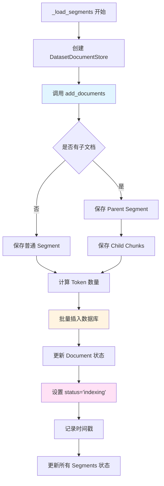
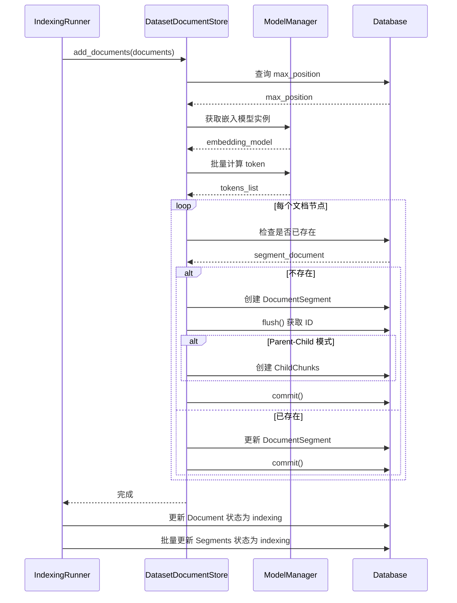

# 分片保存阶段（Load Segments）

## 1. 阶段概述

分片保存（Load Segments）是文档索引流程的第三个阶段，负责将转换后的文档节点保存到数据库中的 `DocumentSegment` 表。

**输入**: `list[Document]` 分割后的文档节点列表
**输出**: 数据库中的 `DocumentSegment` 记录
**状态变化**: `splitting` → `indexing`

## 2. 调用入口

### 2.1 在 IndexingRunner 中的调用

```python
def run(self, dataset_documents: list[DatasetDocument]):
    # ...
    # save segment
    self._load_segments(dataset, requeried_document, documents)
    
    # load
    self._load(...)
```

**位置**: `api/core/indexing_runner.py:96`

## 3. _load_segments() 方法详解

### 3.1 方法签名

```python
def _load_segments(self, dataset, dataset_document, documents):
```

**位置**: `api/core/indexing_runner.py:740`

### 3.2 处理流程

```python
def _load_segments(self, dataset, dataset_document, documents):
    # 1. 创建文档存储对象
    doc_store = DatasetDocumentStore(
        dataset=dataset, 
        user_id=dataset_document.created_by, 
        document_id=dataset_document.id
    )

    # 2. 保存文档节点到数据库
    doc_store.add_documents(
        docs=documents, 
        save_child=dataset_document.doc_form == IndexType.PARENT_CHILD_INDEX
    )

    # 3. 更新文档状态为 indexing
    cur_time = naive_utc_now()
    self._update_document_index_status(
        document_id=dataset_document.id,
        after_indexing_status="indexing",
        extra_update_params={
            DatasetDocument.cleaning_completed_at: cur_time,
            DatasetDocument.splitting_completed_at: cur_time,
            DatasetDocument.word_count: sum(len(doc.page_content) for doc in documents),
        },
    )

    # 4. 更新所有 segment 状态为 indexing
    self._update_segments_by_document(
        dataset_document_id=dataset_document.id,
        update_params={
            DocumentSegment.status: "indexing",
            DocumentSegment.indexing_at: naive_utc_now(),
        },
    )
```

### 3.3 流程图



## 4. DatasetDocumentStore.add_documents()

### 4.1 方法签名

```python
def add_documents(
    self, 
    docs: Sequence[Document], 
    allow_update: bool = True, 
    save_child: bool = False
):
```

**位置**: `api/core/rag/docstore/dataset_docstore.py:62`

### 4.2 核心处理逻辑

```python
def add_documents(self, docs: Sequence[Document], allow_update: bool = True, save_child: bool = False):
    # 1. 获取当前文档的最大 position
    max_position = (
        db.session.query(func.max(DocumentSegment.position))
        .where(DocumentSegment.document_id == self._document_id)
        .scalar()
    )
    
    if max_position is None:
        max_position = 0

    # 2. 获取嵌入模型实例（用于计算 token）
    embedding_model = None
    if self._dataset.indexing_technique == "high_quality":
        model_manager = ModelManager()
        embedding_model = model_manager.get_model_instance(
            tenant_id=self._dataset.tenant_id,
            provider=self._dataset.embedding_model_provider,
            model_type=ModelType.TEXT_EMBEDDING,
            model=self._dataset.embedding_model,
        )

    # 3. 批量计算 token 数量
    if embedding_model:
        page_content_list = [doc.page_content for doc in docs]
        tokens_list = embedding_model.get_text_embedding_num_tokens(page_content_list)
    else:
        tokens_list = [0] * len(docs)

    # 4. 遍历文档节点，创建 DocumentSegment
    for doc, tokens in zip(docs, tokens_list):
        if not isinstance(doc, Document):
            raise ValueError("doc must be a Document")

        if doc.metadata is None:
            raise ValueError("doc.metadata must be a dict")

        # 5. 检查文档是否已存在
        segment_document = self.get_document_segment(doc_id=doc.metadata["doc_id"])

        # 6. 如果不存在，创建新记录
        if not segment_document:
            max_position += 1

            segment_document = DocumentSegment(
                tenant_id=self._dataset.tenant_id,
                dataset_id=self._dataset.id,
                document_id=self._document_id,
                index_node_id=doc.metadata["doc_id"],
                index_node_hash=doc.metadata["doc_hash"],
                position=max_position,
                content=doc.page_content,
                word_count=len(doc.page_content),
                tokens=tokens,
                enabled=False,  # 初始状态为 disabled
                created_by=self._user_id,
            )
            
            # 处理 QA 模式的 answer
            if doc.metadata.get("answer"):
                segment_document.answer = doc.metadata.pop("answer", "")

            db.session.add(segment_document)
            db.session.flush()
            
            # 7. 如果是 Parent-Child 模式，保存子文档
            if save_child:
                if doc.children:
                    for position, child in enumerate(doc.children, start=1):
                        child_segment = ChildChunk(
                            tenant_id=self._dataset.tenant_id,
                            dataset_id=self._dataset.id,
                            document_id=self._document_id,
                            segment_id=segment_document.id,
                            position=position,
                            index_node_id=child.metadata.get("doc_id"),
                            index_node_hash=child.metadata.get("doc_hash"),
                            content=child.page_content,
                            word_count=len(child.page_content),
                            type="automatic",
                            created_by=self._user_id,
                        )
                        db.session.add(child_segment)
        else:
            # 8. 如果已存在，更新记录
            segment_document.content = doc.page_content
            if doc.metadata.get("answer"):
                segment_document.answer = doc.metadata.pop("answer", "")
            segment_document.index_node_hash = doc.metadata.get("doc_hash")
            segment_document.word_count = len(doc.page_content)
            segment_document.tokens = tokens
            
            # 更新子文档
            if save_child and doc.children:
                # 删除现有子文档
                db.session.query(ChildChunk).where(
                    ChildChunk.tenant_id == self._dataset.tenant_id,
                    ChildChunk.dataset_id == self._dataset.id,
                    ChildChunk.document_id == self._document_id,
                    ChildChunk.segment_id == segment_document.id,
                ).delete()
                
                # 添加新子文档
                for position, child in enumerate(doc.children, start=1):
                    child_segment = ChildChunk(...)
                    db.session.add(child_segment)

        # 9. 提交事务（每个文档节点都提交一次）
        db.session.commit()
```

### 4.3 关键设计点

**1. Position 管理**:
- 每个 segment 都有一个 `position` 字段，表示在文档中的顺序
- 通过查询当前最大 position 来确定新 segment 的 position

**2. Token 计算**:
- 如果使用高质量索引（`high_quality`），使用嵌入模型的 tokenizer 计算
- 否则 token 数量为 0

**3. 去重机制**:
- 通过 `index_node_id`（doc_id）检查是否已存在
- 如果存在且 `allow_update=True`，则更新记录

**4. 子文档处理**:
- Parent-Child 模式下，先保存 parent segment
- 然后保存所有 child chunks
- 更新时先删除旧的 child chunks，再添加新的

**5. 事务管理**:
- **当前实现**: 每个文档节点都单独 commit
- **问题**: 性能较差，事务开销大
- **优化建议**: 批量提交

## 5. DocumentSegment 模型结构

### 5.1 关键字段

```python
class DocumentSegment(TypeBase):
    # 基本信息
    id: str
    tenant_id: str
    dataset_id: str
    document_id: str
    
    # 索引信息
    index_node_id: str  # 对应 Document.metadata["doc_id"]
    index_node_hash: str  # 对应 Document.metadata["doc_hash"]
    
    # 内容
    content: str
    word_count: int
    tokens: int
    
    # 位置信息
    position: int  # 在文档中的位置
    
    # 状态
    status: str  # waiting, indexing, completed, error
    enabled: bool  # 是否启用（是否在索引中）
    
    # QA 模式
    answer: str | None  # QA 模式的答案
    
    # 时间戳
    created_at: datetime
    indexing_at: datetime | None
    completed_at: datetime | None
    disabled_at: datetime | None
    
    # 关联信息
    created_by: str
    disabled_by: str | None
```

### 5.2 状态字段说明

**status**:
- `waiting`: 等待处理（初始状态，但实际不会使用）
- `indexing`: 正在构建索引
- `completed`: 索引构建完成
- `error`: 处理失败

**enabled**:
- `False`: 未启用，不在索引中（初始状态）
- `True`: 已启用，在索引中（索引构建完成后更新）

## 6. ChildChunk 模型结构

### 6.1 关键字段

```python
class ChildChunk(TypeBase):
    # 基本信息
    id: str
    tenant_id: str
    dataset_id: str
    document_id: str
    segment_id: str  # 关联的 parent segment
    
    # 索引信息
    index_node_id: str
    index_node_hash: str
    
    # 内容
    content: str
    word_count: int
    
    # 位置信息
    position: int  # 在 parent segment 中的位置
    
    # 类型
    type: str  # automatic, manual
    
    # 关联信息
    created_by: str
```

### 6.2 Parent-Child 关系

```
Document (文档)
  └── DocumentSegment (Parent Segment)
        ├── ChildChunk (Child 1)
        ├── ChildChunk (Child 2)
        └── ChildChunk (Child 3)
```

**索引结构**:
- Parent Segment 的 `index_node_id` 用于检索
- Child Chunks 的 `index_node_id` 也单独索引
- 检索时可以同时返回 parent 和 children

## 7. 状态更新

### 7.1 更新 Document 状态

```python
self._update_document_index_status(
    document_id=dataset_document.id,
    after_indexing_status="indexing",
    extra_update_params={
        DatasetDocument.cleaning_completed_at: cur_time,
        DatasetDocument.splitting_completed_at: cur_time,
        DatasetDocument.word_count: sum(len(doc.page_content) for doc in documents),
    },
)
```

**状态变化**: `splitting` → `indexing`

**更新的字段**:
- `indexing_status`: `"indexing"`
- `cleaning_completed_at`: 清洗完成时间
- `splitting_completed_at`: 分割完成时间
- `word_count`: 文档总字数

### 7.2 更新所有 Segments 状态

```python
self._update_segments_by_document(
    dataset_document_id=dataset_document.id,
    update_params={
        DocumentSegment.status: "indexing",
        DocumentSegment.indexing_at: naive_utc_now(),
    },
)
```

**批量更新**: 一次性更新该文档的所有 segments 状态

**更新的字段**:
- `status`: `"indexing"`
- `indexing_at`: 索引开始时间

### 7.3 _update_segments_by_document() 方法

```python
@staticmethod
def _update_segments_by_document(dataset_document_id: str, update_params: dict):
    """
    Update the document segment by document id.
    """
    db.session.query(DocumentSegment).filter_by(
        document_id=dataset_document_id
    ).update(update_params)
    db.session.commit()
```

**位置**: `api/core/indexing_runner.py:699`

## 8. 性能考虑

### 8.1 当前实现的性能问题

**问题 1: 每个文档节点都单独 commit**
```python
# 当前实现
for doc in docs:
    db.session.add(segment_document)
    db.session.flush()  # 获取 ID
    # ... 处理子文档
    db.session.commit()  # 每个节点都提交
```

**影响**:
- 事务开销大
- 数据库 I/O 频繁
- 性能较差

**优化建议**:
```python
# 优化后
segments_to_add = []
for doc in docs:
    segment_document = DocumentSegment(...)
    segments_to_add.append(segment_document)
    # ... 处理子文档

# 批量插入
db.session.bulk_insert_mappings(DocumentSegment, segments_to_add)
db.session.commit()
```

**问题 2: Token 计算可能较慢**

**当前实现**:
- 如果使用高质量索引，需要调用模型的 tokenizer
- 批量计算，但可能仍然较慢

**优化建议**:
- 异步计算 token
- 使用缓存
- 对于大文档，可以考虑估算而非精确计算

**问题 3: Position 查询**

**当前实现**:
- 每次都要查询最大 position

**优化建议**:
- 在内存中维护 position 计数器
- 或者使用数据库序列（sequence）

### 8.2 批量插入优化

**当前实现**:
```python
for doc in docs:
    segment_document = DocumentSegment(...)
    db.session.add(segment_document)
    db.session.flush()
    db.session.commit()
```

**优化后**:
```python
# 准备批量插入数据
segments_data = []
for doc in docs:
    segments_data.append({
        'tenant_id': self._dataset.tenant_id,
        'dataset_id': self._dataset.id,
        'document_id': self._document_id,
        'index_node_id': doc.metadata["doc_id"],
        'content': doc.page_content,
        # ... 其他字段
    })

# 批量插入
db.session.bulk_insert_mappings(DocumentSegment, segments_data)
db.session.commit()
```

**性能提升**:
- 减少数据库往返次数
- 减少事务开销
- 提高插入速度（可能提升 10-100 倍）

## 9. 错误处理

### 9.1 文档节点验证

```python
if not isinstance(doc, Document):
    raise ValueError("doc must be a Document")

if doc.metadata is None:
    raise ValueError("doc.metadata must be a dict")
```

### 9.2 数据库错误

如果数据库操作失败：
- 异常会向上传播
- 在 `IndexingRunner.run()` 中被捕获
- 文档状态更新为 `error`

### 9.3 重复文档处理

**当前实现**:
- 通过 `index_node_id` 检查是否已存在
- 如果存在且 `allow_update=True`，则更新

**问题**:
- 更新逻辑可能不够完善
- 没有处理并发更新的情况

## 10. 幂等性问题

### 10.1 当前实现的问题

**问题**: 如果 `_load_segments()` 被重复调用，会创建重复的 segments

**场景**:
- 任务重复执行
- 网络重试
- Worker 重启

**影响**:
- 数据库中会有重复的 segments
- 索引中会有重复的数据

### 10.2 改进建议

**方案 1: 使用唯一约束**
```python
# 在 DocumentSegment 模型中添加唯一约束
__table_args__ = (
    UniqueConstraint('document_id', 'index_node_id', name='uq_document_segment'),
)
```

**方案 2: 使用 UPSERT**
```python
# 使用 PostgreSQL 的 ON CONFLICT
db.session.execute(
    insert(DocumentSegment).values(...)
    .on_conflict_do_update(
        index_elements=['document_id', 'index_node_id'],
        set_=update_params
    )
)
```

**方案 3: 先删除再插入**
```python
# 在保存前先删除该文档的所有 segments
db.session.query(DocumentSegment).filter_by(
    document_id=self._document_id
).delete()

# 然后批量插入新的 segments
db.session.bulk_insert_mappings(DocumentSegment, segments_data)
db.session.commit()
```

## 11. 监控和日志

### 11.1 关键日志点

```python
logger.debug(f"Added {len(docs)} documents to document store")
logger.debug(f"Updated document {dataset_document.id} status to indexing")
```

### 11.2 性能指标

- Segments 数量
- 插入耗时
- Token 计算耗时
- 数据库操作耗时

## 12. 流程图总结



## 13. 关键代码位置总结

| 组件 | 文件路径 | 关键方法/类 |
|------|---------|------------|
| 保存入口 | `api/core/indexing_runner.py` | `_load_segments()` |
| 文档存储 | `api/core/rag/docstore/dataset_docstore.py` | `DatasetDocumentStore.add_documents()` |
| Segment 模型 | `api/models/dataset.py` | `DocumentSegment` |
| ChildChunk 模型 | `api/models/dataset.py` | `ChildChunk` |
| 状态更新 | `api/core/indexing_runner.py` | `_update_segments_by_document()` |

## 14. 总结

分片保存阶段的主要职责：

1. **创建 Segments**: 将文档节点保存为 `DocumentSegment` 记录
2. **计算 Token**: 使用嵌入模型计算每个 segment 的 token 数量
3. **保存子文档**: Parent-Child 模式下保存 `ChildChunk` 记录
4. **更新状态**: 将文档和所有 segments 状态更新为 `indexing`
5. **记录统计**: 记录文档总字数、时间戳等信息

**关键设计点**:
- ✅ 支持 Parent-Child 模式
- ✅ 支持 QA 模式
- ✅ 使用 tokenizer 精确计算 token
- ✅ Position 管理保证顺序
- ⚠️ 每个节点单独 commit，性能较差
- ⚠️ 缺少幂等性保护
- ⚠️ Token 计算可能较慢

**下一步**: Segments 保存完成后，进入 `_load()` 阶段构建索引。


