# Dify 知识库功能设计与实现分析

## 1. 知识库创建到文档上传的全流程设计与实现

### 1.1 整体架构流程图

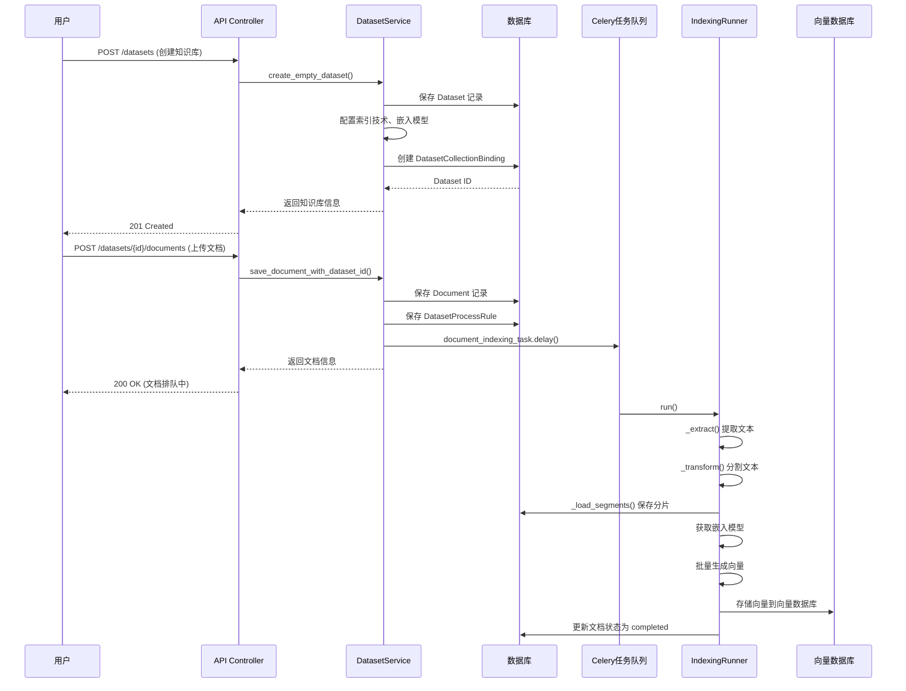

### 1.2 详细流程说明

#### 1.2.1 知识库创建阶段

**API 入口**: `api/controllers/console/datasets/datasets.py:DatasetListApi.post()`

**核心服务**: `api/services/dataset_service.py:DatasetService.create_empty_dataset()`

**创建流程**:

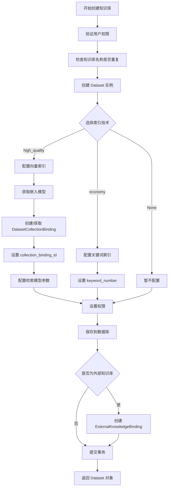

**关键代码位置**:

- 数据模型: `api/models/dataset.py:Dataset` (第41行)
- 创建方法: `api/services/dataset_service.py:DatasetService.create_empty_dataset()` (第195行)

**核心字段说明**:

```python
class Dataset:
    id: str                          # 知识库唯一ID
    tenant_id: str                   # 租户ID
    name: str                        # 知识库名称
    indexing_technique: str          # 索引技术: high_quality/economy/None
    embedding_model: str             # 嵌入模型名称
    embedding_model_provider: str    # 嵌入模型提供商
    collection_binding_id: str       # 向量集合绑定ID
    retrieval_model: dict            # 检索模型配置(JSON)
    permission: str                  # 权限配置
    provider: str                    # vendor(内部) / external(外部)
```

#### 1.2.2 文档上传阶段

**API 入口**: 
- 文本上传: `api/controllers/service_api/dataset/document.py:DocumentAddByTextApi.post()`
- 文件上传: `api/controllers/service_api/dataset/document.py:DocumentAddByFileApi.post()`

**核心服务**: `api/services/dataset_service.py:DocumentService.save_document_with_dataset_id()`

**上传流程**:

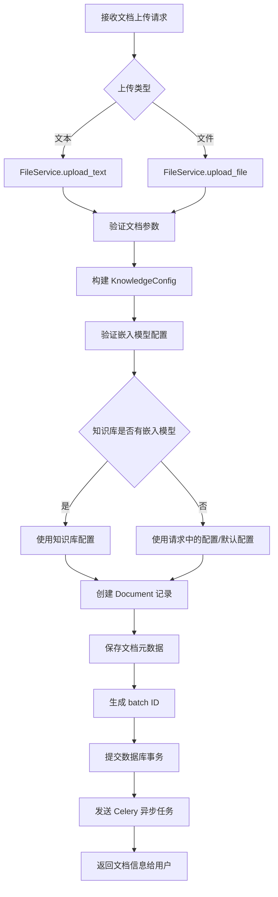

**关键代码位置**:

- 文档模型: `api/models/dataset.py:Document` (第340行)
- 保存方法: `api/services/dataset_service.py:DocumentService.save_document_with_dataset_id()` (第1408行)

#### 1.2.3 文档索引处理阶段

**异步任务入口**: `api/tasks/document_indexing_task.py:document_indexing_task()`

**核心处理器**: `api/core/indexing_runner.py:IndexingRunner`

**处理流程详解**:

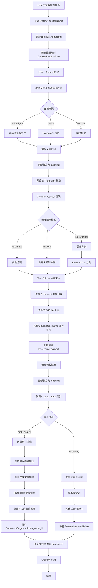

**核心代码位置**:

- 索引运行器: `api/core/indexing_runner.py:IndexingRunner` (第47行)
- 索引处理器工厂: `api/core/rag/index_processor/index_processor_factory.py`
- 向量工厂: `api/core/rag/datasource/vdb/vector_factory.py` (第34行)

**关键处理步骤**:

1. **Extract (提取)**: 
   - 代码位置: `IndexingRunner._extract()` 
   - 根据文档类型调用不同的提取器(FileExtractor, NotionExtractor, WebsiteExtractor)
   - 提取出纯文本内容

2. **Transform (转换)**:
   - 代码位置: `IndexingRunner._transform()`
   - 文本清洗: `CleanProcessor` 删除空格、URL、邮箱等
   - 文本分割: `TextSplitter` 按规则分割成多个 chunks
   - 支持多种分割模式: automatic、custom、hierarchical

3. **Load Segments (保存分片)**:
   - 代码位置: `IndexingRunner._load_segments()`
   - 创建 `DocumentSegment` 记录
   - 批量保存到数据库

4. **Load Index (索引)**:
   - 代码位置: `IndexingRunner._load()`
   - **向量索引**:
     - 调用嵌入模型生成向量: `embedding_model.invoke_text_embedding()`
     - 批量写入向量数据库 (支持多种VDB: Qdrant, Weaviate, Milvus等)
     - 每批1000条向量
   - **关键词索引**:
     - 使用 Jieba 提取关键词
     - 构建倒排索引
     - 保存到 `DatasetKeywordTable`

#### 1.2.4 向量数据库集成

**向量数据库支持**:

Dify 支持多种向量数据库,通过工厂模式统一管理:

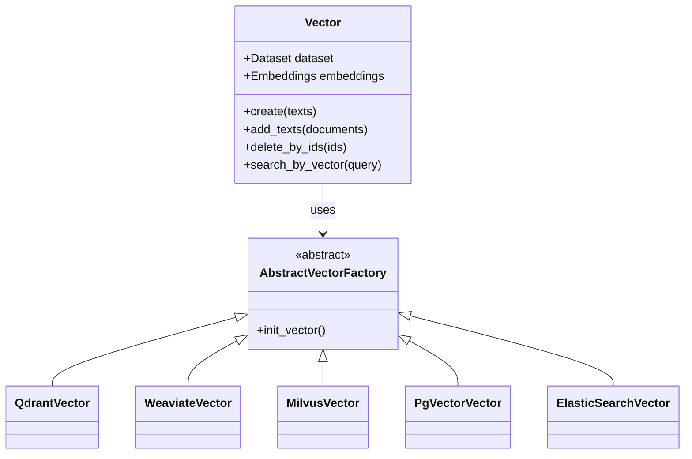

**代码位置**: `api/core/rag/datasource/vdb/vector_factory.py`

**集合命名规则**:
```python
collection_name = f"{VECTOR_INDEX_NAME_PREFIX}_{dataset_id}_Node"
# 例如: Vector_90b1a188_8cef_4f89_bd6b_9f3bd567ae78_Node
```

#### 1.2.5 数据模型关系

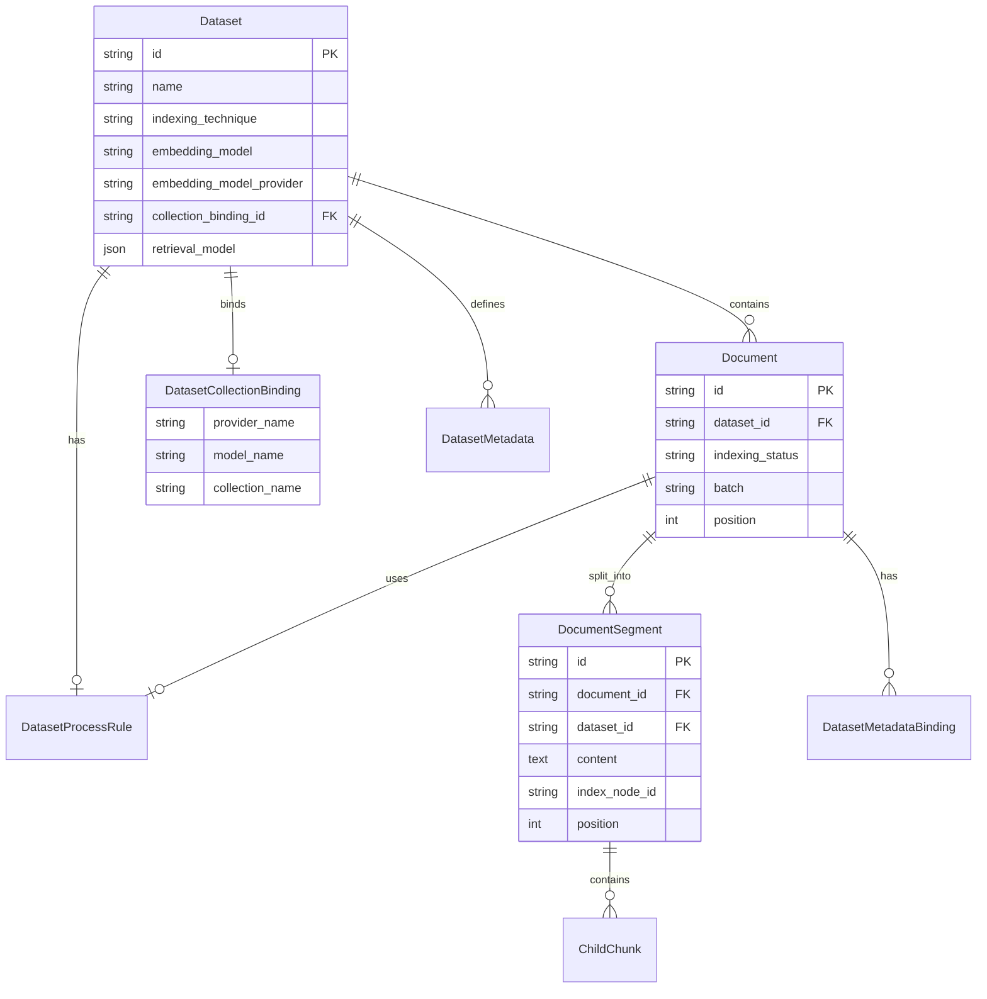

### 1.3 关键技术点

#### 1.3.1 批量向量化处理

为了提高性能,系统采用批量处理策略:

```python
# 代码位置: api/core/rag/datasource/vdb/vector_factory.py:189-204
batch_size = 1000  # 每批处理1000条
for i in range(0, len(texts), batch_size):
    batch = texts[i : i + batch_size]
    # 批量生成向量
    batch_embeddings = self._embeddings.embed_documents([doc.page_content for doc in batch])
    # 批量写入向量数据库
    self._vector_processor.create(texts=batch, embeddings=batch_embeddings, **kwargs)
```

#### 1.3.2 异步任务队列

使用 Celery 处理耗时的索引任务:

```python
# 代码位置: api/tasks/document_indexing_task.py
@shared_task(queue="dataset")
def document_indexing_task(dataset_id: str, document_ids: list):
    # 异步处理文档索引
    pass
```

**任务队列**: `dataset`
**Broker**: Redis
**任务类型**:
- `document_indexing_task`: 新文档索引
- `document_indexing_update_task`: 更新文档
- `add_document_to_index_task`: 添加文档到索引
- `retry_document_indexing_task`: 重试失败的索引

#### 1.3.3 文档状态管理

文档索引过程中的状态流转:

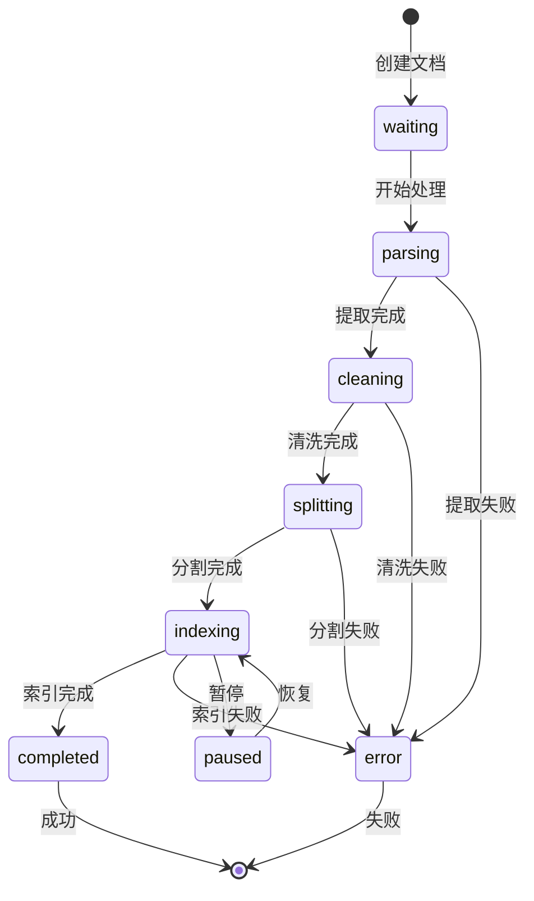

**状态字段**: `Document.indexing_status`

**可能的值**:
- `waiting`: 等待处理
- `parsing`: 正在解析
- `cleaning`: 正在清洗
- `splitting`: 正在分割
- `indexing`: 正在索引
- `completed`: 已完成
- `error`: 处理失败
- `paused`: 已暂停

---

## 2. 知识库嵌入模型修改机制

### 2.1 是否支持修改嵌入模型?

**答案: 是,Dify 支持修改知识库的嵌入模型。**

### 2.2 修改机制实现

#### 2.2.1 修改入口

**API 接口**: `PATCH /console/api/datasets/{dataset_id}`

**代码位置**: `api/controllers/console/datasets/datasets.py:DatasetApi.patch()`

**请求参数**:
```json
{
  "embedding_model": "text-embedding-3-small",
  "embedding_model_provider": "openai",
  "indexing_technique": "high_quality"
}
```

#### 2.2.2 修改流程

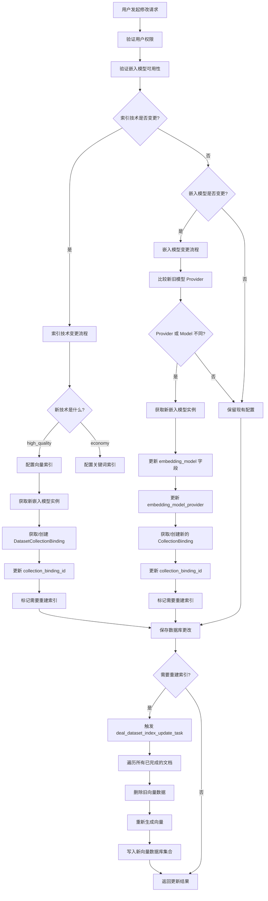

#### 2.2.3 核心实现代码

**嵌入模型更新方法**: `api/services/dataset_service.py:DatasetService._update_embedding_model_settings()`

```python
def _update_embedding_model_settings(dataset, data, filtered_data):
    """
    更新嵌入模型设置
    
    Args:
        dataset: 当前知识库对象
        data: 更新数据字典
        filtered_data: 过滤后的更新数据
    
    Returns:
        str: 操作类型 ('update' or None)
    """
    try:
        # 比较当前和新的模型提供商
        current_provider_str = str(ModelProviderID(dataset.embedding_model_provider)) \
                              if dataset.embedding_model_provider else None
        new_provider_str = str(ModelProviderID(data["embedding_model_provider"])) \
                          if data["embedding_model_provider"] else None

        # 只有当值不同时才更新
        if current_provider_str != new_provider_str or \
           data["embedding_model"] != dataset.embedding_model:
            _apply_new_embedding_settings(dataset, data, filtered_data)
            return "update"
    except LLMBadRequestError:
        raise ValueError("No Embedding Model available")
    except ProviderTokenNotInitError as ex:
        raise ValueError(ex.description)
    return None
```

**应用新嵌入设置**: `api/services/dataset_service.py:DatasetService._apply_new_embedding_settings()`

```python
def _apply_new_embedding_settings(dataset, data, filtered_data):
    """
    应用新的嵌入模型设置
    """
    model_manager = ModelManager()
    try:
        # 获取嵌入模型实例
        embedding_model = model_manager.get_model_instance(
            tenant_id=current_user.current_tenant_id,
            provider=data["embedding_model_provider"],
            model_type=ModelType.TEXT_EMBEDDING,
            model=data["embedding_model"],
        )
    except ProviderTokenNotInitError:
        # 如果无法获取嵌入模型,保留现有设置
        logger.warning("Failed to initialize embedding model, preserving existing settings")
        if dataset.embedding_model_provider and dataset.embedding_model:
            filtered_data["embedding_model_provider"] = dataset.embedding_model_provider
            filtered_data["embedding_model"] = dataset.embedding_model
            if dataset.collection_binding_id:
                filtered_data["collection_binding_id"] = dataset.collection_binding_id
        return

    # 应用新的嵌入模型设置
    filtered_data["embedding_model"] = embedding_model.model
    filtered_data["embedding_model_provider"] = embedding_model.provider
    
    # 获取或创建新的集合绑定
    dataset_collection_binding = DatasetCollectionBindingService.get_dataset_collection_binding(
        embedding_model.provider, 
        embedding_model.model
    )
    filtered_data["collection_binding_id"] = dataset_collection_binding.id
```

#### 2.2.4 集合绑定机制

**DatasetCollectionBinding** 是关键机制:

```python
class DatasetCollectionBinding:
    """
    数据集集合绑定表
    用于管理不同嵌入模型对应的向量集合
    """
    id: str                    # 绑定ID
    provider_name: str         # 模型提供商
    model_name: str            # 模型名称
    collection_name: str       # 向量集合名称
    type: str                  # 类型(默认 'dataset')
```

**作用**:
- 每个 (provider, model) 组合对应一个唯一的集合名称
- 多个 Dataset 可以共享同一个 CollectionBinding
- 修改嵌入模型时,会切换到新的 collection_name

**代码位置**: `api/models/dataset.py:DatasetCollectionBinding` (第1011行)

#### 2.2.5 索引重建流程

修改嵌入模型后,需要重建索引:

**异步任务**: `api/tasks/deal_dataset_index_update_task.py:deal_dataset_index_update_task()`

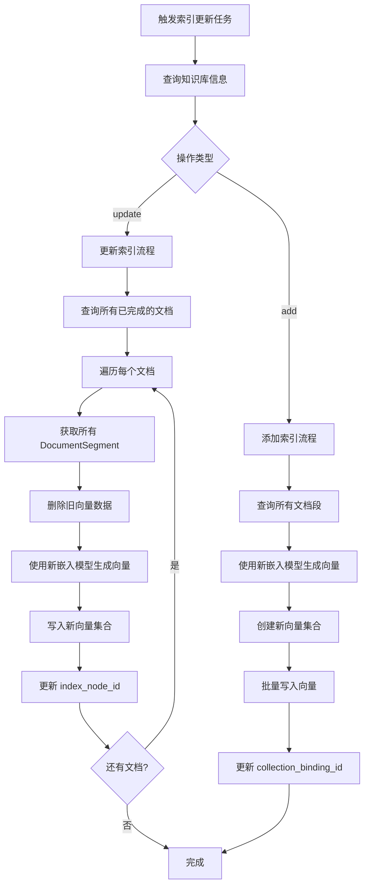

**关键点**:

1. **向量数据迁移**:
   - 从旧集合删除向量: `vector.delete_by_metadata_field('doc_id', document.id)`
   - 重新生成向量: `embedding_model.invoke_text_embedding(texts)`
   - 写入新集合: `vector.create(texts, embeddings)`

2. **集合切换**:
   - 旧集合名称: 基于旧的 (provider, model)
   - 新集合名称: 基于新的 (provider, model)
   - `collection_binding_id` 更新指向新集合

3. **数据完整性**:
   - 只处理状态为 `completed` 的文档
   - 保持 `DocumentSegment` 的内容不变
   - 只更新 `index_node_id` 和向量数据

### 2.3 RAG Pipeline 模式的嵌入模型修改

对于 RAG Pipeline 模式的知识库,嵌入模型修改有特殊处理:

**代码位置**: `api/services/dataset_service.py:DatasetService.update_rag_pipeline_dataset_settings()`

```python
def update_rag_pipeline_dataset_settings(
    session: Session, 
    dataset: Dataset, 
    knowledge_configuration: KnowledgeConfiguration, 
    has_published: bool = False
):
    """
    更新 RAG Pipeline 数据集设置
    
    Args:
        session: 数据库会话
        dataset: 数据集对象
        knowledge_configuration: 知识配置
        has_published: 是否已发布
    """
    if not has_published:
        # 未发布时可以自由修改
        dataset.indexing_technique = knowledge_configuration.indexing_technique
        dataset.embedding_model = knowledge_configuration.embedding_model
        dataset.embedding_model_provider = knowledge_configuration.embedding_model_provider
        # ... 更新其他配置
    else:
        # 已发布时的限制
        if dataset.chunk_structure != knowledge_configuration.chunk_structure:
            raise ValueError("Chunk structure is not allowed to be updated.")
        
        # 检查嵌入模型是否变更
        if dataset.embedding_model != knowledge_configuration.embedding_model:
            # 触发索引更新
            action = "update"
            # ... 应用新设置
```

**特点**:
- 未发布的 Pipeline: 可以自由修改所有配置
- 已发布的 Pipeline: 
  - 不允许修改 chunk_structure
  - 修改嵌入模型会触发重新索引
  - 需要保持向后兼容

### 2.4 注意事项与限制

#### 2.4.1 修改嵌入模型的影响

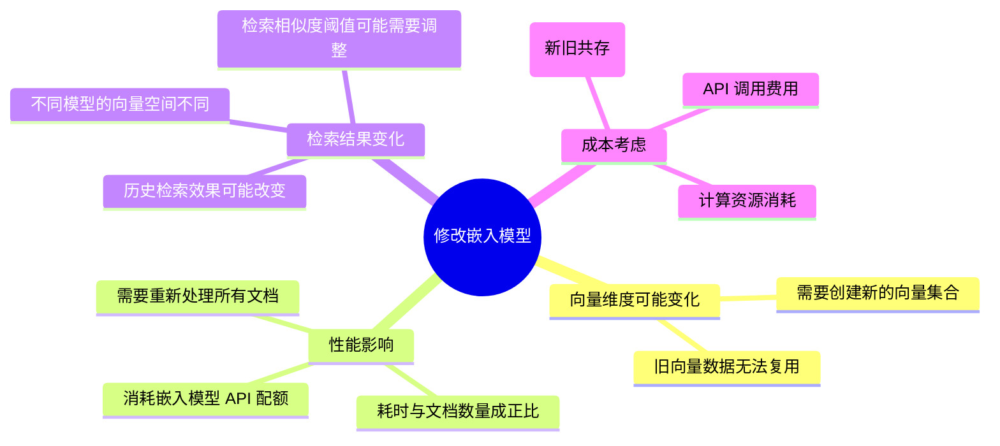

#### 2.4.2 最佳实践建议

1. **选择合适的时机**:
   - 建议在知识库创建初期确定嵌入模型
   - 在业务低峰期进行模型切换
   - 预留充足的处理时间

2. **模型选择考虑**:
   - 模型性能 vs 成本
   - 向量维度(影响存储和检索速度)
   - 支持的语言和领域
   - API 稳定性和可用性

3. **切换流程**:
   ```
   1. 备份当前知识库配置
   2. 在测试环境验证新模型效果
   3. 评估重建索引所需时间和成本
   4. 执行修改操作
   5. 监控索引重建进度
   6. 验证检索效果
   7. 必要时调整检索参数
   ```

4. **风险规避**:
   - 新旧集合在重建完成前都保留
   - 可以通过 `collection_binding_id` 回滚
   - 建议小规模测试后再大规模应用

### 2.5 相关配置示例

#### 2.5.1 修改嵌入模型 API 请求

```bash
PATCH /console/api/datasets/{dataset_id}
Content-Type: application/json

{
  "indexing_technique": "high_quality",
  "embedding_model": "text-embedding-3-small",
  "embedding_model_provider": "openai"
}
```

#### 2.5.2 支持的嵌入模型提供商

Dify 支持多个嵌入模型提供商:

- **OpenAI**: text-embedding-ada-002, text-embedding-3-small, text-embedding-3-large
- **Azure OpenAI**: text-embedding-ada-002
- **Anthropic**: 通过兼容层
- **Hugging Face**: 各种开源模型
- **Cohere**: embed-english-v2.0, embed-multilingual-v2.0
- **LocalAI**: 本地部署模型
- **自定义模型**: 通过插件机制

---

## 3. 技术架构总结

### 3.1 核心技术栈

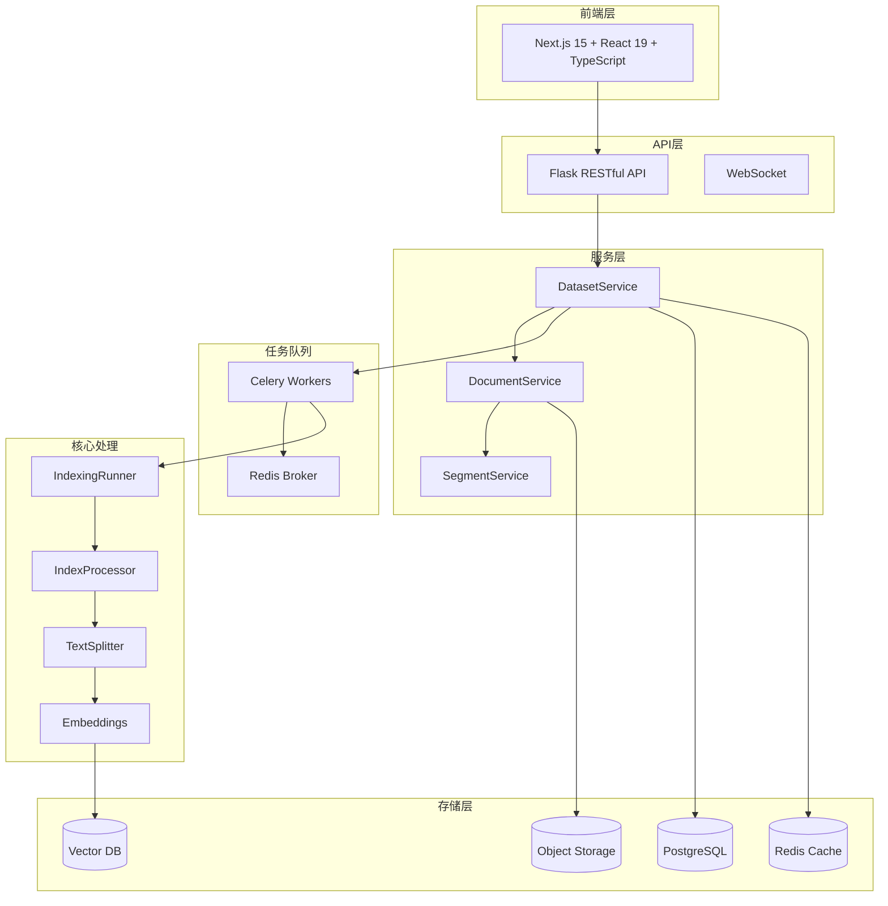

### 3.2 设计模式应用

1. **工厂模式**: 
   - `IndexProcessorFactory`: 根据索引类型创建不同的处理器
   - `VectorFactory`: 根据向量数据库类型创建不同的向量实例

2. **策略模式**:
   - `TextSplitter`: 不同的文本分割策略
   - `CleanProcessor`: 不同的清洗策略

3. **模板方法模式**:
   - `BaseIndexProcessor`: 定义索引处理的基本流程,子类实现具体步骤

4. **责任链模式**:
   - 文档处理流程: Extract -> Clean -> Split -> Index

5. **单例模式**:
   - `ModelManager`: 模型管理器
   - `ProviderManager`: 提供商管理器

### 3.3 可扩展性设计

1. **多向量数据库支持**: 通过抽象工厂模式,易于添加新的向量数据库

2. **多文档格式支持**: 通过提取器接口,易于添加新的文档格式

3. **多嵌入模型支持**: 通过模型管理器,统一管理不同提供商的模型

4. **插件化架构**: RAG Pipeline 支持自定义节点和处理逻辑

---

## 4. 参考资料

### 4.1 关键代码文件

| 文件路径 | 说明 |
|---------|------|
| `api/models/dataset.py` | 数据模型定义 |
| `api/services/dataset_service.py` | 知识库服务核心逻辑 |
| `api/controllers/console/datasets/datasets.py` | 知识库 API 接口 |
| `api/core/indexing_runner.py` | 索引处理核心引擎 |
| `api/core/rag/index_processor/` | 索引处理器实现 |
| `api/core/rag/datasource/vdb/` | 向量数据库集成 |
| `api/tasks/document_indexing_task.py` | 异步索引任务 |
| `api/tasks/deal_dataset_index_update_task.py` | 索引更新任务 |

### 4.2 数据库表结构

| 表名 | 说明 |
|-----|------|
| `datasets` | 知识库主表 |
| `documents` | 文档表 |
| `document_segments` | 文档分片表 |
| `child_chunks` | 子分块表(层级分割) |
| `dataset_process_rules` | 处理规则表 |
| `dataset_collection_bindings` | 集合绑定表 |
| `dataset_keyword_tables` | 关键词索引表 |
| `embeddings` | 向量缓存表 |

### 4.3 API 端点清单

| 端点 | 方法 | 说明 |
|-----|------|------|
| `/console/api/datasets` | GET | 获取知识库列表 |
| `/console/api/datasets` | POST | 创建知识库 |
| `/console/api/datasets/{id}` | GET | 获取知识库详情 |
| `/console/api/datasets/{id}` | PATCH | 更新知识库(含嵌入模型修改) |
| `/console/api/datasets/{id}` | DELETE | 删除知识库 |
| `/console/api/datasets/{id}/documents` | GET | 获取文档列表 |
| `/console/api/datasets/{id}/documents` | POST | 上传文档 |
| `/console/api/datasets/init` | POST | 初始化知识库并上传文档 |

---

## 结论

Dify 的知识库系统采用了完整的 RAG (检索增强生成) 架构,从文档上传到向量索引都经过精心设计:

1. **完整的处理流程**: 从文档上传、文本提取、清洗分割、向量化到索引存储,每个环节都有清晰的职责划分

2. **灵活的配置选项**: 支持多种索引技术、嵌入模型、向量数据库,用户可以根据需求选择最合适的方案

3. **可扩展的架构**: 通过工厂模式、策略模式等设计模式,系统具有良好的可扩展性

4. **嵌入模型可修改**: 支持在知识库创建后修改嵌入模型,但需要重建索引,这是合理的技术权衡

5. **异步处理机制**: 使用 Celery 任务队列处理耗时操作,提升用户体验

6. **DDD 架构**: 遵循领域驱动设计原则,代码组织清晰,易于维护

这套设计在功能完整性、性能、可扩展性之间取得了良好的平衡,是一个成熟的企业级知识库管理系统。


